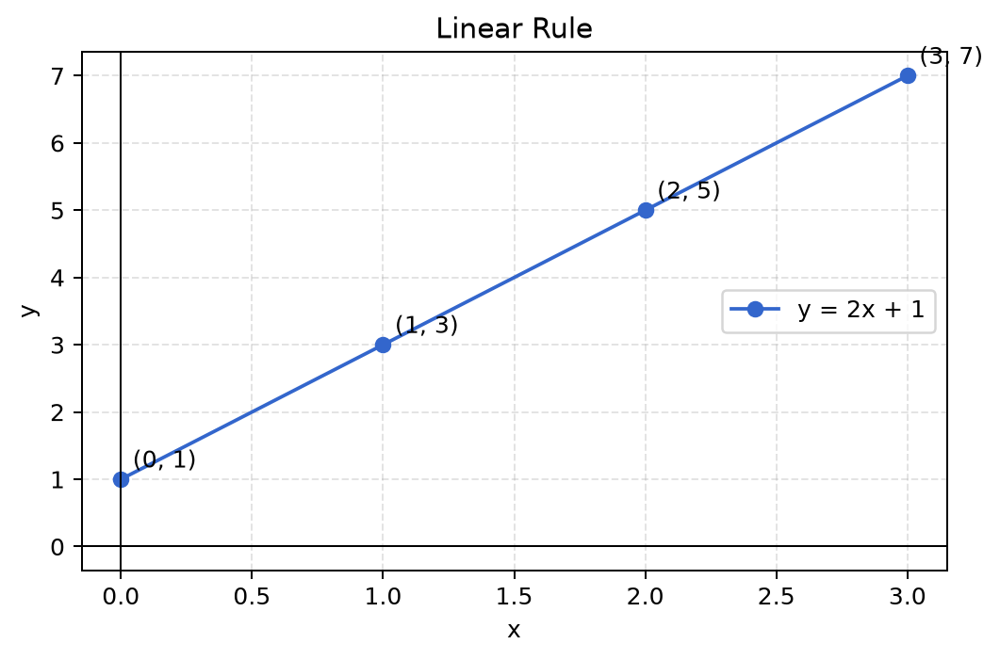

# 第 1 章 数学准备与公式阅读

<div class="chapter-intro">
  <span class="chapter-pill">起步章节</span>
  <span class="chapter-pill">公式阅读</span>
  <span class="chapter-pill">图像直觉</span>
  <p>这一章作为全书的起点，主要任务不是增加计算难度，而是帮助读者建立阅读**数学表达**的基本能力，使**公式、文字、表格和图像**之间能够相互连通。</p>
</div>

<div class="reading-focus" markdown="1">
<strong>阅读重点</strong>

- 把字母理解为“量的名称”，先建立**符号阅读能力**
- 把**公式、表格和图像**看作同一关系的不同表达形式
- 优先把握**“一个量变化时，另一个量如何随之变化”**
</div>

## 本章导读

这一章是全书的真正起点。它不会要求你一开始就掌握复杂计算，而是先帮助你建立一种更重要的能力：看到数学表达时，能够知道自己应该从哪里读起。很多人在后续学习机器学习时会被公式卡住，并不是因为公式本身特别难，而是因为还没有形成稳定的阅读顺序。所以，本章的重点不是“算得多快”，而是“看得明白”。

阅读本章时，建议先通读“本章为什么重要”和“直觉解释”，先把字母、公式、表格与图像之间的关系建立起来，再回头阅读“核心概念”和“例题与推导”。如果中途觉得某个定义过于抽象，可以先跳到后面的“图示理解”与“Python 小实验”，通过图像和数值变化重新建立直觉，再回来读公式。

!!! info "配套内容"
    - [图示理解](#chapter-01-figures)：先看公式如何变成函数图像。
    - [Python 小实验](#chapter-01-python)：观察输入变化时，输出如何随之变化。
    - [本章小结](#chapter-01-summary)：回看本章真正需要带走的核心理解。

## 学习目标

学完本章后，读者应当能够达到以下要求：

- 能够较为平静地阅读简单数学式，不再因为字母出现而立即中断理解
- 能够区分变量、常量、等式和函数在表达中的不同角色
- 能够在自然语言、公式、函数值表和图像之间建立基本对应
- 能够初步理解机器学习中的模型公式，本质上仍是在描述输入与输出的关系

如果本章内容尚未完全掌握，也不必焦虑。只要能够逐步建立“愿意读公式、能够慢慢拆解公式”的习惯，就已经达到了本章最核心的学习目的。

## 本章为什么重要

许多初学者之所以在学习机器学习时感到困难，并不是因为一开始就遇到了特别复杂的推导，而是因为在更靠前的地方就停住了：面对数学式时，不知道应当从哪里读起，也不清楚式子究竟在表达什么关系。换句话说，真正阻碍后续学习的，往往不是计算本身，而是阅读能力尚未建立。

例如，看到下面这样的式子时，读者常常会立刻感到陌生：

\[
y = wx + b
\]

这时，读者可能会同时冒出许多问题：`y` 表示什么，`x` 又表示什么，为什么 `w` 和 `b` 也用字母来写，这个式子到底是在计算一个结果，还是在描述一个规律，抑或已经是在定义某种模型。只要这些最基础的问题没有被理清，后面再遇到向量、矩阵、导数和概率公式时，阅读负担就会迅速累积。

因此，本章并不追求在开头就引入大量高等数学内容，而是先帮助读者建立几项最基本的阅读能力：能够分辨变量与常量，能够看懂一个公式是在描述什么关系，能够在公式、函数值表和图像之间建立对应，也能够初步把握“一个量变化时，另一个量如何随之变化”这一最核心的思想。看上去这些内容都很基础，但它们实际上构成了后续学习线性代数、微积分、概率统计以及机器学习模型的入口。

## 先修知识清单

从严格意义上说，本章几乎不要求读者具备系统的大学数学基础。只要对加减乘除、简单代数式、一元一次方程以及平面直角坐标系有过最初步的接触，就足以开始阅读本章。如果这些内容已经有些模糊，也不必担心，因为本章不会默认读者已经非常熟练，而会通过较慢的解释、具体的例子和图像辅助，把这些旧知识重新唤醒。

## 直觉解释

### 1. 数学公式本质上是在压缩表达

在进入正式定义之前，先从一个最直观的问题出发：公式究竟有什么用。许多初学者之所以畏惧公式，是因为他们容易把公式理解为某种额外的负担，好像只要数学一开始写成符号，就意味着难度突然提高了。实际上，公式首先是一种压缩表达的工具，它的作用是把原本较长、较含糊的自然语言关系，写成更紧凑、更稳定、也更便于推理和计算的形式。

例如，我们可以先用一句自然语言来描述一个朴素的现象：

“学生每天学习时间越多，测试成绩通常越高。”

这句话已经在表达两个量之间的联系，只是这种联系还比较松散。为了让这种关系更明确，我们可以把它压缩成一种更数学化的写法：

\[
\text{成绩} = f(\text{学习时间})
\]

这里的写法并不意味着问题突然变得复杂了，而是说明：成绩可以看作学习时间的某种函数。换句话说，学习时间一旦确定，成绩就会按照某种规则随之确定。如果进一步假设这种关系在一个较粗略的层面上近似线性，那么就可以继续写成：

\[
\text{成绩} = a \times \text{学习时间} + b
\]

也就是：

\[
y = ax + b
\]

可以看到，原本一整句自然语言，现在被压缩成了一个结构清晰的关系式。这里引入公式，不是为了增加形式负担，而是为了把“量与量之间的关系”写得更短、更清楚，也更便于后续计算与推理。对后面的机器学习而言，这一点尤其重要，因为模型本质上就是在用更复杂但结构相似的公式来表达输入与输出之间的关系。

### 2. 字母不是障碍，而是“可变化量”的名字

另一个常见障碍，是读者一看到字母就会立刻紧张。数字似乎是具体的、可把握的，而字母看上去则是抽象的、陌生的，甚至有些“像高等数学”。其实在最初阶段，字母首先只是在为某个量命名。只不过在数学里，这个名字并不是固定指向某一个数字，而是指向一个可以变化的量。

例如，`x` 可以表示学习时间，`y` 可以表示考试成绩，`w` 可以表示某个特征的重要程度，`b` 可以表示基础水平或偏移量。它们的字母不同，并不意味着它们“更难”，而只是为了提醒我们：这些量在整个表达式中的角色不同。机器学习里的字母之所以会更多，是因为需要同时描述输入、输出、参数、误差、损失函数等多个对象。因而，本章最关键的适应不是立刻会做很多计算，而是逐步接受这样一个事实：数学常常通过字母来表达数量关系，而这些字母本身并不可怕。

### 3. 图像是理解公式的桥梁

对基础较弱的读者而言，只看公式往往过于抽象，而只看文字又不够精确。在这两者之间，图像恰好可以起到桥梁作用。很多原本读起来有些生硬的式子，一旦画到坐标系中，就会突然变得容易理解。这并不是因为图像替代了数学，而是因为图像把原本难以直接把握的变化关系变成了可以观察的对象。

例如，一个函数如果写成：

\[
y = 2x + 1
\]

那么它实际上在说明：当 `x` 每增加 1 时，`y` 会增加 2；并且即使 `x = 0`，`y` 也并不是 0，而是 1。单独看这句话，读者可以勉强理解；但如果把这些变化关系画在平面直角坐标系中，它们就会表现为一条直线。对基础较弱的读者来说，这种“从文字到公式，再到图像”的转化，是进入数学学习的重要桥梁，也是后面学习函数、变化率和优化时必须反复使用的思维方式。

## 核心概念 <span class="lv-core">核心</span>

### 1. 变量

变量是指在讨论过程中可以取不同数值的量。也就是说，我们之所以把一个量称为变量，不是因为它一定正在变化，而是因为在当前问题中，它有可能取不同的值。例如，一个学生每天学习的小时数可以不同，一套房子的面积可以不同，一条样本记录中的年龄也可以不同，因此这些量都可以看成变量。在机器学习中，变量经常对应数据中的一个特征，或者模型中的一个参数；理解这一点，有助于读者在后面阅读更复杂公式时迅速判断“哪个量在输入侧，哪个量在参数侧”。

!!! abstract "定义 1.1（变量）"
    在一个问题中可以取不同数值的量，称为**变量**。一个量是不是变量，取决于当前讨论：在当前关系里它可能取不同值，就把它看作变量。

### 2. 常量

常量是指在当前表达或当前讨论范围内保持固定不变的量。需要特别注意的是，常量并不意味着“永远不变”，而只是意味着在当前这一条关系中，它被暂时看作不变化的对象。例如在：

\[
y = 3x + 2
\]

这个式子中，`x` 和 `y` 可以变化，而 `3` 和 `2` 在当前表达里是常量。读者在学习初期很容易把“常量”和“固定事实”混为一谈，其实是否是常量，取决于当前讨论的对象。在一个场景里固定的量，在另一个场景里也可能成为变量。因此，理解常量时要始终把它放回具体的表达式中去看。

!!! abstract "定义 1.2（常量）"
    在当前讨论范围内保持固定不变的量，称为**常量**。常量并非「永远不变」，只是在当前这条关系中被暂时看作不变。

### 3. 等式

等式表示左右两边相等，这一点读者在中学阶段通常已经接触过。但在学习函数和模型公式时，需要进一步理解的是：等式不仅可以表示一个固定结果，也可以表示一种规则性的关系。例如：

\[
2 + 3 = 5
\]

或者：

\[
y = 2x + 1
\]

第一个式子表示一个固定的算术结果，第二个式子则不是说 `y` 永远等于某一个固定数字，而是说：只要 `x` 取了某个值，`y` 就按照右边的规则被确定下来。正是在这里，读者开始从“算一个结果”过渡到“读一个关系”。

!!! abstract "定义 1.3（等式）"
    用等号 \(=\) 连接、表示左右两边相等的式子，称为**等式**。等式既可以表示一个确定的算术结果，也可以表示一种规则性的关系。

### 4. 函数

函数可以理解为一种规则：给定输入，经过某种确定关系，得到输出。这是函数最重要也最适合初学者把握的第一层含义。读者在最开始不必急于追求十分形式化的定义，只要先牢固掌握“函数就是输入到输出的规则”这一认识，就已经为后续学习打下了必要基础。

例如：

\[
f(x) = 2x + 1
\]

它表示一个记作 `f` 的规则。给定输入 `x` 后，输出按照 `2x + 1` 这一关系确定。于是，当 `x = 1` 时，`f(1) = 3`；当 `x = 2` 时，`f(2) = 5`；当 `x = 5` 时，`f(5) = 11`。这就是函数最朴素的含义。读者若能顺利把这种“输入一输出”的对应关系读清楚，后面再看到更复杂的函数写法时，理解压力就会显著降低。

!!! abstract "定义 1.4（函数）"
    设对集合 \(D\) 中的每个输入 \(x\)，都按某个确定规则 \(f\) 对应到**唯一**的输出，记作 \(f(x)\)，则称 \(f\) 为定义在 \(D\) 上的**函数**。

!!! abstract "定义 1.5（自变量与因变量）"
    在 \(y = f(x)\) 中，可自由取值的 \(x\) 称为**自变量**，随 \(x\) 被确定下来的 \(y\) 称为**因变量**。

!!! abstract "定义 1.6（函数值）"
    当自变量取定某个 \(x_0\) 时，函数 \(f\) 给出的输出 \(f(x_0)\) 称为 \(f\) 在 \(x_0\) 处的**函数值**。

## 公式阅读拓展 <span class="lv-ext">拓展</span>

本节只增加「读法」，不要求计算训练；第一次阅读可略读，后面用到时再回看。

### 1. 下标记号 \(x_i\)

当同一类量有很多个时，常用下标区分：\(x_1, x_2, \ldots, x_n\) 表示第 1 个、第 2 个一直到第 \(n\) 个 \(x\)。\(x_i\) 读作「第 \(i\) 个 \(x\)」，这里 \(i\) 是一个位置编号。第 3 章的向量，正是把这样一组带下标的数打包成一个对象。

### 2. 求和符号 \(\sum\)

把许多项加起来时，用求和符号缩写：

\[
\sum_{i=1}^{n} x_i = x_1 + x_2 + \cdots + x_n
\]

它读作「让 \(i\) 从 1 取到 \(n\)，把每个 \(x_i\) 加起来」。看到 \(\sum\) 不要紧张，它只是「连加」的简写。

### 3. 复合写法 \(f(g(x))\)

\(f(g(x))\) 表示**先**把 \(x\) 交给规则 \(g\) 得到 \(g(x)\)，**再**把这个结果交给规则 \(f\)。阅读顺序是「由内向外」。后面神经网络里「一层接一层」的结构，读法与此一致。

??? note "进阶 · 可跳过：函数为什么要求「唯一输出」"
    定义 1.4 强调每个输入对应**唯一**输出。若同一个输入 \(x\) 能对应到两个不同的输出，那么这条对应关系就不是函数——因为「给定输入却不能确定输出」会让后面的预测、求导都失去意义。这一「单值 / 良定义」要求，是函数区别于一般「关系」的关键，但第一次阅读只需知道结论即可。

## 例题与推导

!!! example "例 1.1（如何读懂 \( y = 2x + 1 \)）"
    这一表达不应当被当作需要机械记忆的“句子”，而应当被理解为一条描述变化关系的规则。阅读这类式子时，可以先把它拆成若干很朴素的步骤：先把 `x` 看成输入，再把输入乘以 2，接着再加上 1，最后得到输出 `y`。只要读者能把这样的过程在脑中顺下来，公式就不再只是静止的符号组合，而开始表现出明确的动作顺序。

    为了把这种顺序感建立得更稳，可以取几个具体数值来观察：

    | \(x\) | \(y = 2x + 1\) |
    | --- | --- |
    | 0 | 1 |
    | 1 | 3 |
    | 2 | 5 |
    | 3 | 7 |

    从这个表中不难看出，当 `x` 每增加 1 时，`y` 都稳定地增加 2。这说明它描述的是一种稳定的线性变化。教材在这里采用表格，不只是为了方便计算，而是为了帮助读者把“按规则逐次代入”的过程看得更清楚。很多时候，只要一个函数值表被读懂了，图像和公式之间的联系也就更容易建立起来。

!!! example "例 1.2（用函数描述学习时间与成绩）"
    为了让函数的含义更贴近实际情境，不妨看一个非常理想化的模型：

    \[
    \text{成绩} = 5 \times \text{学习小时数} + 50
    \]

    如果用字母表示：

    \[
    y = 5x + 50
    \]

    这里的 `x` 可以表示一天学习多少小时，`y` 可以表示预测成绩，系数 `5` 表示每多学 1 小时，成绩预计增加 5 分，而 `50` 表示即使学习时间记为 0，模型仍然给出一个基础成绩。这个例子当然非常粗糙，现实中的成绩变化也绝不会这样简单，但它足以说明最初级的数学建模思想：先确定哪些量是输入，哪些量是输出，再用一个清晰的关系式把它们连接起来。机器学习模型在更高层次上的工作，本质上仍然是这件事，只是关系更复杂、参数更多、数据也更大而已。

!!! example "例 1.3（为什么 \(f(x)\) 和 \(y\) 经常一起出现）"
    教材中经常会出现下面这样的写法：

    \[
    y = f(x)
    \]

    它表示：\(f\) 是函数名，\(x\) 是输入，\(f(x)\) 是函数在输入 \(x\) 时对应的输出，而 `y` 只是用来记这个输出值的另一个字母。因而，`y = f(x)` 并不是两个互不相关的对象并排放在一起，而是在说明“输出 \(y\) 由函数 \(f\) 作用在输入 \(x\) 上得到”。理解这层关系后，读者以后再看到更复杂的写法，例如多元函数、模型输出函数或者损失函数时，就能更自然地接受它们的表达方式。

!!! example "例 1.4（读懂 \(z = w_1x_1 + w_2x_2 + b\) 的结构）"
    这条式子不必一次算出结果，先**读结构**：\(x_1, x_2\) 是两个输入，\(w_1, w_2\) 是它们各自的权重，\(b\) 是偏移。整体在说「把每个输入乘以自己的权重，加起来，再加上一个基础值」。例如 \(w_1 = 2,\ w_2 = 3,\ b = 1\)，输入 \(x_1 = 1,\ x_2 = 2\) 时，\(z = 2\times 1 + 3\times 2 + 1 = 9\)。后面线性模型、神经网络的一层，本质都是在重复这个「加权求和」的读法。

## 图示理解 { #chapter-01-figures }

下面这张图把 \( y = 2x + 1 \) 的几个取值点和整条直线放在一起。对初学者来说，这张图的重要性并不在于“图画得是否漂亮”，而在于它第一次把“公式、表格、图像”这三种形式统一到了同一个对象上。也就是说，我们前面看到的那些数字并不是彼此孤立的，而是在平面上落成了一条有规律的直线。



读这张图时，可以先看点 `(0, 1)`，它说明当 \(x = 0\) 时，\(y = 1\)；再看点 `(1, 3)` 和 `(2, 5)`，它们正好对应前面函数值表中的结果。这样读图的目的，是先让你确认：图上的每一个点，其实都对应着“一个输入值”和“一个输出值”的配对，而不是画在平面上的装饰点。

接着再把目光从单个点移到整条直线上，就会发现这些点并不是零散分布的，而是整齐地落在同一条直线上。这说明这里描述的不是杂乱无章的变化，而是一种稳定的线性关系：当 \(x\) 增加时，\(y\) 也会按固定节奏一起变化。只要读者能够把“表格中的数字变化”和“图上的直线变化”真正对应起来，后面学习函数图像时就已经迈出了最关键的一步。

## Python 小实验 { #chapter-01-python }

下面这段代码可以帮助你把公式 \( y = 2x + 1 \) 变成一个真正可执行的小表格。教材在这里加入代码，并不是为了训练复杂编程技巧，而是为了让读者看到：数学公式并不是停留在纸面上的静态对象，它完全可以转化成一步一步可执行的规则。

```python
# 先给出几个输入值。
xs = [0, 1, 2, 3]
# 按照公式 y = 2x + 1 逐个计算输出。
ys = [2 * x + 1 for x in xs]

# 把输入和输出成对打印出来，形成函数值表。
for x, y in zip(xs, ys):
    print(f"x = {x}, y = {y}")
```

运行后，你会得到下面这样的输出：

```text
x = 0, y = 1
x = 1, y = 3
x = 2, y = 5
x = 3, y = 7
```

从这段代码中，读者应当看到三个关键动作：先给 `x` 一个值，再按照 `2 * x + 1` 的规则计算，最后观察输出如何变化。它的意义不在于“学会写这几行代码”，而在于把公式阅读过程变成机械可验证的过程。如果愿意，读者还可以把代码中的 `2` 改成 `3`，或者把 `+ 1` 改成 `+ 5`，观察整张表会如何改变。只要这一步能够顺利完成，读者通常会明显感受到：公式并不是死的，而是可以被操作、被观察、被验证的。

## 与机器学习的联系

这一章虽然处在全书开头，但它和机器学习之间的联系并不遥远。恰恰相反，后面几乎所有模型公式，都是在本章这些最基础对象的基础上不断扩展出来的。

### 1. 机器学习模型本质上也是函数

对机器学习最简单的理解是：输入一些特征，模型输出一个预测结果。只要从“输入一规则一输出”的角度去看，这本质上就是函数。区别只在于，机器学习中的函数通常比本章讨论的一元函数更复杂，输入维度更多，参数也更多，但最基本的结构并没有发生变化。

例如：

\[
\text{房价} = f(\text{面积}, \text{地段}, \text{楼龄})
\]

或者：

\[
\hat{y} = f(\text{用户特征})
\]

### 2. 参数决定函数形状

在式子

\[
y = wx + b
\]

中，`x` 是输入，`y` 是输出，而 `w` 和 `b` 是参数。这里最值得注意的是：当参数变化时，整条函数关系也会随之变化。也就是说，参数并不是附加在式子边上的装饰，它们在决定函数形状、函数斜率和整体位置。后面学习线性回归和神经网络时，读者会不断看到这种结构；本章先把这层直觉建立起来，后面的模型公式就会容易得多。

### 3. 后面的复杂公式，其实是这个思路的扩展

以后你会看到更复杂的表达，例如：

\[
z = w_1x_1 + w_2x_2 + \cdots + w_nx_n + b
\]

它看起来比 \( y = 2x + 1 \) 复杂得多，但本质思路并没有改变：无非是输入变多了、权重变多了、输出的生成过程更丰富了而已。因此，只要本章的阅读能力建立得比较稳，后面遇到复杂公式时，读者就不会只看到一堆陌生符号，而能够开始识别其中的结构。

## 常见误区

### 误区 1：字母越多，数学越高级

不一定。很多时候字母多，只是因为需要同时表示多个量，并不意味着概念本身更难。

### 误区 2：公式是拿来背的

更准确地说，公式是拿来表达关系的。先理解关系，再记公式，效果会好得多。

### 误区 3：图像只是辅助，不重要

对初学者而言，图像经常是理解函数、变化率和优化过程的关键入口。

### 误区 4：机器学习公式和基础数学没关系

恰恰相反。复杂模型通常只是把基础数学对象组合起来。变量、函数、图像、向量、概率，这些基础内容都是机器学习公式的“零件”。

## 练习题

### 基础题

1. **习题 1.1** 在 \(y = 4x + 3\) 中，指出哪些是变量、哪些是常量。
2. **习题 1.2** 计算当 \(x = 0, 1, 2, 3\) 时，\(y = 3x + 2\) 的取值。
3. **习题 1.3** 设 \(f(x) = x + 7\)，求 \(f(1)\)、\(f(5)\)、\(f(10)\)。

### 提高题

4. **习题 1.4** 用自然语言解释 \(y = 5x + 10\) 表示什么样的变化关系。
5. **习题 1.5** 把「成绩 = 每多学 1 小时加 6 分，基础分 40」写成 \(y = ax + b\) 的形式，指出 \(a, b\)。
6. **习题 1.6** 读出 \(\sum_{i=1}^{3} x_i\) 的含义，并在 \(x_1 = 2, x_2 = 5, x_3 = 1\) 时求其值。

### 思考题（选做）

7. **习题 1.7** 举一个生活中的例子，写成「输出 = 某个关于输入的函数」的形式。
8. **习题 1.8** 解释为什么「同一个输入对应两个不同输出」就不能叫函数（可参考进阶折叠块）。

??? note "参考答案"
    **基础题**

    1. 习题 1.1：变量是 \(x, y\)；常量是 \(4\) 和 \(3\)。
    2. 习题 1.2：\(x=0\to2\)，\(x=1\to5\)，\(x=2\to8\)，\(x=3\to11\)。
    3. 习题 1.3：\(f(1)=8\)，\(f(5)=12\)，\(f(10)=17\)。

    **提高题**

    4. 习题 1.4：每当输入 \(x\) 增加 1，输出 \(y\) 增加 5；\(x=0\) 时仍有基础值 10。
    5. 习题 1.5：\(a = 6\)，\(b = 40\)，即 \(y = 6x + 40\)。
    6. 习题 1.6：表示 \(x_1 + x_2 + x_3\)，即「把三个数加起来」；代入得 \(2 + 5 + 1 = 8\)。

    **思考题**

    7. 习题 1.7：开放题，答案不唯一。例如：每月话费 = 0.1 × 通话分钟数 + 20，写成 \(y = 0.1x + 20\)。
    8. 习题 1.8：函数要求每个输入对应唯一输出；若一个输入能得到两个不同输出，就无法由输入确定输出，预测与求导都失去依据，因此它只是「关系」而不是函数。

## 本章知识结构

| 概念 | 一句话核心 | 在机器学习中的角色 |
| --- | --- | --- |
| 变量（定义 1.1） | 可取不同值的量 | 对应数据中的特征或模型输入 |
| 常量（定义 1.2） | 当前暂时固定的量 | 模型中固定的设定值 |
| 函数（定义 1.4） | 输入到输出的确定规则 | 模型本身就是一个函数 |
| 参数 \(w, b\) | 决定函数形状与位置的量 | 训练的本质就是调整参数 |

知识脉络：

- 用**字母**为量命名 → 区分**变量 / 常量**
- 把量之间的关系写成**等式** → 当它表达「输入定、输出定」时就是**函数**
- 函数中可调的量是**参数** → 后续模型与训练都建立在这条线索上

## 本章小结 { #chapter-01-summary }

本章的重点始终不在于计算技巧，而在于建立最基础的数学阅读能力。读者如果能够逐步接受用字母表示量，能够理解公式是在描述变量之间的关系，能够把函数理解为输入到输出的规则，并且能够在公式、表格和图像之间建立起稳定联系，那么本章最重要的目标就已经达成了。

更进一步地说，本章的价值并不只体现在本章本身，而体现在它为整本书打下的阅读基础。后面无论进入向量、矩阵、导数、概率还是优化，只要读者已经在本章里建立了对数学表达的基本信心，后续内容的理解难度都会明显下降。

<div class="chapter-nav">
  <a href="../">
    <strong>章节目录</strong>
    返回章节导航页，重新选择阅读入口
  </a>
  <a href="../02-functions-and-change/">
    <strong>下一章</strong>
    进入第 2 章：函数、图像与变化率
  </a>
</div>


