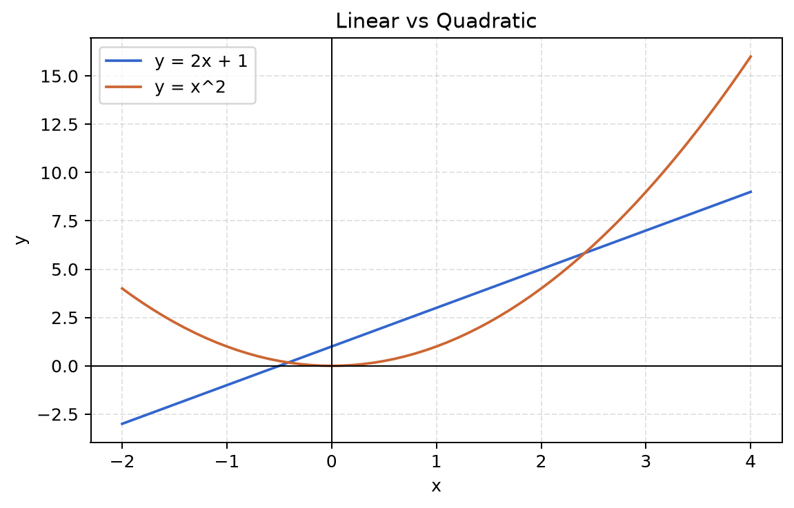
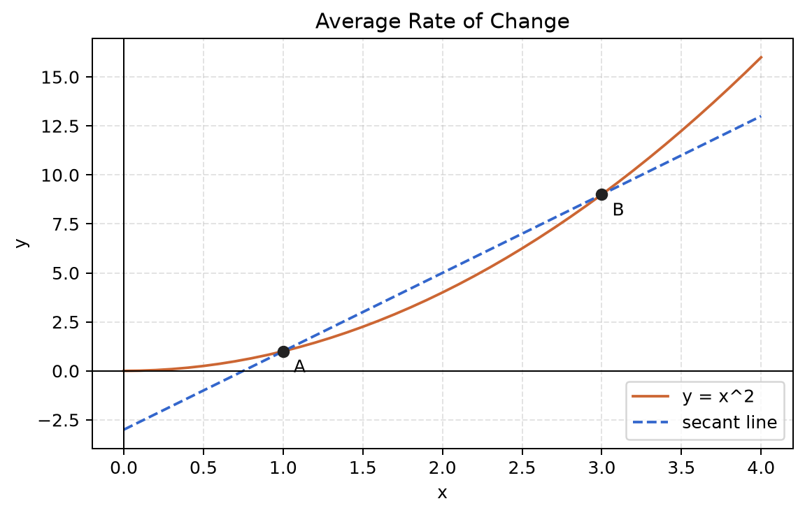

# 第 2 章 函数、图像与变化率

<div class="chapter-intro">
  <span class="chapter-pill">函数主线</span>
  <span class="chapter-pill">变化率</span>
  <span class="chapter-pill">导数前置</span>
  <p>这一章要把“公式在描述什么”进一步推进到“这种关系究竟怎样变化，以及变化得快不快”。</p>
</div>

<div class="reading-focus">
<strong>阅读重点</strong>

- 先把函数理解成“输入到输出的规则”，不要只把它看成一个式子
- 通过图像观察直线和曲线在变化方式上的差异
- 把平均变化率理解成后面导数直觉的过渡台阶
</div>

## 本章为什么重要

如果说第 1 章解决的是“如何读懂公式”，那么这一章要解决的是另一个关键问题：

“公式到底是在描述什么样的变化？”

在机器学习里，我们几乎一直在研究“变化关系”：

- 输入变化，输出怎么变
- 参数变化，预测怎么变
- 误差变化，损失怎么变
- 训练继续进行时，模型效果怎么变

而函数，就是描述这种变化关系的最基本工具。

仅仅会把一个式子代入数字还不够，更重要的是理解：

- 函数表达的是输入与输出之间的依赖关系
- 图像可以把这种关系可视化
- 变化率可以告诉我们“变得快还是慢”

当你开始理解变化率时，其实已经在靠近后面微积分和优化方法的核心思想了。

## 先修知识清单

阅读本章前，建议已经初步掌握：

- 变量与常量
- 等式和简单代数表达式
- 平面直角坐标系
- 第 1 章中关于函数的最基本理解

如果这些内容还不够熟练，也可以边读边回顾，不影响继续学习。

## 直觉解释

### 1. 函数不是“式子”，而是“输入到输出的规则”

很多初学者把函数理解成一种特殊写法，例如：

\[
f(x) = 2x + 1
\]

其实更重要的理解是：函数是一条规则。

它告诉我们：

- 给一个输入
- 按照某种方式处理
- 得到一个输出

例如，自动售货机就是一个非常接近函数的生活例子：

- 输入：你投入多少钱、按下哪个按钮
- 规则：机器根据价格和商品类型处理
- 输出：商品和找零

在数学里，函数就是把这种“规则关系”更精确地表达出来。

### 2. 图像让“变化”变得可见

如果只看一个式子：

\[
y = x^2
\]

你也许知道可以代入数值，但不一定立刻感觉到它在描述什么。

但如果把它画出来，你会发现：

- 当 `x` 远离 0 时，`y` 变大得很快
- 当 `x` 接近 0 时，`y` 变化比较慢
- 图像是弯曲的，不再是一条直线

这时你会第一次真正感受到：

“不同函数的变化方式是不一样的。”

### 3. 变化率是在问“变化有多快”

假设你在观察一个学生的学习时间和测试成绩：

- 学习 1 小时，成绩提升 5 分
- 再多学 1 小时，成绩又提升 5 分

这说明变化率比较稳定。

但如果是运动训练：

- 从 0 公里增加到 1 公里，心率上升明显
- 从 9 公里增加到 10 公里，心率上升可能更快

这说明变化率并不总是固定的。

所以，“变化率”这个概念是在问：

- 输入多变一点时
- 输出会跟着变多少

这正是导数想回答的问题的前身。

## 核心概念

### 1. 自变量与因变量

在一个函数关系中，通常会区分两类量：

- 自变量：主动输入的量
- 因变量：随着输入变化而变化的量

例如：

\[
y = 3x + 2
\]

这里通常把：

- `x` 看作自变量
- `y` 看作因变量

因为 `x` 的取值变化会决定 `y` 的结果。

### 2. 函数值

当自变量取一个具体数值时，函数会给出对应的输出，这个输出就叫函数值。

例如：

\[
f(x) = x^2 + 1
\]

那么：

- `f(0) = 1`
- `f(2) = 5`
- `f(3) = 10`

函数值不是一种额外的新对象，它就是函数在特定输入下给出的结果。

### 3. 图像

函数图像就是把所有“输入 - 输出”对应点画到坐标系中形成的图形。

例如，对函数：

\[
y = 2x + 1
\]

如果我们列出几个点：

- `(0, 1)`
- `(1, 3)`
- `(2, 5)`

再把这些点连起来，就得到一条直线。

函数图像的意义在于，它把原本抽象的变化关系变成了可以观察的形状。

### 4. 变化率

变化率用来描述：

- 输入变化了多少
- 输出相应变化了多少

最简单的变化率可以写成：

\[
\text{变化率} = \frac{\text{输出的变化量}}{\text{输入的变化量}}
\]

如果输入从 \(x_1\) 变到 \(x_2\)，输出从 \(y_1\) 变到 \(y_2\)，那么平均变化率可以写成：

\[
\frac{y_2 - y_1}{x_2 - x_1}
\]

这表示在一段区间上，输出平均每单位输入变化了多少。

### 5. 平均变化率与局部变化

先看一个例子：

\[
f(x) = x^2
\]

如果我们看区间 `[1, 3]`：

- `f(1) = 1`
- `f(3) = 9`

那么平均变化率是：

\[
\frac{9 - 1}{3 - 1} = 4
\]

这说明在这个区间内，`y` 平均每增加 1 个单位的 `x`，会增加 4。

但要注意，“平均变化率”并不等于每一点的变化都一样快。对弯曲函数来说，不同位置的变化快慢可能不同。

## 例题与推导

### 例 1：比较线性函数和二次函数

考虑两个函数：

\[
f(x) = 2x + 1,\qquad g(x) = x^2
\]

我们列一个表：

| \(x\) | \(f(x) = 2x + 1\) | \(g(x) = x^2\) |
| --- | --- | --- |
| 0 | 1 | 0 |
| 1 | 3 | 1 |
| 2 | 5 | 4 |
| 3 | 7 | 9 |

从表中可以观察到：

- `f(x)` 每次都稳定增加 2
- `g(x)` 的增长越来越快

这说明：

- 线性函数常常对应“固定变化率”
- 二次函数常常对应“变化率在变化”

这也是为什么后面研究导数时，弯曲函数会更值得关注。

### 例 2：从表格中读平均变化率

设某商品广告投放量 `x` 与当天点击量 `y` 有如下记录：

| 广告投放量 `x` | 点击量 `y` |
| --- | --- |
| 1 | 100 |
| 2 | 150 |
| 3 | 190 |

如果比较 `x = 1` 到 `x = 2`：

\[
\text{平均变化率} = \frac{150 - 100}{2 - 1} = 50
\]

表示广告投放量每增加 1 个单位，点击量平均增加 50。

如果比较 `x = 2` 到 `x = 3`：

\[
\text{平均变化率} = \frac{190 - 150}{3 - 2} = 40
\]

这说明在不同区间，增长速度可以不同。

### 例 3：为什么切线想表达“局部变化率”

对于直线：

\[
y = 2x + 1
\]

不管你在哪个位置看，它的变化率都是 2。

但对曲线：

\[
y = x^2
\]

在 `x = 1` 和 `x = 3` 附近，陡峭程度并不一样。

这时人们自然会问：

“我能不能只关心某一个点附近的变化快慢？”

这就引出了切线的想法：

- 在曲线某一点附近
- 用一条最贴近曲线的直线
- 去描述那个点附近的变化趋势

这条直线的斜率，就是后面导数概念的直观来源。

### 例 4：把函数理解为预测规则

假设我们有一个非常简单的房价预测规则：

\[
\hat{y} = 0.8x + 50
\]

如果用字母表示：

\[
y = 0.8x + 50
\]

这里：

- `x` 是房屋面积
- `y` 是预测房价
- `0.8` 表示面积每增加 1 个单位，预测房价平均增加 0.8 个单位
- `50` 表示基础偏移

这说明函数不仅是课堂中的数学对象，也是最简单预测模型的表达方式。

## 图示理解

先看下面这张函数对比图：



这张图最重要的不是“看公式长什么样”，而是看它们的变化方式有什么不同：

- \(y = 2x + 1\) 是直线，说明变化率稳定
- \(y = x^2\) 是曲线，说明变化快慢会随着位置不同而变化
- 当 `x` 变大时，二次函数的增长越来越明显

再看平均变化率的图：



这里曲线上的两个点 `A` 和 `B` 被一条割线连接起来。割线的斜率，就是区间上的平均变化率。

这一步很关键，因为后面学习导数时，你会从“区间上的割线”继续走向“某一点附近的切线”。

## Python 小实验

下面这段代码可以帮助你同时观察线性函数和二次函数的取值变化：

```python
# 先准备几个离散的输入值。
xs = [0, 1, 2, 3]
# 分别计算线性函数和二次函数的输出。
linear_values = [2 * x + 1 for x in xs]
quadratic_values = [x * x for x in xs]

# 把同一个输入下的两种输出并排打印，方便比较。
for x, linear_value, quadratic_value in zip(xs, linear_values, quadratic_values):
    print(
        f"x = {x}, linear = {linear_value}, quadratic = {quadratic_value}"
    )
```

如果你想直接用 Python 计算平均变化率，可以写成：

```python
def average_rate(x1: float, x2: float) -> float:
    # 这里固定研究函数 y = x^2。
    y1 = x1 ** 2
    y2 = x2 ** 2
    # 平均变化率 = 输出变化量 / 输入变化量。
    return (y2 - y1) / (x2 - x1)


# 比较两个不同区间上的平均变化率。
print(average_rate(1, 3))
print(average_rate(2, 4))
```

这段代码能帮助你观察到一个重要事实：对于 \(y = x^2\) 这种曲线函数，不同区间上的平均变化率可能不同。

如果你已经愿意多走一步，还可以用 `matplotlib` 自己把图画出来：

```python
import matplotlib.pyplot as plt

# 生成更细的横坐标，画出的曲线会更平滑。
xs = [value / 10 for value in range(-20, 41)]
linear_values = [2 * x + 1 for x in xs]
quadratic_values = [x * x for x in xs]

# 把两条函数曲线画到同一张图上进行比较。
plt.plot(xs, linear_values, label="y = 2x + 1")
plt.plot(xs, quadratic_values, label="y = x^2")
plt.legend()
plt.grid(True, linestyle="--", alpha=0.3)
plt.show()
```

## 配图建议

本章建议至少配四张图：

1. 线性函数与二次函数对比图  
   在同一坐标系中画出 \(y = 2x + 1\) 和 \(y = x^2\)，帮助读者直观看到“直线”和“曲线”的区别。

2. 表格到图像的转换图  
   先列出函数值表，再把点画到坐标平面，说明图像不是凭空画出来的。

3. 平均变化率示意图  
   在曲线的两个点之间连一条割线，展示“区间上的平均变化率”。

4. 切线直觉图  
   在曲线的一个点附近画切线，帮助读者感受“局部变化率”的含义。

如果后续正式绘图，建议图上明确标出：

- 输入轴和输出轴
- 两个比较点
- 割线或切线
- 斜率所代表的变化关系

## 与机器学习的联系

### 1. 模型本质上是在学习函数

最简化地说，机器学习做的事情就是：

- 输入数据特征
- 学习一个函数关系
- 输出预测结果

例如：

\[
\hat{y} = f(x_1, x_2, x_3)
\]

或者：

\[
\hat{y} = f(x_1, x_2, x_3, x_4)
\]

因此，“函数视角”不是数学附属品，而是机器学习的基本语言。

### 2. 训练过程关心的是“输出如何随参数变化”

后面学习模型训练时，你会不断看到下面这种问题：

- 参数调大一点，损失会怎样变化
- 某个方向更新参数后，误差会不会下降

这些问题本质上都在研究变化率。

### 3. 导数和梯度不是突然冒出来的

很多学生第一次见导数和梯度时，会觉得它们是完全陌生的新概念。

实际上，它们只是把本章中已经出现的问题变得更精确：

- 平均变化率 -> 区间上的变化快慢
- 局部变化率 -> 某一点附近的变化快慢
- 导数/梯度 -> 用严格数学语言描述这种局部变化

所以只要本章理解扎实，后面进入优化方法时就不会那么突兀。

## 常见误区

### 误区 1：函数一定要写成复杂公式

不是。函数的本质是规则，不是复杂程度。简单到 \(y = x + 1\)，复杂到神经网络，都可以看作函数。

### 误区 2：图像只是把公式画出来，不重要

恰恰相反。图像可以帮助你快速判断增长、下降、弯曲、陡峭程度，是理解变化的重要入口。

### 误区 3：变化率只和直线有关

不是。直线只是最容易理解变化率的起点。真正更有价值的问题，是研究曲线在不同位置的变化快慢。

### 误区 4：平均变化率就是某一点的变化率

不一定。平均变化率描述的是一个区间上的平均情况，而某一点附近的变化快慢需要更细的刻画。

## 练习题

1. 计算函数 \(f(x) = 3x + 1\) 在 \(x = 0, 1, 2, 3\) 时的函数值。
2. 比较函数 \(y = 2x + 1\) 和 \(y = x^2\) 在增长方式上的差异，并尝试用自然语言描述。
3. 设某函数在两个点上的取值分别为 `(1, 4)` 和 `(3, 10)`，求这段区间上的平均变化率。
4. 设 \(f(x) = x^2\)，求区间 \([2, 4]\) 上的平均变化率。
5. 请你自己举一个生活中的例子，并写出“输入变化会如何影响输出”的简单函数关系。

## 本章小结

本章建立了三个重要视角：

- 函数视角：把数学对象看成输入到输出的规则
- 图像视角：把变化关系变成可观察的形状
- 变化率视角：研究输入变化时输出变化得有多快

学完本章后，读者应当逐步能够：

- 理解自变量和因变量
- 通过表格和图像观察函数变化
- 区分直线函数和曲线函数的不同增长方式
- 理解平均变化率的含义
- 接受“局部变化率”将通向导数这一事实

这会为后续的向量、微积分和优化方法打下非常关键的桥梁。

<div class="chapter-nav">
  <a href="01-foundations.md">
    <strong>上一章</strong>
    回到第 1 章：数学准备与公式阅读
  </a>
  <a href="README.md">
    <strong>章节目录</strong>
    返回章节导航页
  </a>
  <a href="03-vectors-and-geometry.md">
    <strong>下一章</strong>
    进入第 3 章：向量与几何直觉
  </a>
</div>
