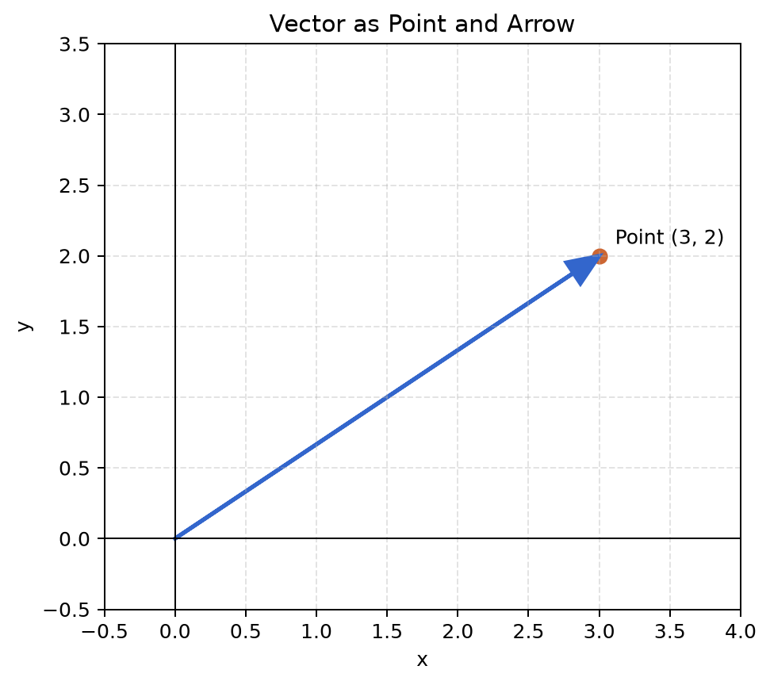
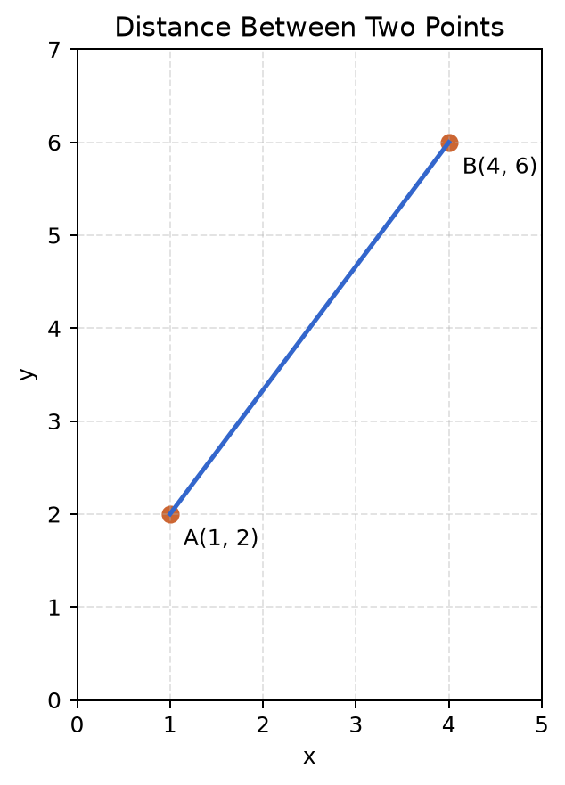

# 第 3 章 向量与几何直觉

<div class="chapter-intro">
  <span class="chapter-pill">向量入门</span>
  <span class="chapter-pill">距离与方向</span>
  <span class="chapter-pill">线性模型前置</span>
  <p>这一章会把“单个数字”推进到“由**多个特征组成的对象**”，让你开始用**向量**来理解样本、距离和相似性。</p>
</div>

<div class="reading-focus" markdown="1">
<strong>阅读重点</strong>

- 先把**向量**理解成一组有顺序的数字，再逐步过渡到几何解释
- 同时保留“点”和“箭头”两种视角来理解**向量**
- 特别关注**长度、距离与点积**，它们会直接进入后续模型表达
</div>

## 本章导读

这一章的关键任务，是把你从“单个数字”的思维方式带到“多个量一起看”的思维方式。到了这里，机器学习中的输入不再只是一个自变量，而更像是一条样本记录：它通常同时包含多个特征，也因此需要一种能够整体表示、整体比较和整体计算的方式。向量正是这种方式的最基本表达。很多读者第一次接触向量时，会觉得自己突然从函数跳到了另一门陌生学科；其实更准确的理解是，我们只是把前面一直在讨论的“量与量之间的关系”，从一个量扩展到了多个量同时出现的情形。

阅读本章时，建议不要把向量只看成一列数字，也不要只看成几何课上的箭头，而要在这两种理解之间来回切换。你可以先从“样本由多个特征组成”这一数据视角进入，再逐步过渡到点、箭头、长度、距离和夹角这些几何视角。只要这两种视角能够连起来，后面阅读线性模型、相似度计算和矩阵表达时就会轻松很多。换句话说，本章真正要建立的，不只是一个新定义，而是一种新的观察方式：开始把多个量看成一个整体。

!!! info "配套内容"
    - [图示理解](#chapter-03-figures)：观察点、箭头和距离如何对应同一个向量对象。
    - [Python 小实验](#chapter-03-python)：通过数值计算体验向量长度、距离与点积。
    - [本章小结](#chapter-03-summary)：回顾本章关于“整体表示”和“几何理解”的核心结论。

## 学习目标

学完本章后，读者应当能够达到以下要求：

- 能够把一个样本记录自然地理解为由多个特征组成的向量
- 能够在“数值列表”“平面中的点”“从原点出发的箭头”之间切换理解
- 能够解释长度、距离和点积各自反映了什么几何或数据含义
- 能够初步看懂后续模型中出现的 \(w \cdot x + b\) 这类表达

本章的学习重点不是抽象证明，而是建立“多个特征可以整体表示、整体比较、整体计算”的观念。只要这一观念逐步稳定下来，后续学习矩阵和线性模型时就会自然很多。

## 本章为什么重要

在前两章里，我们主要讨论的是“一个输入如何影响一个输出”。但真实的机器学习问题里，输入往往不只是一个数字，而是一组数字。预测房价时，一个样本可能同时包含面积、楼层、距离地铁站的距离和房龄；预测学生成绩时，一个样本也可能同时包含每周学习时间、作业完成率、出勤率和课堂测验成绩。到了这种场景里，单独盯着某一个数字已经不够了，我们更需要一种方式，把这些量作为同一个对象整体看待。

向量正是用来表达这种对象的最基本工具。它允许我们把“多个特征共同描述一个样本”这件事写得清楚，也允许我们进一步讨论这些样本之间究竟相差多远、方向是否接近、哪些特征在整体上更重要。也正因为如此，本章虽然表面上在讲向量、长度、距离和点积，但它真正承担的任务，是让读者第一次进入“高维数据也可以整体理解”的世界。

因此，本章的目标并不是一开始就把读者推入抽象线性代数，而是先建立几项可靠的直觉：向量可以看作一组有顺序的数字，可以在几何上看成点或箭头，也可以用来比较远近、方向和相似性。只要这些直觉逐步稳定下来，后面理解矩阵、梯度、距离度量、相似度计算以及各种模型表达时，就会明显轻松很多，因为你已经不再把数据看成一堆分散的数字，而开始把它们看成可以整体分析的对象。

## 先修知识清单

阅读本章前，最好已经对函数和图像的最基本概念、平面直角坐标系、平方与开方这些内容有初步印象，同时还记得第 2 章里关于“变化可以被图像表达”这一基础直觉。不过，本章对先修知识的要求并不高，它更关心的是你是否愿意从具体例子出发，把多个量一起看，而不是要求你一开始就熟练掌握形式化线性代数。

即使这些内容还不完全熟练，也不影响本章的直觉学习。你完全可以边读边补：读到点和箭头时就回想平面坐标系，读到长度时就顺便复习平方与开方，读到距离和方向时再回头想一想图像为何能帮助理解抽象关系。对初学者来说，这样的回顾不是“基础不够”的表现，反而是建立稳定理解的正常过程。

## 直觉解释

### 1. 向量首先是一组有顺序的数字

很多学生第一次接触向量时，会误以为它是一种非常遥远的“高等数学对象”。其实从最朴素的角度看，向量完全可以先理解为“一组按顺序排好的数字”。这句话看上去很简单，但它能够帮助读者把陌生感迅速降下来。因为一旦接受了这个起点，就会发现向量并不是凭空发明的新怪物，而只是把多个量整齐地放在一起，从而便于整体表达和整体计算。

例如：

\[
(2, 5)
\]

可以表示：

- 一个点的坐标
- 两门课程的成绩
- 两个商品特征
- 两个传感器读数

再例如：

\[
(x_1, x_2, x_3, x_4)
\]

在具体代入数值之后，它就成为一个多维向量。也就是说，多维向量并不是某种额外神秘的对象，而只是“更多个量按顺序放在一起”。从数据角度看，一条样本记录本来就往往同时包含多个特征，因此把它写成向量，其实只是把现实中的“多个描述量同时存在”用更数学化的方式表达出来。

### 2. 向量既可以看作点，也可以看作箭头

例如在二维平面里，向量：

\[
(3, 2)
\]

有两种非常重要的看法。第一种是点的看法，它表示平面上坐标为 `(3, 2)` 的点；第二种是箭头的看法，它表示从原点 `(0, 0)` 指向 `(3, 2)` 的箭头。很多初学者一开始会担心这两种说法是否互相冲突，其实它们只是从不同角度描述同一个对象。

把向量看成点，方便我们理解样本在空间中“落在哪里”；把向量看成箭头，则更方便理解方向、长度和位移。也正因为如此，本章学习时不应只固定在一种视角上，而应逐步学会在两种视角之间来回切换。只要这种切换开始自然，后面学习距离、点积和线性变换时就会顺得多。

### 3. 向量帮助我们描述“相似”与“不相似”

假设有两个学生：学生 A 的成绩向量是 `(数学 90, 英语 85)`，学生 B 的成绩向量是 `(数学 88, 英语 84)`。这两个向量很接近，所以我们会自然地说，他们的成绩结构比较相似。如果另一个学生 C 的向量是 `(数学 40, 英语 95)`，那么它与学生 A 的差异就明显更大。这个例子说明，一旦把对象表示成向量，我们就可以用更统一的方式讨论“谁离谁更近”“谁和谁更像”“差异主要体现在哪些方向上”。

这正是很多机器学习方法的基础。因为模型处理的数据，往往并不是一个孤立数字，而是一整组特征共同构成的对象。向量的价值，就在于它提供了一种把这些对象整体化的语言，使后面谈距离、相似度、分类边界和模型输入都变得更自然。

## 核心概念

### 1. 向量

向量可以先理解为一个按顺序排列的数值列表。这里最重要的不是一开始追求抽象定义，而是先建立“整体对象”的意识：向量不是若干数字随便放在一起，而是若干有固定顺序、共同描述同一个对象的数字。

例如：

\[
(1, 2)
\]

或者：

\[
(3, 5, 7)
\]

顺序非常重要，因为：

\[
(1, 2) \neq (2, 1)
\]

在机器学习里，一个向量通常对应一条样本记录的特征表示。因此，顺序之所以重要，不只是出于形式规定，而是因为每一个位置都对应某个确定特征，位置一旦交换，含义也会随之改变。

!!! abstract "定义 3.1（向量）"
    按照固定顺序排列起来、共同描述同一个对象的一组数，称为**向量**。

### 2. 维度

向量里有几个数，就说它是几维向量。维度这个词看上去有些抽象，但在入门阶段完全可以把它理解成“这个向量里记录了几个位置的数”。如果一个样本有 3 个特征，它就可以写成 3 维向量；如果有 100 个特征，它就可以写成 100 维向量。

例如：

例如，`(2, 5)` 是二维向量，`(1, 3, 7)` 是三维向量，而一个包含 100 个特征的样本，就是 100 维向量。维度越高，并不意味着概念越神秘，只是表示同时记录的特征更多。真正的学习难点，往往不是“高维”这个词，而是能否继续保持整体理解的视角。

!!! abstract "定义 3.2（维度）"
    向量中包含几个分量，就称该向量是几维向量；这个“几”称为向量的**维度**。

### 3. 向量加法

两个相同维度的向量可以相加。

例如：

\[
(1, 2) + (3, 4) = (4, 6)
\]

它可以理解为“对应位置分别相加”。

如果把向量看成箭头，那么向量加法也可以看成“位移的叠加”。

### 4. 数乘

向量可以和一个数字相乘。

例如：

\[
2(1, 3) = (2, 6)
\]

如果把向量看作箭头，那么数乘表示：

- 方向不变或翻转
- 长度被放大或缩小

例如：

- `2v` 表示长度放大 2 倍
- `0.5v` 表示长度缩小为原来的一半
- `-v` 表示方向相反

### 5. 向量长度

向量长度也常叫范数。在二维里，向量：

\[
(x, y)
\]

的长度可以写成：

\[
\sqrt{x^2 + y^2}
\]

例如向量 \((3, 4)\) 的长度为：

\[
\sqrt{3^2 + 4^2} = 5
\]

长度帮助我们理解一个点离原点有多远，也帮助我们理解某个方向上的“强度”有多大。对初学者来说，长度的学习价值不只在于掌握计算公式，更在于开始把几何直觉和数据表示真正连起来。

!!! abstract "定义 3.3（向量长度）"
    向量从原点出发到终点的几何长度，称为该向量的**长度**或**范数**。

### 6. 距离

如果有两个点：

\[
A = (x_1, y_1), \qquad B = (x_2, y_2)
\]

那么它们之间的距离可以写成：

\[
\sqrt{(x_2 - x_1)^2 + (y_2 - y_1)^2}
\]

这就是平面中最常见的欧氏距离。它之所以重要，不只是因为这是一条熟悉的几何公式，而是因为它让我们第一次能够用统一方式量化“两个对象相差多远”。在机器学习里，很多方法都会问一个核心问题：“哪个样本离我最近？”一旦距离可以计算，很多分类、聚类和检索方法就有了基础。

!!! abstract "定义 3.4（欧氏距离）"
    两个点或两个向量之间按直线长度衡量的距离，称为它们的**欧氏距离**。

### 7. 点积

两个向量的点积在二维里可以写成：

\[
(a, b) \cdot (c, d) = ac + bd
\]

例如：

\[
(1, 2) \cdot (3, 4) = 1 \times 3 + 2 \times 4 = 11
\]

点积非常重要，因为它既能做数值组合，也和方向关系有关。对初学者来说，最适合的第一层理解是：把对应位置的数相乘，再把结果加总。这样理解时，它看起来像一种“加权求和”；等几何直觉逐步稳定之后，再进一步把它和方向接近程度联系起来，就会自然得多。

!!! abstract "定义 3.5（点积）"
    两个同维向量对应分量相乘后再求和所得的结果，称为它们的**点积**。

- 对应特征做加权配对
- 再把结果加总

后面在线性模型和神经网络里，你会频繁见到这种结构。

## 例题与推导

### 例 1：把一条样本记录写成向量

假设我们要描述一套房子，用三个特征：

- 面积
- 房龄
- 距离地铁站距离

某套房子的记录可能写成：

\[
(89, 12, 0.8)
\]

这表示：

- 面积为 89
- 房龄为 12
- 距离地铁站 0.8 公里

这就是一个三维向量。

从这里开始，读者应逐步接受：

“数据表中的一行，在数学上常常就是一个向量。”

### 例 2：向量长度

考虑向量：

\[
v = (3, 4)
\]

它的长度为：

\[
\lVert v \rVert = \sqrt{3^2 + 4^2} = 5
\]

这和勾股定理是一致的。

如果画图，你会看到这个向量从原点出发，到达点 `(3, 4)`，与坐标轴形成一个直角三角形，斜边长度就是向量长度。

### 例 3：两个样本的距离

设：

\[
A = (1, 2), \qquad B = (4, 6)
\]

那么它们的距离为：

\[
\sqrt{(4 - 1)^2 + (6 - 2)^2}
= \sqrt{3^2 + 4^2}
= 5
\]

这表示点 `A` 和点 `B` 在平面中的直线距离是 5。

在机器学习里，这个距离可以用来衡量两个样本是否接近。

### 例 4：点积与加权求和

设有向量：

\[
x = (2, 3), \qquad w = (4, 5)
\]

那么点积为：

\[
w \cdot x = 4 \times 2 + 5 \times 3 = 23
\]

可以把它理解为：先让第一个特征乘上第一个权重，再让第二个特征乘上第二个权重，最后把结果相加。这已经非常接近后面机器学习中常见的表达：

\[
w_1x_1 + w_2x_2 + \cdots + w_nx_n
\]

### 例 5：为什么“方向”也重要

设两个向量：

\[
(1, 1) \text{ 和 } (10, 10)
\]

它们长度差很多，但方向相同。

再比较：

\[
(1, 1) \text{ 和 } (1, -1)
\]

这两个向量长度可能类似，但方向明显不同。

这告诉我们：两个对象是否相似，不仅和“大小差多少”有关，也和“方向是否一致”有关。前者更多反映量级差异，后者则更像是在问“结构是否相像”。这也是为什么后面很多模型既关心距离，也关心方向关系。

## 图示理解 { #chapter-03-figures }

先看向量作为“点”和“箭头”的双重表示：



读这张图时，可以先看右上方那个坐标点 \((3,2)\)。如果把向量理解成“一个对象由两个数字共同描述”，那么它首先可以被看成平面上的一个点，表示这个对象在两个维度上的取值分别是多少。接着再看从原点指向这个点的箭头，就会发现同一个向量也可以被理解成“从原点出发走到 \((3,2)\) 的位移”。也就是说，点视角强调的是“这个对象落在什么位置”，箭头视角强调的是“它朝什么方向走了多远”。

这一步很关键，因为后面机器学习里这两种看法会反复切换。当我们讨论样本分布时，常把向量看成点；当我们讨论方向、长度、相似性和加权作用时，又更常把向量看成箭头。真正重要的，不是只记住哪一种图像，而是逐渐接受：这两种图像其实都在描述同一个向量。

再看两个点之间的距离：



再看第二张图时，先不要急着想公式，而是先看点 `A` 和点 `B` 在平面上的位置。它们可以理解成两条样本记录，或者两个由二维特征描述的对象。图中把 `A` 和 `B` 直接连起来的那条线段，表示的正是“从一个点走到另一个点最直接要走多远”。这个长度，就是它们在几何上的距离。

如果把这张图读顺，后面的距离公式就会自然很多。公式并不是凭空冒出来的新规则，而是在把图中的横向差、纵向差和线段总长度写成可计算的形式。也正因为如此，很多机器学习方法才会关心“谁离谁更近”：因为距离越小，往往意味着两个样本在特征空间里越相似。

## Python 小实验 { #chapter-03-python }

下面这段 Python 代码可以帮助你计算向量长度、距离和点积：

```python
from math import sqrt

# 计算向量 v 的长度。
v = (3, 4)
length = sqrt(v[0] ** 2 + v[1] ** 2)
print("向量长度:", length)

# 计算两点 a 和 b 之间的欧氏距离。
a = (1, 2)
b = (4, 6)
distance = sqrt((b[0] - a[0]) ** 2 + (b[1] - a[1]) ** 2)
print("两点距离:", distance)

# 计算向量 x 和 w 的点积。
x = (2, 3)
w = (4, 5)
dot_product = x[0] * w[0] + x[1] * w[1]
print("点积:", dot_product)
```

这段代码有三个教学作用：

- 用 `sqrt` 把勾股定理变成可执行的长度公式
- 用坐标差计算距离，理解“远近”如何量化
- 用点积看到“加权求和”的结构

如果你把 `x = (2, 3)` 和 `w = (4, 5)` 改成别的数字，就能观察不同特征组合下点积如何变化。

下面是一个更贴近机器学习表达的版本：

```python
# 一个样本的三个特征。
features = (80, 12, 3)
# 三个特征对应的权重。
weights = (0.8, -0.2, 1.5)
# 偏置项负责整体平移输出。
bias = 10

# 按照 w · x + b 的结构计算模型输出。
score = (
    features[0] * weights[0]
    + features[1] * weights[1]
    + features[2] * weights[2]
    + bias
)

print("模型输出:", score)
```

这就是后面线性模型里 \(w \cdot x + b\) 的最朴素写法。

## 与机器学习的联系

### 1. 一条样本记录通常就是一个向量

机器学习中的表格数据，常常可以写成下面的形式：

\[
x = (x_1, x_2, \ldots, x_n)
\]

这里每个 \(x_i\) 都对应一个特征。

因此，向量不是额外附加的数学对象，而是数据表示的自然语言。

### 2. 距离决定“谁和谁更像”

很多方法都会依赖距离概念，例如：

- 最近邻分类
- 聚类
- 相似样本检索

这些方法背后都离不开一个问题：

“两个向量之间有多近？”

### 3. 点积决定“加权组合”

在线性回归、逻辑回归和神经网络中，经常会出现：

\[
w \cdot x + b
\]

这个式子本质上就是：

- 输入向量 \(x\)
- 参数向量 \(w\)
- 做点积得到加权和
- 再加一个偏置 `b`

如果本章对向量和点积理解到位，后面看模型公式会轻松很多。

### 4. 向量空间让高维数据可被分析

虽然真实数据可能不是二维或三维，无法直接画出来，但数学思路没有变：

- 一条样本记录仍然是一个向量
- 样本之间仍然可以比较距离和方向
- 模型仍然在这些向量之间寻找规律

这就是为什么线性代数会成为机器学习数学的核心基础之一。

## 常见误区

### 误区 1：向量就是“带箭头的图形”

箭头图是帮助理解的方式之一，但向量更本质的含义是一个按顺序排列的数字对象。

### 误区 2：维度高就完全无法理解

高维只是特征更多，并不改变基本思想。二维和三维图像只是帮助我们建立直觉。

### 误区 3：距离越小就一定越相似

很多时候这是有帮助的，但还要看特征是否经过合理处理，例如量纲是否统一、特征是否标准化。

### 误区 4：点积只是一个机械计算公式

不是。点积既是数值计算工具，也是后面理解线性模型、投影和相似性的重要入口。

## 练习题

1. 判断下列向量分别是几维：`(2, 3)`、`(1, 4, 6)`、`(5, 7, 9, 2)`。
2. 计算 `(1, 2) + (3, 4)`。
3. 计算 `3(2, 1)`。
4. 求向量 `(6, 8)` 的长度。
5. 求点 `A = (1, 1)` 和 `B = (4, 5)` 之间的距离。
6. 计算向量 `(2, 3)` 与 `(4, 1)` 的点积。
7. 请你把一个现实对象写成三维或四维向量，例如“一个学生”或“一套房子”的特征表示。

??? note "参考答案"
    1. \((2, 3)\) 是二维，\((1, 4, 6)\) 是三维，\((5, 7, 9, 2)\) 是四维（维度就是分量个数）。
    2. \((1, 2) + (3, 4) = (4, 6)\)。
    3. \(3(2, 1) = (6, 3)\)。
    4. \(\lVert(6, 8)\rVert = \sqrt{6^2 + 8^2} = \sqrt{36 + 64} = \sqrt{100} = 10\)。
    5. 距离 \(= \sqrt{(4 - 1)^2 + (5 - 1)^2} = \sqrt{9 + 16} = \sqrt{25} = 5\)。
    6. \((2, 3) \cdot (4, 1) = 2 \times 4 + 3 \times 1 = 8 + 3 = 11\)。
    7. 开放题，答案不唯一。例如“一个学生” = （年龄, 每周学习小时数, 平均成绩） = \((16, 20, 85)\)，每个分量是一个特征。

## 本章知识结构

| 概念 | 一句话核心 | 在机器学习中的角色 |
| --- | --- | --- |
| 向量 | 按顺序组织起来的一组数 | 一条样本记录、一个参数组都可写成向量 |
| 长度与距离 | 描述量有多大、对象彼此多远 | 支撑相似性比较、最近邻与聚类直觉 |
| 点积 | 用加权求和把两个向量联系起来 | 是 \(w \cdot x + b\) 这类模型公式的核心 |
| 几何直觉 | 把数字关系读成点、方向和空间位置 | 帮助理解高维数据表示与线性模型 |

知识脉络：

- 从单个数走到由多个特征组成的**向量**
- 用**长度和距离**判断对象有多大、彼此多近
- 用**点积**把“多个特征共同作用”写成加权组合
- 把这些对象重新放回**几何空间**中理解模型

## 本章小结 { #chapter-03-summary }

本章最核心的任务，是帮助读者完成从“单个数字”到“由多个特征共同组成的对象”的过渡。向量之所以重要，并不只是因为它是一种新的记号，而是因为它第一次让我们能够把一条样本记录、一个参数组，甚至一个空间中的方向，都放到同一种语言里来理解。只要这一层认识开始稳定，后面看到数据、参数和特征时，就不再只是看到彼此分散的数字，而会开始意识到它们本来就应当被整体地组织起来。

在此基础上，长度、距离和点积又进一步把“整体表示”推进为“整体计算”。长度和距离帮助我们判断对象有多大、彼此有多近，点积则让多个特征的共同作用可以被压缩成一个统一的加权结果。对第一次学习的人来说，本章真正需要带走的，不只是向量加法或数乘的计算规则，而是一个稳定的核心直觉：机器学习中的一条样本、一个特征向量、一次线性打分，本质上都建立在向量这种整体表示方式之上。这也正是下一章进入矩阵表达以及后续理解线性模型、高维数据分析和相似性计算的基础。

<div class="chapter-nav">
  <a href="../02-functions-and-change/">
    <strong>上一章</strong>
    回到第 2 章：函数、图像与变化率
  </a>
  <a href="../">
    <strong>章节目录</strong>
    返回章节导航页
  </a>
  <a href="../04-matrices-and-transformations/">
    <strong>下一章</strong>
    进入第 4 章：矩阵与线性变换
  </a>
</div>


