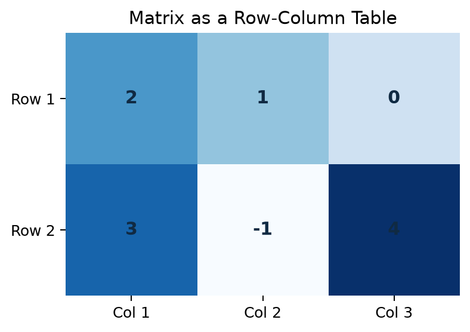
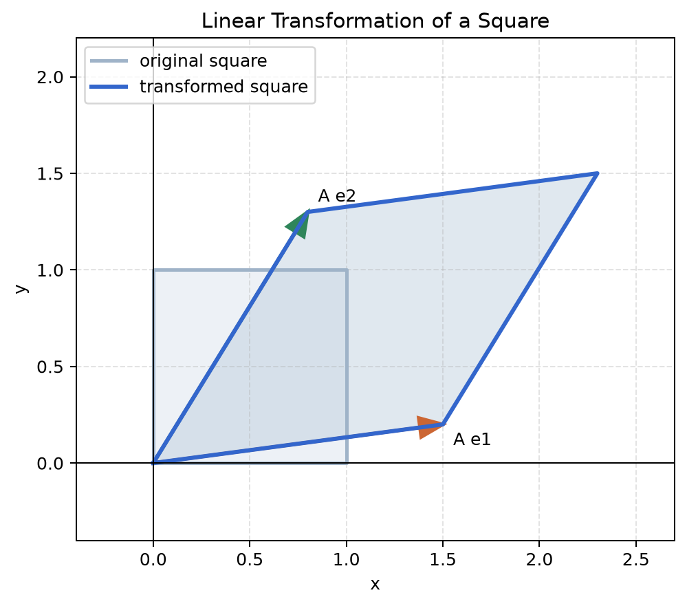

# 第 4 章 矩阵与线性变换

<div class="chapter-intro" markdown="1">
  <span class="chapter-pill">矩阵入门</span>
  <span class="chapter-pill">线性变换</span>
  <span class="chapter-pill">模型表达前置</span>
  <p>这一章会把前面学到的向量进一步组织起来，让你理解**矩阵**既是“按行按列排好的数字表”，也是“把向量整体变换”的工具。</p>
</div>

<div class="reading-focus" markdown="1">
<strong>阅读重点</strong>

- 先把**矩阵**理解成“有行有列的数字表”，建立行列定位意识
- 再理解**矩阵乘向量**本质上是在对向量执行统一规则的处理
- 特别留意“矩阵既组织数据，又表达**线性变换**”这两个角色
</div>

## 本章导读

这一章会把前面已经学过的向量进一步组织起来。第 3 章解决的是“一个样本怎样整体表示”，而这一章要继续回答另一个更大的问题：当我们有很多样本、很多特征，或者想对一个向量做统一变换时，怎样才能既写得清楚，又算得高效。矩阵正是为这种场景服务的工具。很多读者第一次遇到矩阵时，会觉得它忽然变得又大又复杂，好像只是把数字排成了更难看的方阵；但从学习顺序上看，矩阵并不是突然跳出来的新对象，而是向量思路继续向前推进后的自然结果。

阅读本章时，建议始终保留两个视角。第一个视角是“数字表”视角，也就是把矩阵看成按行按列排好的数据；第二个视角是“变换规则”视角，也就是把矩阵看成一个会把输入向量整体变成另一个向量的操作。刚开始接触矩阵时，很多读者会在这两个视角之间来回摇摆，这其实是正常的。真正重要的不是立刻做复杂运算，而是逐步意识到：这两个视角描述的其实是同一个对象。只要这一点开始变得清楚，后面看到矩阵乘法、数据矩阵和线性层公式时，就不会觉得它们彼此割裂。

!!! info "配套内容"
    - [图示理解](#chapter-04-figures)：先看矩阵怎样改变网格、箭头和图形。
    - [Python 小实验](#chapter-04-python)：观察矩阵乘向量和线性变换的数值结果。
    - [本章小结](#chapter-04-summary)：回顾矩阵作为数据组织工具和变换工具的双重角色。

## 学习目标

学完本章后，读者应当能够达到以下要求：

- 能够根据行数和列数判断一个矩阵的基本结构
- 能够把矩阵乘向量理解为“每一行分别做一次点积，再组合成新的向量”
- 能够用图像直觉理解矩阵会怎样改变平面中的向量和图形
- 能够初步看懂机器学习里常见的 \(X\)、\(W\)、\(Wx+b\) 等矩阵化表达

本章的学习不以复杂推导为目标，而以“建立统一认识”为目标。读者只要能够同时把矩阵看成数据表、计算规则和空间变换工具，就已经抓住了本章的核心。

## 本章为什么重要

如果说第 3 章解决的是“一个样本可以写成一个向量”，那么这一章要继续解决的问题就是：当我们面对很多个向量，或者想对一个向量做系统性变换时，应该用什么工具来表达。只要真正进入机器学习的公式和数据表述，这个问题就会立刻出现。因为现实中的数据几乎从来不是单个样本孤立存在，而是许多样本一起出现；模型参数也往往不只控制一个方向，而是要同时作用在多个特征上。

在这种情况下，矩阵的重要性就会变得非常明显。一批样本数据常常排成一个矩阵，线性模型和神经网络中的参数常常写成矩阵，矩阵乘法又恰好允许我们把“很多个量一起处理”的想法压缩成统一的计算规则。也正因为如此，矩阵并不是线性代数中可有可无的附加内容，而是后续理解模型公式、批量计算、线性层结构和高维数据组织方式的必经环节。

更重要的是，矩阵提供了一种非常有力量的统一视角。它既可以表示“数据怎样被排在一起”，又可以表示“一个空间中的对象怎样被整体改变”。前一种理解帮助我们读懂数据集和参数表，后一种理解帮助我们看懂线性变换、特征空间和模型结构。只要这两层理解开始连起来，矩阵就不再只是一个要背规则的计算对象，而会变成后续很多模型表达的共同语言。

## 先修知识清单

阅读本章前，最好已经对向量的基本概念、向量加法与数乘、二维平面坐标系，以及第 3 章里关于点、箭头、距离和点积的直觉有比较清晰的印象。不过，这里的要求依然主要是直觉层面的，而不是计算层面的。也就是说，你不必一开始就能熟练完成所有向量运算，只要能够理解“一个向量可以整体表示一个对象”，就已经足以进入矩阵这一章。

如果这些内容还不完全熟练，也不影响本章继续往下读，因为本章会尽量从图像和例子出发，再逐步过渡到矩阵乘法和线性变换。更实际的做法是把第 3 章当作一块随时可以回看的地基：读到矩阵乘向量时就回想点积在做什么，读到线性变换时就回想箭头在平面中如何变化。这样来回往返，反而更有助于把前后章节真正连成一个整体。

## 直觉解释

### 1. 矩阵先是“排整齐的数字表”

很多学生第一次看到矩阵时，会觉得它只是一个排列得更复杂的符号。其实从最朴素的角度看，矩阵可以先理解为“把数字按行和列排成一个表”。这一步之所以重要，是因为它能帮助读者先把陌生感降下来：矩阵并不是突然冒出来的神秘公式，而只是把原本分散的数字组织得更整齐、更便于整体处理。

例如：

\[
A =
\begin{bmatrix}
2 & 1 & 0 \\
3 & -1 & 4
\end{bmatrix}
\]

这个矩阵有 2 行、3 列，因此它是一个 \(2 \times 3\) 矩阵。如果先把矩阵理解为“有组织的数据表”，那么它的第一层含义就会清楚很多。因为无论后面矩阵会不会参与运算、会不会表示变换，它最初都先是在帮助我们把大量数字放进一个清晰结构里。

### 2. 矩阵可以把多个数字一起处理

向量是按顺序排列的一组数字，矩阵则可以看成“对这组数字执行统一处理规则的对象”。也就是说，矩阵的价值不只是把数字摆在纸上，更在于它允许我们同时处理多个分量，而不必把每一步都拆成零散的单独计算。

例如，设：

\[
x =
\begin{bmatrix}
1 \\
2
\end{bmatrix},
\qquad
A =
\begin{bmatrix}
2 & 1 \\
1 & 3
\end{bmatrix}
\]

那么：

\[
Ax =
\begin{bmatrix}
2 & 1 \\
1 & 3
\end{bmatrix}
\begin{bmatrix}
1 \\
2
\end{bmatrix}
=
\begin{bmatrix}
2 \times 1 + 1 \times 2 \\
1 \times 1 + 3 \times 2
\end{bmatrix}
=
\begin{bmatrix}
4 \\
7
\end{bmatrix}
\]

这一计算过程最值得读者把握的，不是符号排列本身，而是背后的动作顺序：原向量先提供输入，矩阵的每一行再各自做一次“加权求和”，最后把这些结果重新组合成新的向量。只要这个过程在脑中开始变得清楚，矩阵乘向量就不会再像机械规则，而会显得非常有结构感。

### 3. 线性变换是在“整体地改变向量”

矩阵更重要的一面在于，它不仅用于数值计算，还可以表达“变换”。也就是说，矩阵并不是只负责算出几个新数字，它还在告诉我们：如果把整个平面或空间中的对象都交给同一条规则，会发生怎样的整体变化。

例如，一个矩阵可以让平面上的图形发生拉伸、压缩、旋转或剪切。此时矩阵就不再只是一个数字表，而是在表达一种“对整个空间施加统一规则”的方式。对初学者来说，这一层理解非常关键，因为它会把原本看似枯燥的运算对象，变成一个真正能“改变图形”的几何工具。

如果把一个单位正方形放在平面中，再让矩阵去作用它，这个正方形可能会被拉伸、倾斜，从而变成平行四边形。这正是线性变换最直观的图像来源。

## 核心概念

### 1. 矩阵

矩阵（matrix）是按行和列排列的数表。这里最重要的学习目标，不是立刻记住全部记号，而是先建立位置意识：矩阵里的每个数都不是孤立放置的，它总有自己的行位置和列位置，而这些位置会决定它在数据表达和运算中的作用。

一般写成：

\[
A =
\begin{bmatrix}
a_{11} & a_{12} & \cdots & a_{1n} \\
a_{21} & a_{22} & \cdots & a_{2n} \\
\vdots & \vdots & \ddots & \vdots \\
a_{m1} & a_{m2} & \cdots & a_{mn}
\end{bmatrix}
\]

这里，\(m\) 表示行数，\(n\) 表示列数，\(a_{ij}\) 表示第 \(i\) 行第 \(j\) 列的元素。只要读者能够逐步习惯这种“按行按列定位”的读法，后面看数据矩阵、参数矩阵和矩阵运算时就会顺畅很多。

!!! abstract "定义 4.1（矩阵）"
    按照固定行列结构排列起来的数表，称为**矩阵**。

如果先从全书学习路径往后看，可以把矩阵理解成“二维数据结构”的代表。后面到了神经网络部分，读者还会遇到比矩阵更一般的多维数组结构，它们通常统称为**张量**（tensor）。不过在当前这一章里，先把二维的行列结构真正读顺，比提前追求更高维名词更重要。

### 2. 矩阵乘向量

如果矩阵 \(A\) 的列数与向量 \(x\) 的维度一致，那么可以定义 \(Ax\)。这一条件之所以重要，是因为矩阵的每一行都需要和向量的全部分量对应起来；如果列数对不上，就无法完成这种统一的加权求和。

学习这一部分时，最重要的不是机械记住公式，而是理解：矩阵的每一行都在对向量做一次点积，这些点积结果再按顺序组合成新的向量。因此，矩阵乘向量本质上是在同时执行多次“加权求和”。只要这一层看清楚，后面读 \(Wx+b\) 一类模型公式时就会自然很多。

!!! abstract "定义 4.2（矩阵乘向量）"
    当矩阵的列数与向量维度一致时，矩阵对向量的每一行分别做点积，并把结果按顺序组合成新向量，这一运算称为**矩阵乘向量**。

### 3. 单位矩阵

单位矩阵记作 \(I\)，例如二维情况：

\[
I =
\begin{bmatrix}
1 & 0 \\
0 & 1
\end{bmatrix}
\]

它的作用非常像数字里的 1，因为：

\[
Ix = x
\]

也就是说，单位矩阵不会改变原来的向量。它在矩阵世界中的角色，很像数字世界里的 1：不引入新的变化，只保持原对象不变。

!!! abstract "定义 4.3（单位矩阵）"
    主对角线元素为 1、其余元素为 0，并满足与向量相乘后保持向量不变的方阵，称为**单位矩阵**。

### 4. 线性变换

线性变换（linear transformation）强调两件事：向量加法结构被保留，数乘结构也被保留。更直观地说，矩阵做变换时不会把直线随意扭曲成无规则的曲线，而是在保持线性结构的前提下，有规则地改变空间中的对象。对初学者来说，不必一开始就背完整形式定义，只要先抓住“整体改变，但不胡乱扭曲结构”这一点，就已经足够重要。

!!! abstract "定义 4.4（线性变换）"
    保持向量加法与数乘结构不变的变换，称为**线性变换**。

## 例题与推导

### 例 1：把矩阵当作数据表

设有两个学生的三项特征：

\[
X =
\begin{bmatrix}
80 & 12 & 3 \\
92 & 10 & 4
\end{bmatrix}
\]

读这个矩阵时，可以按教材中最常用的方式理解：第 1 行是第 1 个学生，第 2 行是第 2 个学生，而每一列对应一个特征。这就是矩阵在机器学习里最常见的第一种角色，也就是组织一批样本数据。只要这一层理解稳定下来，后面看到 \(X\) 这样的数据矩阵记号时，就不会只把它当成抽象字母，而会知道它通常代表“很多样本按行排在一起”的结果。

### 例 2：矩阵乘向量

设：

\[
A =
\begin{bmatrix}
2 & 1 \\
1 & 3
\end{bmatrix},
\qquad
x =
\begin{bmatrix}
1 \\
2
\end{bmatrix}
\]

那么：

\[
Ax =
\begin{bmatrix}
4 \\
7
\end{bmatrix}
\]

这个结果可以从“行向量逐次作用”的角度理解：第一行 \((2, 1)\) 与向量 \(x\) 做点积，得到 4；第二行 \((1, 3)\) 与向量 \(x\) 做点积，得到 7。这样一来，矩阵乘法和第 3 章的点积就不再是割裂的两个主题，而会显得是非常自然的延伸。

### 例 3：矩阵把正方形变成平行四边形

设矩阵：

\[
A =
\begin{bmatrix}
1.5 & 0.8 \\
0.2 & 1.3
\end{bmatrix}
\]

它会把基向量

\[
e_1 =
\begin{bmatrix}
1 \\
0
\end{bmatrix},
\qquad
e_2 =
\begin{bmatrix}
0 \\
1
\end{bmatrix}
\]

分别变成：

\[
Ae_1 =
\begin{bmatrix}
1.5 \\
0.2
\end{bmatrix},
\qquad
Ae_2 =
\begin{bmatrix}
0.8 \\
1.3
\end{bmatrix}
\]

要把这个结论真正看清楚，可以先把单位正方形想成由四个顶点围成的图形：原点 \(O=(0,0)\)、点 \(e_1=(1,0)\)、点 \(e_2=(0,1)\)，以及右上角的点 \(e_1+e_2=(1,1)\)。其中，从原点出发指向 \(e_1\) 和 \(e_2\) 的两条边，正好就是这块单位正方形的“横边”和“竖边”。

矩阵 \(A\) 作用之后，原点仍然留在原点，因为 \(A0=0\)。与此同时，原来那两条边的方向分别被改写成 \(Ae_1\) 和 \(Ae_2\)。也就是说，新的图形不再是沿坐标轴展开，而是沿着

\[
\begin{bmatrix}
1.5 \\
0.2
\end{bmatrix}
\quad \text{和} \quad
\begin{bmatrix}
0.8 \\
1.3
\end{bmatrix}
\]

这两个新方向展开。

接下来还要看右上角那个顶点去了哪里。原来它对应的是 \(e_1+e_2\)，而矩阵对加法保持线性结构，所以

\[
A(e_1+e_2)=Ae_1+Ae_2=
\begin{bmatrix}
1.5 \\
0.2
\end{bmatrix}
+
\begin{bmatrix}
0.8 \\
1.3
\end{bmatrix}
=
\begin{bmatrix}
2.3 \\
1.5
\end{bmatrix}
\]

这样一来，新的四个顶点就变成了 \(O\)、\(Ae_1\)、\(Ae_2\) 和 \(Ae_1+Ae_2\)。从图像上看，这四个点围成的图形正是一个平行四边形：它的两组对边仍然分别互相平行，只是长度和方向都发生了变化。也正因为如此，我们才说矩阵不仅是在“改几个数字”，而是在把整个单位正方形按统一规则整体变形。

### 例 4：为什么矩阵适合表达一层线性模型

如果有一个输入向量：

\[
x =
\begin{bmatrix}
x_1 \\
x_2 \\
x_3
\end{bmatrix}
\]

再设一层线性变换的参数矩阵为：

\[
W =
\begin{bmatrix}
w_{11} & w_{12} & w_{13} \\
w_{21} & w_{22} & w_{23}
\end{bmatrix}
\]

那么：

\[
Wx =
\begin{bmatrix}
w_{11}x_1 + w_{12}x_2 + w_{13}x_3 \\
w_{21}x_1 + w_{22}x_2 + w_{23}x_3
\end{bmatrix}
\]

要读清这个式子，可以先把输入向量 \(x\) 理解成“一条样本记录的 3 个特征”，例如 \(x_1\) 表示面积，\(x_2\) 表示房龄，\(x_3\) 表示距离某个参照点的数值。此时，矩阵 \(W\) 的第一行就在回答“怎样把这 3 个特征组合成第 1 个输出”，第二行则在回答“怎样把这 3 个特征组合成第 2 个输出”。

也就是说，矩阵的每一行都像是一组独立的加权规则：第一行产生上面的输出分量，第二行产生下面的输出分量。原来如果手工写，我们需要分别写出两条加权求和式子；而写成 \(Wx\) 之后，这两件事就被压缩进了一次矩阵乘法里。这样再去看线性模型或神经网络中的一层计算，就会更自然：矩阵并不是把式子写得更花，而是在把“同一个输入同时生成多个输出”的结构统一表达出来。

## 图示理解 { #chapter-04-figures }

先看矩阵作为“有行有列的数字表”：



读这张图时，首先要看的不是具体数字大小，而是它们排布的方式。矩阵之所以和普通数字列表不同，就在于每个数字都被放在一个明确的行、列位置上。也就是说，矩阵里的一个元素并不只是“某个数”，而是“第几行、第几列上的那个数”。只要这层定位意识开始稳定，后面读到 \(a_{ij}\) 这类记号时，你就不会把它看成一串难懂的下标，而会自然理解成“第 \(i\) 行第 \(j\) 列”的位置说明。

这一步对机器学习尤其重要，因为后面数据矩阵里，“行”常常对应样本，“列”常常对应特征。也就是说，矩阵不是把数字随便堆在一起，而是在用一种有结构的方式组织很多样本和很多特征。

再看矩阵作为线性变换：



读第二张图时，可以先看灰色的单位正方形，把它理解成“变换前的标准小方格”。再看蓝色图形，它表示矩阵作用之后，原来的方形被整体拉伸、倾斜或旋转成了新的形状。真正最关键的是那两支彩色箭头，因为它们对应的是两个基向量 \(e_1\) 和 \(e_2\) 在矩阵作用后的新位置。

接下来可以再往前想一步：为什么只知道这两支箭头的新位置，就足以决定整个方形怎么变？原因在于，单位正方形里的任一点都可以看成 \(e_1\) 和 \(e_2\) 的某种组合。例如右上角是 \(e_1+e_2\)，中间靠右一点的某个位置，也可以理解成“先沿 \(e_1\) 走一部分，再沿 \(e_2\) 走一部分”。矩阵作用之后，这些“走法”本身没有消失，只是原来沿 \(e_1\)、\(e_2\) 的移动，统一改成了沿 \(Ae_1\)、\(Ae_2\) 的移动。

这一点很重要：矩阵并不是先去直接“改整个正方形”，而是先规定最基本的两个方向会怎样变化；而整个图形之所以跟着改变，正是因为组成这个图形的所有点，都会按同一套线性规则重新定位。只要这层关系读顺，后面再看矩阵乘向量、线性层和参数变换时，就不会觉得矩阵只是机械运算表，而会把它真正看成一个“整体改变空间”的工具。

## Python 小实验 { #chapter-04-python }

下面先用纯 Python 实现一个 \(2 \times 2\) 矩阵乘向量：

```python
# 用嵌套列表表示一个 2x2 矩阵。
matrix = [
    [2, 1],
    [1, 3],
]

# 用列表表示一个二维向量。
vector = [1, 2]

# 第一个输出分量来自矩阵第一行和向量的点积。
first_value = matrix[0][0] * vector[0] + matrix[0][1] * vector[1]
# 第二个输出分量来自矩阵第二行和向量的点积。
second_value = matrix[1][0] * vector[0] + matrix[1][1] * vector[1]

# 把两个输出分量组合成新的向量。
result = [first_value, second_value]
print("矩阵乘向量结果:", result)
```

如果你想进一步观察“矩阵如何改变图形”，可以用下面这段代码变换一个单位正方形的四个顶点：

```python
def multiply_matrix_vector(matrix: list[list[float]], vector: list[float]) -> list[float]:
    """计算 2x2 矩阵与二维向量的乘积。"""
    return [
        matrix[0][0] * vector[0] + matrix[0][1] * vector[1],
        matrix[1][0] * vector[0] + matrix[1][1] * vector[1],
    ]


# 这个矩阵会把正方形拉伸并略微剪切。
matrix = [
    [1.5, 0.8],
    [0.2, 1.3],
]

# 单位正方形的四个顶点。
square_points = [
    [0, 0],
    [1, 0],
    [1, 1],
    [0, 1],
]

# 把每个顶点都经过同一个矩阵变换。
transformed_points = [multiply_matrix_vector(matrix, point) for point in square_points]
print("变换后的顶点:", transformed_points)
```

这两段代码的教学意义在于：

- 第一段帮助你把矩阵乘法拆开看清楚
- 第二段帮助你看到“矩阵不是只算一个数，而是在整体改变一批点”

## 与机器学习的联系

### 1. 数据集经常以矩阵形式出现

如果有 \(m\) 个样本、每个样本有 \(n\) 个特征，那么数据常写成：

\[
X \in \mathbb{R}^{m \times n}
\]

这里：

- 行通常表示样本
- 列通常表示特征

这就是为什么很多教材会把训练数据记作 \(X\)。

### 2. 线性层的核心就是矩阵乘法

在神经网络和很多线性模型里，常见表达是：

\[
y = Wx + b
\]

如果把 \(x\) 看成输入向量，把 \(W\) 看成参数矩阵，那么这一步本质上就是：

- 先做矩阵乘向量
- 再加偏置

所以只要矩阵乘法不再陌生，后面的模型公式就会好懂很多。

### 3. 一批样本可以一起计算

机器学习里经常不是只算一个样本，而是一次处理一批样本。此时矩阵表达会非常自然：

\[
Y = XW
\]

这表示：

- \(X\) 里放着一批输入样本
- \(W\) 是参数
- 计算结果 \(Y\) 也是一批输出

这种写法不仅简洁，而且方便程序实现和硬件加速。

## 常见误区

### 误区 1：矩阵只是更大的表格

不完全对。矩阵确实像表格，但它更重要的意义是可以表示线性变换和成批计算规则。

### 误区 2：矩阵乘法只是机械运算

不是。矩阵乘法的背后其实是在做“多次点积”和“统一变换”，这正是它在机器学习里有价值的原因。

### 误区 3：线性变换就是任意图形变化

不是。线性变换有严格结构，它会保持加法和数乘关系，不会随意把直线扭成乱七八糟的曲线。

### 误区 4：只要会按公式算矩阵乘法就够了

还不够。更重要的是理解：

- 行和列分别在表达什么
- 为什么每一行都像一次点积
- 为什么一个矩阵能整体改变空间中的点和向量

## 练习题

1. 判断下面矩阵分别有几行几列：

\[
\begin{bmatrix}
1 & 2 \\
3 & 4
\end{bmatrix},
\qquad
\begin{bmatrix}
1 & 0 & 2
\end{bmatrix},
\qquad
\begin{bmatrix}
2 \\
5 \\
7
\end{bmatrix}
\]

2. 设

\[
A =
\begin{bmatrix}
2 & 1 \\
1 & 3
\end{bmatrix},
\qquad
x =
\begin{bmatrix}
1 \\
2
\end{bmatrix}
\]

求 \(Ax\)。

3. 用自然语言解释“矩阵的每一行和向量做一次点积”这句话是什么意思。
4. 为什么说单位矩阵不会改变向量？
5. 试着把“3 个样本、每个样本 2 个特征”的数据写成一个 \(3 \times 2\) 矩阵。
6. 观察一个单位正方形经过矩阵变换后变成平行四边形，这种现象说明了什么？

??? note "参考答案"
    1. 第一个是 \(2 \times 2\)（2 行 2 列）；第二个是 \(1 \times 3\)（1 行 3 列）；第三个是 \(3 \times 1\)（3 行 1 列）。
    2. \(Ax = \begin{bmatrix} 2 \times 1 + 1 \times 2 \\ 1 \times 1 + 3 \times 2 \end{bmatrix} = \begin{bmatrix} 4 \\ 7 \end{bmatrix}\)。
    3. 它表示：矩阵的每一行都是一组权重，与输入向量做点积，相当于对输入做一次加权求和；矩阵有几行，输出就有几个分量。
    4. 因为单位矩阵的每一行只在对应位置为 1、其余为 0，与向量做点积时恰好原样取出该位置的分量，所以输出与输入完全相同，向量不被改变。
    5. 答案不唯一，每行一个样本、每列一个特征，例如 \(\begin{bmatrix} 1 & 2 \\ 3 & 4 \\ 5 & 6 \end{bmatrix}\)。
    6. 说明线性变换会保持直线仍是直线、平行仍然平行，把整个网格均匀地拉伸或剪切，而不会把直线弯成曲线——这正是“线性”在几何上的含义。

## 本章知识结构

| 概念 | 一句话核心 | 在机器学习中的角色 |
| --- | --- | --- |
| 矩阵 | 有行有列地组织数字和规则 | 用来表示数据集、参数组和线性层 |
| 矩阵乘向量 | 每一行都在对输入做一次点积 | 是 \(Wx+b\) 这类模型计算的核心 |
| 线性变换 | 矩阵会整体改变向量和空间结构 | 帮助理解投影、旋转、拉伸与特征提取 |
| 数据矩阵 | 一批样本可以一起写、一起算 | 支撑批量训练、矩阵化实现与加速 |

知识脉络：

- 先把多个数组织成**矩阵**
- 再把矩阵读成“多次点积组成的统一计算”
- 接着把矩阵理解为对空间的**整体变换**
- 最后回到机器学习里，把数据和参数都放进**矩阵表达**

## 本章小结 { #chapter-04-summary }

本章最核心的任务，是让读者完成从“向量表示单个对象”到“矩阵统一组织多组对象与规则”的过渡。矩阵首先可以被看成有行有列的数字结构，但它真正重要的地方，在于它既能组织一批样本数据，也能组织一组参数关系，还能把这些关系写成统一而高效的计算过程。只要这层作用开始看清，矩阵就不再只是更大的数字表，而会变成连接数据表达、模型计算和空间变换的关键工具。

进一步说，矩阵乘向量把“多次点积”收束成一次整体运算，线性变换则把这种运算重新解释为空间中的投影、旋转、拉伸与压缩。对第一次学习的人来说，本章真正需要带走的，不只是矩阵乘法的步骤，而是一个稳定认识：后面频繁出现的 \(XW\)、\(Wx+b\)、线性层、投影和降维，本来就是矩阵语言在不同场景中的自然延伸。只要本章基础扎实，后续进入特征值、奇异值分解、线性模型和神经网络时，阅读负担就会明显下降。

<div class="chapter-nav">
  <a href="../03-vectors-and-geometry/">
    <strong>上一章</strong>
    回到第 3 章：向量与几何直觉
  </a>
  <a href="../">
    <strong>章节目录</strong>
    返回章节导航页
  </a>
  <a href="../05-eigenvalues-and-svd/">
    <strong>下一章</strong>
    进入第 5 章：特征值、特征向量与奇异值分解
  </a>
</div>


