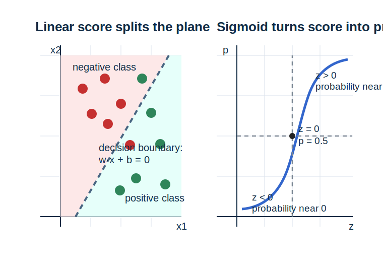

# 第 12 章 线性模型中的数学

<div class="chapter-intro" markdown="1">
  <span class="chapter-pill">线性回归</span>
  <span class="chapter-pill">逻辑回归</span>
  <span class="chapter-pill">正则化</span>
  <p>这一章会把前面学过的<strong>向量、矩阵、导数、概率与优化</strong>真正汇合到具体模型中，让你看到<strong>线性模型</strong>为何能成为机器学习入门阶段最重要的一类模型，并为下一章从线性结构自然推进到神经网络打下桥梁。</p>
</div>

<div class="reading-focus" markdown="1">
<strong>阅读重点</strong>

- 先把**线性模型**理解为“加权求和再做解释”的统一框架
- 把**损失函数**理解为“模型好坏的量化标准”
- 把**正则化**理解为“在拟合数据之外额外加入约束”
</div>

## 本章导读

到了这一章，前面学过的很多数学对象终于开始真正汇合。第 3 章的向量告诉我们如何表示一条样本记录，第 4 章的矩阵告诉我们如何批量组织数据，第 6 到第 8 章的导数、梯度和优化方法告诉我们如何调整参数，第 9 到第 11 章的概率统计则告诉我们如何理解不确定性与泛化。而线性模型，正是把这些内容第一次真正放到一个完整模型框架里来使用。

很多初学者会低估线性模型的重要性，觉得它似乎只是机器学习里的入门例子。但从学习路径来看，线性模型并不只是“简单模型”，它更像一座桥。因为它的表达足够简单，能让我们清楚看到特征如何进入模型、参数如何控制输出、损失函数如何衡量误差、梯度下降如何更新参数、正则化又如何约束模型复杂度。也正因为如此，它是最适合用来复盘前面数学主线的一类模型。

本章的重点不是只停留在“会写一个公式”，而是要真正理解线性模型背后的数学结构。在线性回归里，我们关心的是连续输出，损失通常和平方误差相关；在逻辑回归里，我们关心的是分类概率，输出要经过 sigmoid 这类非线性变换；在正则化里，我们则开始关注模型不仅要拟合训练数据，还要避免过度复杂。只要这些主线真正连起来，后面走向更复杂模型时就会自然很多。

!!! info "配套内容"
    - [Python 小实验](#chapter-12-python)：观察线性分数、sigmoid 输出和正则化项的数值意义。
    - [本章小结](#chapter-12-summary)：回顾线性模型作为全书中期收束点的核心作用。

## 学习目标

学完本章后，读者应当能够达到以下要求：

- 能够用 \(w \cdot x + b\) 的语言解释线性模型输出
- 能够区分线性回归与逻辑回归分别在解决什么任务
- 能够理解损失函数、梯度更新与正则化在模型中的角色
- 能够把本章模型公式与前面学过的向量、矩阵、导数和概率联系起来

第一次阅读本章时，可以先把注意力放在“框架如何汇合”上，而不必急于掌握所有推导细节。只要你已经看清楚线性模型并不是几个孤立公式，而是在统一输入表示、参数学习、概率解释和泛化控制这些主线，后面再看具体推导时就会更有方向感。

## 本章为什么重要

机器学习之所以被称为“学习”，是因为模型需要从数据中自动调整参数，以便在新样本上做出更合理的预测。而线性模型恰好是理解这一过程最理想的起点。因为它的结构足够简单，我们可以清楚地看到每个特征如何进入模型、每个参数如何影响输出、误差如何被量化成损失、梯度如何驱动参数更新。这种透明性，是很多更复杂模型暂时做不到的。

线性回归的重要性首先体现在回归任务上。它用一个线性表达式去拟合连续目标值，例如房价、销售额、温度等。尽管真实世界关系不总是严格线性的，但线性回归提供了一个非常清晰的数学起点：如果不同特征对目标的影响可以近似加总，那么模型就可以写成加权求和的形式。逻辑回归则进一步说明，线性结构并不只适用于连续预测；只要在加权和后再接一个合适的函数，就可以把输出解释为概率，用于分类任务。

正则化的重要性则来自泛化问题。前一章我们已经看到，模型在训练样本上表现好，并不自动保证它在新样本上也同样好。线性模型正好提供了一个最清楚的例子，让我们看见如何在拟合训练数据之外，再给参数大小加入约束。也就是说，本章不仅在讲一个模型家族，也在讲机器学习里“拟合数据”和“控制复杂度”之间的平衡。

## 先修知识清单

阅读本章前，最好已经对向量、点积、矩阵乘法、导数、梯度下降、概率输出和泛化问题有比较稳定的直觉，尤其要记得两个核心表达：一是第 3 章和第 4 章里反复出现的 \(w \cdot x + b\) 或 \(Wx+b\)；二是第 8 章中参数更新依赖梯度方向的思想。如果这些内容还比较模糊，建议先回看对应章节中的“向量与点积”“矩阵乘向量”和“梯度下降”部分。

不过，本章依然以理解模型结构为主，而不是以大规模推导技巧为主。你不必一开始就能独立推完整个最小二乘法或逻辑回归的损失函数，只要能够把“输入、参数、输出、损失、更新”这几类对象逐步连起来，就已经抓住了最关键的起点。

## 直觉解释

### 1. 线性模型是在做“加权求和”

设一套房子的特征向量是 \(x = (x_1, x_2, x_3)\)，分别代表面积、房龄和距地铁站距离。如果我们认为这些因素会以某种近似可加的方式共同影响房价，那么最自然的模型写法就是

\[
\hat{y} = w_1x_1 + w_2x_2 + w_3x_3 + b
\]

这里每个权重都在衡量对应特征的重要程度，而偏置 \(b\) 则像一个基础起点。对初学者来说，最重要的直觉不是立刻背会记号，而是先理解：线性模型在做的事情，其实就是把多个特征按不同权重组合起来。你也可以把它想成一张“总评分表”: 每个特征都先贡献自己那一部分分数，最后再汇总成一个总分。只要这个画面建立起来，后面看到 \(w^\top x+b\) 时，就不会只觉得是在做机械点积，而会知道它本质上是在给样本做一次线性打分。

### 2. 损失函数是在回答“模型到底好不好”

模型写出来之后，并不意味着任务已经完成，因为我们还需要衡量当前参数是否真的让模型表现良好。损失函数正是在做这件事。它把“预测和真实值差得大不大”“分类判断是否合理”这类直觉问题，转换成了一个可以优化的数字。

从学习路径上看，损失函数之所以重要，是因为它把模型和优化方法真正连接起来了。没有损失，我们就不知道该往哪边调整参数；有了损失，梯度下降才有了明确目标。

### 3. 逻辑回归不是“线性回归做分类”

很多初学者会误以为逻辑回归只是把线性回归硬拿来处理分类。更准确地说，逻辑回归的核心思想是：先保留线性打分结构 \(w \cdot x + b\)，再通过 sigmoid 函数把这个分数压到 \(0\) 到 \(1\) 之间，从而把结果解释成概率。也就是说，它的“线性”体现在特征的加权组合上，而“逻辑”体现在如何把线性分数转成分类概率。若把这件事画到平面上来看，线性分数等于 0 的位置会形成一条分界线；分界线一侧的样本更偏向正类，另一侧则更偏向负类。这样一来，逻辑回归就不再只是“算一个概率”，而是在用线性打分先把空间划成两边，再用 sigmoid 把“离边界有多远”翻译成概率强弱。

### 4. 正则化是在防止模型把样本记得太死

如果参数可以无限增大，模型有时可能会在训练集上拟合得很好，但这并不一定意味着它学到了稳定规律。正则化就是在提醒模型：除了要尽量减小训练损失，还要避免参数变得过大或过于复杂。从直觉上说，它像是在对模型说：“你可以拟合数据，但不要过度用力。”

## 核心概念

### 1. 线性回归模型

对于输入向量 \(x \in \mathbb{R}^n\)，线性回归的预测通常写成

\[
\hat{y} = w^\top x + b
\]

其中 \(w\) 是权重向量，\(b\) 是偏置项。这个模型的核心结构非常简单：对输入特征做加权求和，再加上一个整体偏移。

!!! abstract "定义 12.1（线性回归）"
    用特征的线性组合 \(w^\top x + b\) 来预测连续输出的模型，称为**线性回归模型**。

### 2. 平方误差损失

若真实值为 \(y\)，预测值为 \(\hat{y}\)，则单个样本的平方误差损失常写为

\[
L = (\hat{y} - y)^2
\]

如果对一批样本取平均，就得到常见的均方误差。平方误差之所以常用，是因为它会对较大的偏差给予更强惩罚，也便于求导和优化。

!!! abstract "定义 12.2（平方误差损失）"
    用预测值与真实值之差的平方来衡量回归误差的损失，称为**平方误差损失**。

### 3. 逻辑回归与 sigmoid

逻辑回归先计算线性分数

\[
z = w^\top x + b
\]

再通过 sigmoid 函数

\[
\sigma(z) = \frac{1}{1+e^{-z}}
\]

把输出压到 \(0\) 到 \(1\) 之间，从而把它解释成某一类别的概率。

!!! abstract "定义 12.3（逻辑回归）"
    先对特征做线性组合，再用 sigmoid 函数把结果映射为概率的分类模型，称为**逻辑回归模型**。

### 4. 对数几率

逻辑回归里还有一个经常出现、但初学者容易跳过去的量，叫作**对数几率**（logit）。如果某个样本属于正类的概率为 \(p\)，那么它对应的几率是

\[
\frac{p}{1-p}
\]

而对数几率则写成

\[
\log \frac{p}{1-p}
\]

逻辑回归的一个关键特点，就是它把这个对数几率写成了线性形式 \(w^\top x + b\)。这意味着：模型虽然输出的是概率，但它在内部学习的仍然是一条线性打分规则。

!!! abstract "定义 12.4（对数几率）"
    将概率 \(p\) 转换为 \(\log \frac{p}{1-p}\) 这种形式后得到的量，称为**对数几率**；逻辑回归正是把对数几率建模为特征的线性组合。

### 5. 交叉熵损失

在二分类逻辑回归中，若真实标签 \(y \in \{0,1\}\)，预测概率为 \(\hat{p}\)，则常见的交叉熵损失（cross-entropy loss）为

\[
L = -\bigl(y \log \hat{p} + (1-y)\log(1-\hat{p})\bigr)
\]

这个损失的核心直觉是：当模型对正确类别给出高概率时，损失较小；当模型对正确类别给出低概率时，损失会迅速增大。

!!! abstract "定义 12.5（交叉熵损失）"
    用预测概率与真实标签之间的不一致程度来衡量分类误差的损失，称为**交叉熵损失**。

### 6. 正则化

正则化通常是在原有损失函数上，再加上一项对参数大小的惩罚。例如 L2 正则化常写成

\[
L_{\text{total}} = L_{\text{data}} + \lambda \|w\|^2
\]

这里 \(\lambda\) 控制惩罚强度。正则化的直觉含义是：不仅要拟合数据，还要避免参数无节制地变大。

!!! abstract "定义 12.6（正则化）"
    在原有数据损失之外，再加入对参数复杂度的惩罚项，以约束模型复杂度的方法，称为**正则化**。

为了帮助第一次接触模型的读者形成更稳定的整体图像，可以把线性回归与逻辑回归先做一个并排比较。这样一来，你在后面读到损失函数和输出解释时，就不容易把两者混在一起。

| 模型 | 主要任务 | 线性部分 | 最终输出 | 常见损失 |
| --- | --- | --- | --- | --- |
| 线性回归 | 预测连续数值 | \(w^\top x + b\) | 连续值 \(\hat{y}\) | 平方误差 |
| 逻辑回归 | 预测类别概率 | \(w^\top x + b\) | 概率 \(\hat{p}\) | 交叉熵 |

如果把本章再往后看一步，还会发现它其实已经在为第 13 章做铺垫。因为神经网络最底层仍然离不开这里的线性打分结构：先算 \(Wx+b\)，再决定是否接上非线性映射与更深层的组合。也就是说，第 13 章看起来像是在讲“新模型”，但真正新增的核心并不是把线性模型推翻，而是在保留线性组合的同时，把这种结构分层堆叠起来。

!!! note "读完本章后进入第 13 章时，可以先抓住这条过渡线"
    先记住线性模型的核心骨架是“输入向量 \(\rightarrow\) 线性打分 \(\rightarrow\) 输出解释 \(\rightarrow\) 损失函数 \(\rightarrow\) 梯度更新”；到神经网络时，你只需要把这条骨架想成被扩展成了“多层线性打分 \(\rightarrow\) 多次非线性变换 \(\rightarrow\) 同样的损失与梯度更新”。这样阅读下一章时，就不容易觉得像突然换了一门新课。

## 例题与推导

### 例 1：线性回归的最朴素预测

设房价模型写成

\[
\hat{y} = 0.8x + 50
\]

若房屋面积 \(x = 100\)，则预测值为

\[
\hat{y} = 0.8 \times 100 + 50 = 130
\]

这个例子虽然简单，但它清楚展示了线性回归的结构：一个特征经过权重缩放，再加上偏置，得到连续预测值。

### 例 2：平方误差如何衡量回归误差

若上一例中真实房价是 \(140\)，则平方误差损失为

\[
L = (130 - 140)^2 = 100
\]

这个值的意义不是“误差有 100 个单位”这样直接的口语解释，而是说明模型当前预测与真实值之间存在一定偏差，并且这种偏差已经被转换成了可优化的数字。

### 例 3：逻辑回归怎样输出概率

设某分类模型的线性分数为

\[
z = 2
\]

则 sigmoid 输出为

\[
\sigma(2) = \frac{1}{1 + e^{-2}} \approx 0.88
\]

这意味着模型认为该样本属于正类的概率约为 \(0.88\)。如果把分类边界理解为线性分数 \(z=0\) 的位置，那么 \(z=2\) 就表示这个样本已经落在正类一侧，而且离边界还有一定距离，所以 sigmoid 才会给出一个明显大于 \(0.5\) 的概率。这个例子说明，逻辑回归并不是直接输出类别标签，而是在先给出线性分数后，再把分数转换成概率。

如果把“分类边界”和“sigmoid 概率”放在同一张图里，这个过程会更容易连起来：



看左边这幅图时，先把虚线理解成线性分数 \(w \cdot x + b = 0\) 对应的分类边界：它把平面分成两侧，一侧的样本更偏向负类，另一侧的样本更偏向正类。再看右边的 sigmoid 曲线，就会明白它在做的是“压缩”：线性分数本来可以取任意实数，但经过 sigmoid 后，会被稳定地压到 \(0\) 到 \(1\) 之间，于是才有了概率解释。这样一来，逻辑回归就不再只是“算一个概率”，而会变成“先在线性空间里分边，再把离边界的远近翻译成概率强弱”的完整过程。

### 例 4：正则化为什么会偏好较小参数

设有两个模型在训练数据上的原始损失完全一样，都是 \(10\)。其中模型 A 的参数范数平方为 \(4\)，模型 B 的参数范数平方为 \(25\)。若 \(\lambda = 0.1\)，则加上 L2 正则化后的总损失分别为

\[
L_A = 10 + 0.1 \times 4 = 10.4
\]

\[
L_B = 10 + 0.1 \times 25 = 12.5
\]

这说明在拟合效果相同的情况下，正则化会更偏好参数更小、结构更克制的模型。这个例子有助于把“控制复杂度”从抽象口号变成具体数值判断。

## Python 小实验 { #chapter-12-python }

下面这段代码用最小示例把线性回归、逻辑回归和 L2 正则化的数值结构串起来。重点不在跑完整训练，而在于真正看清楚这几种公式在算什么。

```python
from __future__ import annotations

import math


def linear_score(features: list[float], weights: list[float], bias: float) -> float:
    """计算线性模型的加权分数。

    :param features: 输入特征向量
    :param weights: 权重向量
    :param bias: 偏置项
    :return: 线性分数
    """
    score: float = 0.0

    for feature_value, weight_value in zip(features, weights):
        # 每个特征先乘自己的权重，再加总起来。
        score += feature_value * weight_value

    return score + bias


def sigmoid(value: float) -> float:
    """计算 sigmoid 函数值。

    :param value: 输入分数
    :return: 映射到 0 到 1 之间的概率值
    """
    return 1.0 / (1.0 + math.exp(-value))


features: list[float] = [80.0, 12.0, 3.0]
weights: list[float] = [0.8, -0.2, 1.5]
bias: float = 10.0

score: float = linear_score(features, weights, bias)
probability: float = sigmoid(score / 50.0)

print("线性分数:", score)
print("逻辑回归概率输出:", probability)

# 计算一个简单的 L2 正则项。
lambda_value: float = 0.1
regularization: float = lambda_value * sum(weight * weight for weight in weights)
print("L2 正则项:", regularization)
```

如果你运行这段代码，会看到同一组特征先经过加权求和得到线性分数，再通过 sigmoid 变成分类概率，而 L2 正则项则额外度量了参数规模。这段示例把本章三条核心主线放到了一起。

## 与机器学习的联系

### 1. 线性模型是很多复杂模型的起点

无论是线性回归还是逻辑回归，它们都把前面学过的数学对象以非常透明的方式组织起来。很多更复杂模型虽然结构更深，但底层仍然离不开类似的线性组合。

### 2. 训练模型就是在最小化损失函数

前面学过的优化方法在本章真正落地：参数不再是抽象符号，而是要通过最小化损失函数来学习的对象。线性模型正是最适合观察这件事如何发生的场景。

### 3. 正则化是泛化能力的重要控制手段

前一章中的泛化问题，在本章第一次有了非常具体的模型内机制。正则化不是附属技巧，而是把“不要过度拟合样本”这一统计目标直接写进损失函数的方法。

### 4. 神经网络会在本章结构上继续加层

后面学习神经网络时，真正需要延续下去的并不是某一个具体公式，而是本章已经建立起来的阅读顺序：先看输入怎样进入模型，再看中间怎样算分数，再看输出如何解释，最后看损失与梯度怎样驱动更新。神经网络会把这条顺序扩展得更长，但不会把它改掉。

## 常见误区

### 误区 1：线性模型太简单，因此不值得认真学

线性模型虽然结构简单，但正因为简单，才最适合用来真正理解特征、参数、损失和优化是如何协同工作的。

### 误区 2：逻辑回归本质上是回归模型

逻辑回归名字里有“回归”，但它常用于分类任务。这里的“回归”更多来自历史命名，而不是说它在做连续值预测。

### 误区 3：损失函数只是训练时临时算一下的数字

损失函数不是陪衬，而是训练过程的核心方向盘。没有损失，就谈不上参数应往哪里更新。

### 误区 4：正则化只会让模型变差

正则化确实可能稍微牺牲训练集拟合，但它的目标是换取更稳的泛化表现。不能只看训练误差而忽略整体效果。

## 练习题

1. 请用自己的语言解释 \(w^\top x + b\) 在模型里表达了什么。
2. 设 \(x=(2,3)\)，\(w=(4,5)\)，\(b=1\)，求线性分数 \(w^\top x + b\)。
3. 为什么逻辑回归需要 sigmoid，而不能直接把线性分数当作概率？
4. 平方误差损失和交叉熵损失各更适合什么类型的任务？
5. 请用自己的语言解释正则化为什么能帮助控制模型复杂度。

## 本章知识结构

| 概念 | 一句话核心 | 在机器学习中的角色 |
| --- | --- | --- |
| 线性打分 | 用 \(w^\top x + b\) 把多个特征做加权组合 | 是线性回归、逻辑回归和后续神经网络的共同骨架 |
| 损失函数 | 用一个数衡量当前模型预测得好不好 | 决定训练时参数应朝哪个方向更新 |
| 概率映射 | 把线性分数进一步解释成概率输出 | 支撑逻辑回归中的分类判断 |
| 正则化 | 在拟合数据之外再约束模型复杂度 | 帮助控制过拟合并提升泛化稳定性 |

知识脉络：

- 先用**线性打分**把输入特征组织成统一输出
- 再用**损失函数**判断当前参数好不好
- 接着在分类任务里加入**概率映射**解释输出
- 最后用**正则化**把泛化控制写进训练目标

## 本章小结 { #chapter-12-summary }

本章最核心的任务，是把前面分散学习的数学主线第一次真正汇合到具体模型中。线性回归说明连续预测可以通过加权求和来完成，逻辑回归说明线性打分再经过概率映射后可以用于分类，而损失函数与梯度优化则把“模型好不好”真正转化成了可以学习的方向。只要这些结构开始连起来，线性模型就不再只是几个公式，而会成为理解机器学习训练机制的第一座桥梁。

在此基础上，正则化进一步把统计学中的泛化思想写进了模型训练过程本身。本章最后真正希望读者带走的，不只是线性回归或逻辑回归这些名称，而是一个稳定的核心认识：特征表示、参数学习、损失设计、概率解释和泛化控制，本来就是同一套模型框架中的不同侧面。也正因为如此，下一章继续进入神经网络时，你不会是在学习一套全新数学，而是在看这套模型框架怎样被进一步堆叠、扩展并加入非线性。

<div class="chapter-nav">
  <a href="../11-statistics-and-inference/">
    <strong>上一章</strong>
    回到第 11 章：统计学基础与估计
  </a>
  <a href="../">
    <strong>章节目录</strong>
    返回章节导航页
  </a>
  <a href="../13-neural-network-math/">
    <strong>下一章</strong>
    进入第 13 章：神经网络的数学基础
  </a>
</div>
