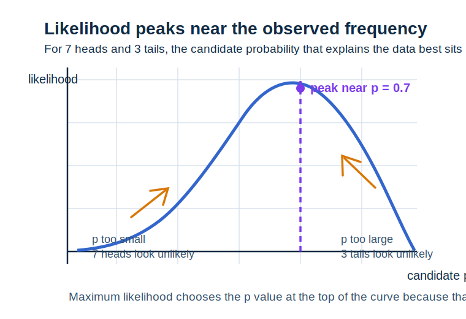
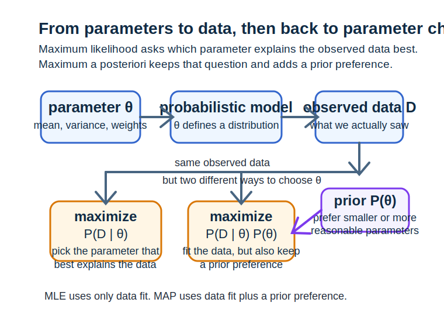

# 第 16 章 最大似然、最大后验与概率建模

<div class="chapter-intro" markdown="1">
  <span class="chapter-pill">似然</span>
  <span class="chapter-pill">贝叶斯</span>
  <span class="chapter-pill">概率建模</span>
  <p>这一章会把前面学过的<strong>概率、分布、线性模型与交叉熵</strong>进一步组织成“<strong>概率建模</strong>”的统一语言，帮助你真正理解为什么很多机器学习训练都可以写成<strong>最大似然</strong>问题，以及为什么在加入先验之后会自然走向<strong>最大后验</strong>。</p>
</div>

<div class="reading-focus" markdown="1">
<strong>阅读重点</strong>

- 先把**概率模型**理解为“模型不只输出答案，还在描述数据出现的可能性”
- 把**似然**理解为“参数固定时，当前数据有多容易被模型解释”
- 把**最大后验**理解为“在数据解释力之外，再加入先验偏好”
</div>

## 本章导读

前面第 9 到第 11 章已经帮助我们建立了概率、分布和统计估计的基础语言，第 12 章又让我们第一次看到逻辑回归、交叉熵和分类概率如何出现在模型训练中。但很多初学者读到这里时，仍然会觉得这些内容像是并列摆放的几个概念：概率是概率，损失是损失，训练是训练，贝叶斯又像另一套体系。真正让这些内容连起来的关键，是“概率建模”视角。

从这个视角看，模型训练不再只是“找一组参数让损失变小”，而是“找一组参数让当前观测数据在模型下显得尽可能合理”。一旦这层视角建立起来，很多原本零散的对象就会开始重新排队：分布不再只是统计课中的抽象函数，而会变成模型对数据的描述方式；似然不再只是新记号，而是在回答“当前参数有多能解释观测数据”；交叉熵和负对数似然之间的关系，也会自然变得清楚。

最大后验则是在此基础上再向前走一步。现实建模中，我们有时并不希望参数为了迎合数据而完全失去约束，这时就会引入先验，把原有的“解释数据”目标与“保持某种先验偏好”结合起来。也正因为如此，本章并不是单独新增一堆概率术语，而是在为后面更系统的统计学习、贝叶斯方法和正则化理解打基础。

!!! info "配套内容"
    - [图示理解](#chapter-16-figures)：先看“参数 -> 分布 -> 数据 -> 似然”这条关系链如何运作。
    - [Python 小实验](#chapter-16-python)：比较不同参数下数据的似然值，并观察加入先验后目标如何变化。
    - [本章小结](#chapter-16-summary)：回顾最大似然、最大后验与概率建模的统一视角。

## 学习目标

学完本章后，读者应当能够达到以下要求：

- 能够解释什么叫“模型在给数据分配概率”
- 能够区分概率 \(P(\text{数据}\mid\text{参数})\) 与参数后验 \(P(\text{参数}\mid\text{数据})\)
- 能够理解最大似然为什么会成为很多训练方法的统一表达
- 能够说明最大后验与正则化之间为什么会出现自然联系

第一次阅读本章时，可以先把重点放在“关系方向”上，而不必一开始就执着于所有公式记号。只要你能先看清谁是数据、谁是参数、谁是条件、谁是被更新的对象，本章最核心的结构就已经建立起来了。

## 本章为什么重要

机器学习模型之所以经常和概率联系在一起，并不是因为概率会让表达显得更复杂，而是因为数据本身就带有噪声、不确定性和有限样本特征。如果模型只能给出一个生硬的点预测，而不能表达“这个结果有多可能”“另一种结果出现得多不多”，那么很多训练目标、评估方法和泛化讨论都会失去统一语言。

最大似然的重要性在于，它给出了一个非常通用的训练原则：在候选参数里，选择那组最能让当前观测数据显得合理的参数。这个原则之所以强大，是因为它不依赖模型名字。无论是高斯噪声下的线性回归、伯努利输出下的逻辑回归，还是更复杂的概率模型，本质上都可以被重新组织成“在某个分布假设下，让观测数据的似然尽量大”。

最大后验的重要性则在于，它把“拟合数据”和“保留先验偏好”同时写进了目标。对机器学习学习者来说，这一点尤其重要，因为它能帮助我们重新理解正则化：很多时候，正则化并不是凭空额外加的一项惩罚，而是某种先验假设在优化目标中的体现。也正因为如此，本章会成为后面信息论、贝叶斯方法和泛化分析的关键桥梁。

## 先修知识清单

阅读本章前，最好已经对条件概率、贝叶斯公式、随机变量、常见分布、逻辑回归中的概率输出以及交叉熵有较稳定的直觉。特别是要记得两件事：第一，分布是在描述“一个随机量通常怎样出现”；第二，逻辑回归里的输出本来就已经在尝试给类别分配概率。

如果这些内容还有些模糊，也不必急着停下。本章本来就适合和第 9 到第 12 章做来回对照阅读。你可以把它理解成：前面的章节解决了概率语言和模型训练各自是什么，而本章要做的是把它们真正焊接起来。

## 直觉解释

### 1. 概率建模是在问“模型觉得什么样的数据更像真的”

当我们说一个模型是概率模型时，意思并不是它一定要输出非常复杂的概率分布图，而是说：给定一组参数后，它能够对不同可能出现的数据赋予不同的可能性。如果某些数据在当前参数下更常出现，我们就说它们概率更高；如果某些数据在当前参数下非常罕见，我们就说它们概率更低。

把这件事放回机器学习里，可以把模型想成一个“分布生成规则”。参数固定以后，它就不只是给出一个结果，还在隐含地说：“如果世界真按我这组参数运转，那么什么样的数据更常见，什么样的数据不太像会出现。”一旦接受了这种看法，训练目标就会自然变成：找到那组最能解释现有数据的参数。

### 2. 概率和似然看起来像同一件事，但读的方向不同

这是本章最容易混淆的地方。设模型参数记作 \(\theta\)，观测数据记作 \(D\)。从概率建模角度看，\(P(D \mid \theta)\) 可以读成“在参数 \(\theta\) 已知时，这份数据出现的概率是多少”。但当我们把数据 \(D\) 当作已知、把参数 \(\theta\) 当作待选对象时，同样这个式子又会被读成“这组参数对当前数据的解释力有多强”，这时它就被称为似然。

也就是说，公式没变，变的是阅读目的。把参数看成条件、把数据看成会发生的结果时，它是概率；把数据看成已知事实、把参数看成待比较候选时，它是似然。初学者一旦把这层“方向变了，角色就变了”的意识建立起来，后面的最大似然和最大后验就会顺很多。

### 3. 最大似然是在所有候选参数里挑“最会解释数据”的那组

设想你有很多条观测数据，而模型参数可以调。最大似然做的事情不是问“这组参数美不美观”，也不是先问“它是不是满足某个先验偏好”，而是先问最直接的问题：如果参数取这组值，当前这些观测数据会不会显得很自然、很常见？如果答案是更自然，就说明似然更高；如果数据在这组参数下看起来很别扭、很罕见，那似然就低。

这也是为什么最大似然会成为非常自然的训练原则。我们手头已经有数据了，最先要做的事情，当然就是找一组参数来尽量解释它们。对机器学习来说，这一步往往就已经足以产生许多熟悉的训练目标。

### 4. 最大后验是在“解释数据”之外再问“这种参数本来合不合理”

现实中，我们有时并不希望参数为了迎合有限数据而完全失控。比如，如果某组参数虽然能更紧地贴住当前样本，但它大得离谱或结构特别极端，我们往往会怀疑这是不是过拟合。最大后验的思路，正是在最大似然之外，再引入“参数本来更偏向什么样子”的先验判断。

从直觉上说，最大后验像是在做双重平衡：一方面，参数要能解释当前数据；另一方面，参数也不能背离我们原本对“合理参数”的总体偏好太远。也正因为如此，最大后验往往会和正则化自然产生联系。

## 核心概念

### 1. 概率模型

概率模型用参数 \(\theta\) 指定一个关于数据的概率分布，例如 \(P(x \mid \theta)\) 或 \(P(y \mid x, \theta)\)。在机器学习里，它的作用是告诉我们：在给定参数后，模型认为哪些观测更可能出现。

!!! abstract "定义 16.1（概率模型）"
    用参数化概率分布来描述数据或标签生成规律的模型，称为**概率模型**。

### 2. 似然函数

设观测数据为 \(D\)，参数为 \(\theta\)。把 \(D\) 固定、把 \(\theta\) 看作变量时，函数

\[
L(\theta; D) = P(D \mid \theta)
\]

称为似然函数。它不是在说“参数会随机地出现”，而是在比较“不同参数对当前数据的解释力”。

!!! abstract "定义 16.2（似然函数）"
    在固定观测数据的前提下，把参数作为自变量、用来衡量参数对当前数据解释程度的函数，称为**似然函数**。

### 3. 对数似然

因为多个样本的联合概率经常写成连乘形式，直接计算似然会不太方便，所以常常取对数，把连乘变成连加：

\[
\ell(\theta; D) = \log P(D \mid \theta)
\]

这称为对数似然。由于对数函数是单调递增的，最大化对数似然和最大化原始似然会得到同样的最优参数，但计算与求导通常更方便。

!!! abstract "定义 16.3（对数似然）"
    对似然函数取对数后得到的函数，称为**对数似然**。

### 4. 最大似然估计

最大似然估计（maximum likelihood estimation, MLE）就是选择让似然最大的参数：

\[
\hat{\theta}_{\text{MLE}} = \arg\max_{\theta} P(D \mid \theta)
\]

等价地，也常写成最大化对数似然。

!!! abstract "定义 16.4（最大似然估计）"
    在所有候选参数中，选择使观测数据似然最大的参数估计方法，称为**最大似然估计**。

### 5. 先验、后验与最大后验估计

如果在看数据之前，我们就对参数有某种先验偏好，可以用先验分布 \(P(\theta)\) 表示。观察到数据 \(D\) 之后，参数的更新分布写成

\[
P(\theta \mid D) = \frac{P(D \mid \theta)P(\theta)}{P(D)}
\]

这就是后验分布。若进一步选取使后验最大的参数，就得到最大后验估计（maximum a posteriori, MAP）：

\[
\hat{\theta}_{\text{MAP}} = \arg\max_{\theta} P(\theta \mid D)
\]

由于 \(P(D)\) 与参数无关，所以等价于最大化

\[
P(D \mid \theta)P(\theta)
\]

!!! abstract "定义 16.5（最大后验估计）"
    在综合考虑数据似然与参数先验后，选择使后验概率最大的参数估计方法，称为**最大后验估计**。

### 6. 负对数似然

在机器学习优化里，我们更习惯最小化损失而不是最大化目标，因此常把最大化对数似然改写成最小化负对数似然：

\[
\mathcal{L}(\theta) = - \log P(D \mid \theta)
\]

这样一来，最大似然问题就自然转成了一个损失最小化问题。很多熟悉的损失函数，本质上都可以从这个角度重新理解。

!!! abstract "定义 16.6（负对数似然）"
    对数似然加上负号后得到、可直接作为优化损失使用的目标，称为**负对数似然**。

为了帮助第一次进入这一章的读者建立更稳的整体感，可以先把几个最常见对象并排对照：

| 对象 | 读法重点 | 角色 |
| --- | --- | --- |
| \(P(D \mid \theta)\) | 参数给定时，数据出现的概率 | 概率 / 似然 |
| \(\log P(D \mid \theta)\) | 用加法组织样本解释力 | 对数似然 |
| \(P(\theta)\) | 看数据之前对参数的偏好 | 先验 |
| \(P(\theta \mid D)\) | 看完数据后对参数的新判断 | 后验 |
| \(-\log P(D \mid \theta)\) | 适合最小化的训练目标 | 负对数似然损失 |

## 例题与推导

### 例 1：抛硬币中的最大似然

设一枚硬币正面概率为 \(p\)。如果我们抛了 10 次，其中 7 次正面、3 次反面，那么在伯努利模型下，这份数据的似然可以写成

\[
L(p) = p^7(1-p)^3
\]

这里最重要的不是马上求导，而是先看清它在说什么：如果某个候选 \(p\) 会让“7 次正面、3 次反面”这种结果更常出现，那么它的似然就更高。比如，\(p=0.7\) 往往比 \(p=0.2\) 更像是这份数据背后的真实参数。

若进一步取对数，可得

\[
\ell(p) = 7\log p + 3\log(1-p)
\]

对其求导并令导数为 0：

\[
\frac{7}{p} - \frac{3}{1-p} = 0
\]

解得

\[
p = 0.7
\]

这个结果和直觉完全一致：最大似然估计会把观测频率 \(7/10\) 直接提取为最能解释数据的参数。



先看这张图时，最值得先盯住的是那条蓝色曲线的最高点。左边区域对应“正面概率太小”，这会让 7 次正面显得不太自然；右边区域则对应“正面概率太大”，这又会让 3 次反面显得不太自然。于是，真正最会解释“7 次正面、3 次反面”这份数据的参数，就会落在中间那段峰值附近，也就是 \(p \approx 0.7\)。这样一来，“最大似然就是挑曲线最高点”这件事，就不再只是抽象定义，而会变成一幅可以直接读出来的图。

### 例 2：高斯噪声下线性回归为什么会走向平方误差

设线性模型写成

\[
y_i = w^\top x_i + b + \varepsilon_i
\]

并假设噪声 \(\varepsilon_i\) 服从均值为 0、方差为 \(\sigma^2\) 的高斯分布。那么在给定输入 \(x_i\) 与参数后，目标值 \(y_i\) 的条件分布就可写成

\[
y_i \mid x_i \sim \mathcal{N}(w^\top x_i + b, \sigma^2)
\]

这意味着，每个样本的对数似然里都会出现一个形如

\[
-(y_i - (w^\top x_i + b))^2
\]

的项。把所有样本加总后，最大化对数似然就等价于最小化平方误差和。也就是说，线性回归里常见的平方误差，并不是凭空拍脑袋选出来的，而是在“高斯噪声”这个概率假设下自然长出来的。

这个例子特别重要，因为它说明了一个更大的原则：训练目标往往不是孤立设计的，它背后常常对应着某种数据生成假设。

### 例 3：逻辑回归为什么会走向交叉熵

设分类标签 \(y \in \{0,1\}\)，模型给出正类概率

\[
\hat{p} = P(y=1 \mid x, \theta)
\]

则在伯努利模型下，一个样本的条件概率可写为

\[
P(y \mid x, \theta) = \hat{p}^y(1-\hat{p})^{1-y}
\]

取对数得到

\[
\log P(y \mid x, \theta) =
y\log \hat{p} + (1-y)\log(1-\hat{p})
\]

因此，最大化对数似然等价于最小化

\[
- \bigl(y\log \hat{p} + (1-y)\log(1-\hat{p})\bigr)
\]

这正是二分类里常见的交叉熵损失。于是，交叉熵就不再只是“分类时常用的损失函数”，而会变成“伯努利似然取负对数后的自然结果”。

### 例 4：最大后验为什么会自然连到正则化

设参数 \(w\) 的先验是零均值高斯分布：

\[
w \sim \mathcal{N}(0, \sigma_w^2 I)
\]

那么先验密度的对数里会出现一个形如

\[
- \|w\|^2
\]

的项。若我们最大化后验

\[
P(w \mid D) \propto P(D \mid w)P(w)
\]

则等价于最大化

\[
\log P(D \mid w) + \log P(w)
\]

进一步改写成最小化目标时，就会自然出现

\[
-\log P(D \mid w) + \lambda \|w\|^2
\]

这正是“负对数似然 + L2 正则项”的形式。这个例子说明，L2 正则化不仅是优化技巧，也可以被看成某种高斯先验在最大后验估计中的体现。

## 图示理解 { #chapter-16-figures }

理解似然与后验时，最值得先看的画面，不是某条复杂积分公式，而是“参数、分布、数据、目标函数”之间到底是谁在解释谁。只要这个方向感开始稳定，本章大多数公式都会变得容易很多。



先看这张图时，最值得先盯住的是上面那条从左到右的主线：参数 \(\theta\) 先定义一个概率模型，而这个概率模型再去解释我们已经观察到的数据 \(D\)。这一步如果读顺了，后面“为什么训练要回头比较参数”就会自然很多。接着再把视线移到下面两块橙色区域，你会看到最大似然和最大后验其实都在做“回头挑参数”这件事，只不过最大似然只看 \(P(D\mid\theta)\)，而最大后验还额外接入了右侧紫色的先验 \(P(\theta)\)。这样一来，两者的关系就不会再像两套分开的定义，而会变成同一条流程上的两个不同落点。

如果说上一张主图先帮你抓住了“参数如何定义数据世界、训练又如何回头选参数”这条总流程，那么下面这张分步图就是在把这条流程按阅读顺序慢慢拆开。

<div class="ml-loop">
  <div class="ml-loop-head">
    <strong>图 16.2 从参数到数据解释，再从数据回到参数选择</strong>
    <p>先顺着主流程读“参数怎样定义分布”，再逆着想“固定数据后，我们怎样比较不同参数的解释力”。</p>
  </div>
  <div class="ml-loop-cycle">
    <div class="ml-loop-step">
      <strong>1. 选择参数 theta</strong>
      <span>参数决定模型如何看待世界，例如均值、方差、分类边界或权重大小。</span>
    </div>
    <div class="ml-loop-step">
      <strong>2. 参数定义分布</strong>
      <span>一旦参数固定，模型就能为可能出现的数据分配概率。</span>
    </div>
    <div class="ml-loop-step">
      <strong>3. 观察真实数据 D</strong>
      <span>现在数据已经摆在面前，我们开始比较哪组参数更像能生成它们。</span>
    </div>
    <div class="ml-loop-step">
      <strong>4. 比较似然或后验</strong>
      <span>最大似然看解释力，最大后验则再加入先验偏好。</span>
    </div>
  </div>
  <div class="ml-loop-return">
    <strong>关键不是公式变了，而是阅读方向变了。</strong> 当参数固定、数据还没出现时，你在看概率；当数据固定、参数待比较时，你就在看似然。
  </div>
  <div class="ml-loop-tracks">
    <div class="ml-track ml-track-data">
      <strong>数据视角</strong>
      数据是已经观察到的事实，所以训练时不会再把它当作待抽样对象。
    </div>
    <div class="ml-track ml-track-model">
      <strong>模型视角</strong>
      参数不是孤立数字，而是在决定模型给不同数据分配多少概率。
    </div>
    <div class="ml-track ml-track-loss">
      <strong>目标视角</strong>
      最大化对数似然或最小化负对数似然，本质上是在选“最会解释数据”的参数。
    </div>
    <div class="ml-track ml-track-update">
      <strong>先验视角</strong>
      如果你不希望参数完全失控，就可以用先验把“合理偏好”一起写进目标。
    </div>
  </div>
</div>

读这张图时，可以反复用一句话来检查自己有没有读顺：**参数先决定分布，分布再解释数据，而训练则是在已有观测数据面前反过来比较参数。** 更具体地说，先把第 1、2 步连起来读成“参数如何定义一个数据世界”，再把第 3、4 步连起来读成“真实数据已经出现后，我们怎样回头挑参数”。一旦这条顺序稳定下来，似然和后验就不会再像两个突兀的新名词，而会自然回到“模型怎样解释观测数据”这条主线上。

## Python 小实验 { #chapter-16-python }

下面这段代码用最小示例比较不同参数下数据的似然，并顺手加入一个简单高斯先验，观察最大似然与最大后验的区别。

```python
from __future__ import annotations

import math


def bernoulli_log_likelihood(success_count: int, failure_count: int, probability: float) -> float:
    """计算伯努利模型下的对数似然。

    :param success_count: 正面或成功次数
    :param failure_count: 反面或失败次数
    :param probability: 假设的成功概率
    :return: 当前参数下的对数似然
    """
    return success_count * math.log(probability) + failure_count * math.log(1.0 - probability)


def gaussian_log_prior(parameter: float, sigma: float) -> float:
    """计算零均值高斯先验的对数密度中与参数相关的部分。

    :param parameter: 当前参数值
    :param sigma: 先验标准差
    :return: 与参数相关的对数先验项
    """
    return - (parameter * parameter) / (2.0 * sigma * sigma)


success_count: int = 7
failure_count: int = 3
candidate_probabilities: list[float] = [0.3, 0.5, 0.7, 0.9]

print("只看最大似然：")
for probability in candidate_probabilities:
    log_likelihood: float = bernoulli_log_likelihood(success_count, failure_count, probability)
    print(f"p = {probability:.1f}, log likelihood = {log_likelihood:.4f}")

print("\n加入一个偏好较小参数的先验后：")
for probability in candidate_probabilities:
    log_likelihood = bernoulli_log_likelihood(success_count, failure_count, probability)
    log_prior: float = gaussian_log_prior(probability, sigma=0.4)
    log_posterior_score: float = log_likelihood + log_prior
    print(
        f"p = {probability:.1f}, "
        f"log likelihood = {log_likelihood:.4f}, "
        f"log posterior score = {log_posterior_score:.4f}"
    )
```

如果你运行这段代码，通常会先看到 `p = 0.7` 在最大似然下表现最好，因为它最接近观测频率；而加入先验之后，各候选参数的比较结果会开始同时受到“解释数据能力”和“先验偏好”两部分影响。这个体验非常适合帮助初学者把“最大似然”和“最大后验”从纸面公式重新压回到直观比较过程里。

## 与机器学习的联系

### 1. 很多损失函数都可以从负对数似然重新理解

平方误差、交叉熵这些看似不同的损失，背后往往都对应某种概率建模假设。也正因为如此，概率建模并不是理论附属品，而是训练目标的一种统一来源。

### 2. 逻辑回归、朴素贝叶斯和更复杂概率模型共享同一语言

虽然模型结构不同，但只要它们在用分布描述数据、在比较似然或后验，它们就已经进入了同一条概率建模主线。理解这一点之后，很多模型名字之间的距离会明显缩短。

### 3. 最大后验为正则化提供了更深的解释

当你把 L2 正则化重新看成某种高斯先验时，就会发现“限制参数不要过大”并不是拍脑袋加的规则，而是把先验偏好写进训练目标的自然方式。

### 4. 后续信息论会进一步解释为什么交叉熵如此自然

本章主要从似然与概率建模角度理解交叉熵；后续进入信息论后，你还会进一步看到熵、交叉熵和 KL 散度怎样把“分布差多远”这件事写得更系统。

## 常见误区

### 误区 1：似然就是概率，完全没有区别

两者公式可以一样，但阅读方向不同。概率是在参数已知时看数据会不会出现；似然是在数据已知时比较哪组参数更能解释它。

### 误区 2：最大似然就是“把训练误差调小”那么简单

最大似然当然常常会落成优化目标，但它背后其实还带着明确的概率解释：模型是在寻找最能解释现有观测数据的参数。

### 误区 3：最大后验是完全独立于最大似然的另一套方法

最大后验并不是推翻最大似然，而是在似然之外再乘上先验，把“解释数据”和“参数偏好”一起考虑。

### 误区 4：正则化只是工程技巧，与概率建模无关

很多正则化项都可以被重新解释成某种先验假设在目标函数中的体现。理解这一点后，你会更容易把优化技巧和概率建模真正连起来。

## 练习题

1. 请用自己的语言解释为什么同一个 \(P(D \mid \theta)\) 有时被称为概率，有时被称为似然。
2. 为什么说对数似然通常比原始似然更适合求导和优化？
3. 在线性回归中，为什么高斯噪声假设会自然导向平方误差损失？
4. 在线性分类中，为什么伯努利建模会自然导向交叉熵损失？
5. 请用“解释数据”和“参数偏好”这两个角度，说明最大似然与最大后验的区别。

## 本章知识结构

| 概念 | 一句话核心 | 在机器学习中的角色 |
| --- | --- | --- |
| 概率模型 | 用参数化分布描述数据出现方式 | 是把模型与概率语言焊接起来的起点 |
| 似然与对数似然 | 比较不同参数对当前数据的解释力 | 是很多训练目标的统一来源 |
| 最大似然估计 | 选择最能解释观测数据的参数 | 是常见训练方法的基本原则 |
| 先验与最大后验估计 | 在解释数据之外再加入参数偏好 | 为正则化和贝叶斯方法提供入口 |

知识脉络：

- 先看模型如何给数据分配概率
- 再把固定数据后的 \(P(D \mid \theta)\) 重新读成**似然**
- 接着用**最大似然**把训练组织成参数选择问题
- 最后用**先验与最大后验**把正则化和概率偏好接进同一目标

## 本章小结 { #chapter-16-summary }

本章最核心的任务，是把前面已经学过的概率、分布、逻辑回归和交叉熵重新组织成“概率建模”这条更统一的主线。似然帮助我们比较不同参数对当前数据的解释力，最大似然则把这种比较直接变成训练原则；而最大后验进一步说明，训练目标不仅可以考虑数据解释力，也可以同时写入参数先验偏好。

如果把本章放回整本书的进阶路线里看，它承担的作用非常关键：第 15 章解决了“高维参数怎样求导、怎样高效训练”，而本章进一步解决“训练目标为什么会这样写、这些损失背后到底在假设什么样的数据世界”。只要这层概率建模视角开始稳定，后面继续进入信息论、贝叶斯更新和更复杂概率模型时，就会更容易把它们重新放回同一张机器学习数学地图中。也就是说，本章先把“模型如何解释数据”讲清，下一章则会继续把“分布之间差了多少”写成更系统的信息论语言。

<div class="chapter-nav">
  <a href="../15-matrix-calculus-and-autodiff/">
    <strong>上一章</strong>
    回到第 15 章：矩阵微积分与自动求导
  </a>
  <a href="../">
    <strong>章节目录</strong>
    返回章节导航页
  </a>
  <a href="../17-information-theory/">
    <strong>下一章</strong>
    进入第 17 章：信息论基础
  </a>
</div>
