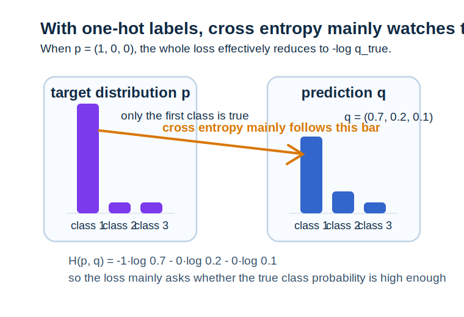
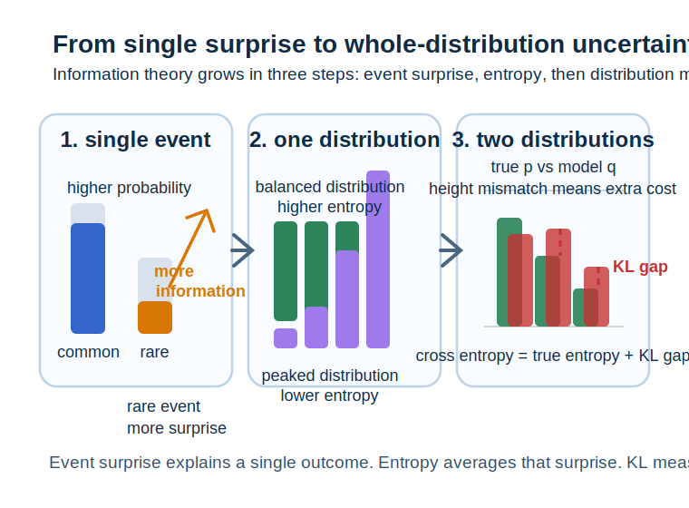

# 第 17 章 信息论基础

<div class="chapter-intro" markdown="1">
  <span class="chapter-pill">信息量</span>
  <span class="chapter-pill">熵</span>
  <span class="chapter-pill">KL 散度</span>
  <p>这一章会把前面已经出现过的<strong>概率分布、交叉熵与似然</strong>进一步组织成<strong>信息论（information theory）</strong>语言，帮助你理解为什么“<strong>不确定性有多大</strong>”“<strong>两个分布差多远</strong>”这些问题，会在现代机器学习里变成<strong>熵（entropy）</strong>、<strong>交叉熵（cross entropy）</strong>和 <strong>KL 散度（Kullback-Leibler divergence）</strong>。</p>
</div>

<div class="reading-focus" markdown="1">
<strong>阅读重点</strong>

- 先把**信息量**理解为“一个结果有多出乎意料”
- 把**熵**理解为“一个分布平均有多不确定”
- 把**KL 散度**理解为“用一个分布去近似另一个分布时，多付出了多少额外代价”
</div>

## 本章导读

上一章中，我们已经看到很多损失函数并不是凭空设计出来的，而是可以从负对数似然的角度自然长出来。对不少初学者来说，到这里又会出现一个新问题：既然损失函数已经能从概率建模里得到，那为什么机器学习里还总会出现“信息量”“熵”“交叉熵”“KL 散度”这些看起来更抽象的词？它们和前面学过的概率分布、似然、交叉熵损失之间，到底是什么关系？

答案在于，信息论给了我们一种重新看待概率分布的角度。前面的概率语言主要在回答“这个结果会不会发生、发生得多不多”；而信息论进一步追问：“如果结果发生了，它带来了多少新信息？如果一个分布非常不确定，它平均会带来多少信息？如果我用错了分布来描述世界，又会多付出多少描述成本？”只要这层视角建立起来，熵和 KL 散度就不再只是新的公式，而会重新回到“模型怎样刻画不确定性”这条主线上。

在机器学习里，这条主线非常重要。分类任务里的交叉熵损失、生成模型中的分布匹配、变分方法里的 KL 散度、语言模型里的困惑度，背后都在用信息论语言描述“一个模型对真实分布的贴近程度”。也正因为如此，本章并不是概率统计之外的附属内容，而是帮助我们把“分布差多远”这种直觉真正写成数学。

!!! info "配套内容"
    - [图示理解](#chapter-17-figures)：先看信息量、熵和 KL 散度在“分布比较”这条线里怎样排队。
    - [Python 小实验](#chapter-17-python)：比较两个简单分布的熵、交叉熵与 KL 散度。
    - [本章小结](#chapter-17-summary)：回顾信息论在机器学习损失函数中的角色。

## 学习目标

学完本章后，读者应当能够达到以下要求：

- 能够解释“信息量”为什么和事件概率有关
- 能够用自然语言说明熵代表的平均不确定性
- 能够区分熵、交叉熵和 KL 散度各自在比较什么
- 能够理解为什么交叉熵和 KL 散度会频繁出现在机器学习目标函数里

第一次阅读本章时，可以先把重点放在“直觉解释”上，而不必急于背记每个公式的严格形式。只要你能先建立“概率越小，信息量越大”“分布越平均，熵往往越高”“模型分布和真实分布越不一致，KL 往往越大”这三层直觉，本章就已经打通了大半。

## 本章为什么重要

机器学习里有很多问题，本质上都不是在问“一个点预测对不对”，而是在问“一个预测分布和真实分布差多远”。例如，分类模型不是只给一个标签，而是给一组类别概率；生成模型不是只输出一个样本，而是在试图学会整个数据分布；语言模型也不是只说“下一个词是什么”，而是在为很多可能的下一个词分配概率。在这些场景里，如果没有衡量分布差异的工具，训练和评估都会变得缺少统一语言。

信息论正是在这里发挥作用。熵让我们能描述一个分布本身有多不确定；交叉熵让我们能描述“如果真实分布是这样，但你用另一个分布去编码，会多花多少平均代价”；KL 散度则更进一步，把“用错分布”的额外代价直接写成一个不对称但非常有用的距离型量。对机器学习学习者来说，这些对象最重要的价值不在于公式本身，而在于它们会不断出现在训练目标、模型比较和生成质量分析中。

本章的重要性还体现在“去损失函数黑箱化”上。很多人知道交叉熵损失常用于分类，但并不真正清楚它为何自然；也知道 KL 散度在高级模型中经常出现，却不知道它到底在惩罚什么。本章的目标，就是把这些对象重新压回到概率和不确定性这条主线上，让它们从“高级名词”重新变成“可以解释的数学工具”。

## 先修知识清单

阅读本章前，最好已经对概率分布、对数、对数似然、交叉熵损失和最大似然有比较稳定的直觉。特别是要记得：上一章已经说明过交叉熵可以从负对数似然里长出来，而本章要做的是进一步解释它在“分布比较”这层意义上为什么自然。

如果这些内容还有一点松，也不用过于担心。本章和第 16 章是非常适合来回对照阅读的一对章节：第 16 章强调“数据如何由模型解释”，本章则强调“分布之间如何被比较”。

## 直觉解释

### 1. 一个结果越罕见，带来的信息量往往越大

设想你每天都看到太阳从东方升起，这件事虽然重要，但几乎没有“信息惊喜”；而如果某天你看到一个几乎不可能发生的结果，它往往会立刻带来更多新信息。信息论正是把这种直觉写成数学：一个事件越罕见，它一旦发生，带来的信息量就越大。

也就是说，信息量并不是某种脱离概率的新对象，而是对概率的另一种读法。概率在说“它有多可能”，信息量则在说“它如果真的发生，有多让人意外”。这种双视角会成为后面熵和交叉熵的起点。

### 2. 熵是在看“平均而言，这个分布有多不确定”

如果一个分布几乎把所有概率都压在一个结果上，那么这个分布的未来几乎没有悬念，不确定性很低；如果一个分布把概率分得很平均，那么在观察结果之前，我们会觉得更拿不准，不确定性就更高。熵做的事情，就是把这种“平均不确定性”量化出来。

从直觉上说，熵越大，并不意味着模型越好或越坏，而是意味着“在结果出来之前，你平均更难猜中会发生什么”。因此，熵首先是一个分布本身的性质，而不是两个分布比较后的性质。

### 3. 交叉熵是在看“我用错了分布去描述世界，会平均多花多少代价”

如果真实世界按分布 \(p\) 产生结果，而你却用另一个分布 \(q\) 去描述它，那么你在很多结果上的“意外度”就会被算错。交叉熵正是在衡量：当真实分布是 \(p\)，你却按 \(q\) 去看待它时，平均要付出多大的描述成本。

这样理解时，分类里的交叉熵损失就会自然很多。真实标签对应的分布往往很尖锐，而模型输出的是自己的预测分布；训练其实是在不断调参数，让模型分布尽量贴近真实分布，于是交叉熵也就不断下降。

### 4. KL 散度是在看“因为分布不匹配而多出来的那部分代价”

若交叉熵包含了“真实分布本身的不确定性”以及“你用错分布的额外代价”两部分，那么 KL 散度做的事情，就是把那部分“额外代价”单独提取出来。也就是说，它在回答：如果真实分布是 \(p\)，你却坚持用 \(q\)，那么你平均会多花多少。

这也是为什么 KL 散度在机器学习里非常重要。很多训练目标并不是直接在最小化欧氏距离，而是在让一个预测分布靠近目标分布，而 KL 就是描述这类靠近程度的经典方式。

## 核心概念

### 1. 信息量

若事件 \(x\) 的概率为 \(p(x)\)，则它的信息量常写作

\[
I(x) = -\log p(x)
\]

概率越小，\(-\log p(x)\) 越大，这正对应“越罕见，越意外，信息量越大”的直觉。

!!! abstract "定义 17.1（信息量）"
    用 \(-\log p(x)\) 表示某个结果发生时所带来意外程度或信息多少的量，称为该结果的**信息量**。

### 2. 熵

若离散随机变量 \(X\) 的分布为 \(p(x)\)，则其熵定义为

\[
H(p) = - \sum_x p(x)\log p(x)
\]

它可以看成“信息量的期望”，也就是平均不确定性。

!!! abstract "定义 17.2（熵）"
    一个概率分布下信息量的期望值，称为该分布的**熵**。

### 3. 交叉熵

若真实分布为 \(p\)，模型分布为 \(q\)，则交叉熵定义为

\[
H(p, q) = - \sum_x p(x)\log q(x)
\]

它表示：数据其实按 \(p\) 产生，但你用 \(q\) 去描述时，平均会付出多大的信息代价。

!!! abstract "定义 17.3（交叉熵）"
    用真实分布 \(p\) 加权、但对模型分布 \(q\) 取对数所得到的平均代价，称为 \(p\) 与 \(q\) 之间的**交叉熵**。

### 4. KL 散度

KL 散度定义为

\[
D_{\mathrm{KL}}(p\|q) = \sum_x p(x)\log \frac{p(x)}{q(x)}
\]

它满足一个非常重要的关系：

\[
H(p, q) = H(p) + D_{\mathrm{KL}}(p\|q)
\]

这说明交叉熵可以分成“真实分布本身的不确定性”和“因为分布不匹配多出来的代价”两部分。

!!! abstract "定义 17.4（KL 散度）"
    衡量当真实分布为 \(p\) 而近似分布为 \(q\) 时所产生额外信息代价的量，称为 \(p\) 相对于 \(q\) 的**KL 散度**。

### 5. 困惑度

在语言模型等场景里，还常看到困惑度（perplexity）。它本质上是交叉熵的指数形式，用来表示“模型平均还有多少种可能性拿不准”。对初学者来说，记住它和交叉熵单调对应就已经足够。

!!! abstract "定义 17.5（困惑度）"
    由交叉熵指数化得到、用于表示模型平均不确定程度的量，称为**困惑度**。

为了帮助第一次进入本章的读者稳定住对象关系，可以先把几个最常见量并排对照：

| 对象 | 主要问题 | 作用 |
| --- | --- | --- |
| 信息量 \(I(x)\) | 一个结果有多意外 | 衡量单次结果的信息多少 |
| 熵 \(H(p)\) | 一个分布平均有多不确定 | 衡量分布自身的不确定性 |
| 交叉熵 \(H(p,q)\) | 用 \(q\) 描述 \(p\) 时平均多花多少代价 | 常见训练损失来源 |
| KL 散度 \(D_{\mathrm{KL}}(p\|q)\) | 分布不匹配多出来多少额外代价 | 衡量分布差异 |

## 例题与推导

### 例 1：为什么概率越小，信息量越大

设某事件概率为 \(0.5\)，则信息量为

\[
I = -\log 0.5
\]

若另一事件概率只有 \(0.01\)，则信息量为

\[
I = -\log 0.01
\]

由于 \(0.01\) 更小，所以对应的信息量更大。这和直觉完全一致：极罕见的结果一旦发生，会让我们得到更多新信息。

### 例 2：公平硬币和偏置硬币的熵比较

设一枚公平硬币满足

\[
p(\text{正}) = p(\text{反}) = 0.5
\]

则熵为

\[
H(p) = -0.5\log 0.5 - 0.5\log 0.5
\]

若另一枚偏置硬币满足

\[
p(\text{正}) = 0.9, \qquad p(\text{反}) = 0.1
\]

则熵为

\[
H(p) = -0.9\log 0.9 - 0.1\log 0.1
\]

第二种分布虽然也有不确定性，但由于结果大多偏向正面，所以平均不确定性更低，熵也会更小。这个例子说明：熵高不高，关键不在结果个数，而在概率分布是否更平均。

### 例 3：分类中的交叉熵为什么只盯真实标签

设一个三分类任务里，真实标签分布是 one-hot 形式：

\[
p = (1, 0, 0)
\]

模型预测为

\[
q = (0.7, 0.2, 0.1)
\]

则交叉熵为

\[
H(p, q) = -1\cdot \log 0.7 - 0\cdot \log 0.2 - 0\cdot \log 0.1 = -\log 0.7
\]

这个结果非常重要，因为它说明：在 one-hot 标签下，求和里真正留下来的，其实只有真实类别那一项，所以交叉熵主要在惩罚“模型给真实类别分配的概率是不是足够高”。也就是说，模型真正需要学会的是：把真实标签对应的概率抬上去。



先看这张图时，最值得先盯住的是左边目标分布里那根唯一高起来的柱子。因为真实标签是 one-hot 形式，所以真正被“点亮”的只有第一个类别；这也意味着，右边预测分布里最关键的，不是三根柱子一起长什么样，而是与真实类别对齐的那一根到底有多高。图中橙色箭头强调的正是这一点：交叉熵会主要追着真实类别那一项去看，所以当 \(q_{\text{true}}\) 从 0.7 继续变大时，损失就会下降得更明显。这张图特别适合帮助第一次接触交叉熵的读者把“为什么它只盯真实类”真正看成一个图像事实。顺着这一步再往下看，交叉熵和 KL 散度的关系也会更容易理解，因为接下来你只需要继续问：如果模型分布整体和真实分布不一致，额外代价会从哪里冒出来？

### 例 4：KL 散度如何分离出“额外代价”

若真实分布为 \(p\)，模型分布为 \(q\)，则有

\[
H(p, q) = H(p) + D_{\mathrm{KL}}(p\|q)
\]

这里 \(H(p)\) 只与真实分布自身有关，是你无论如何都绕不开的本底不确定性；而 \(D_{\mathrm{KL}}(p\|q)\) 则是因为你没有完全用对分布而多出来的那部分额外代价。这个分解非常值得记住，因为它几乎把“熵、交叉熵、KL 散度之间到底差在哪”一句话说清楚了。

## 图示理解 { #chapter-17-figures }

这一节先看信息论里的层次怎样从“单个结果有多意外”走到“一个分布有多不确定”，再走到“两个分布差多远”。读图时建议按“先把第 1、2 步读成单次意外怎样变成平均不确定性，再把第 3、4 步读成两个分布比较时额外代价从哪里来”的顺序推进。只要读完后你能回答“信息量、熵、交叉熵和 KL 散度分别在比较什么层次的对象”，这一节的图示主线就算真正建立起来。



<span class="figure-inline-label figure-inline-label-order">读图顺序</span>不要急着同时记住所有术语，而是先顺着从左到右的三块区域读。左边那一块在提醒你：概率越小，单次结果越意外，所以单次信息量越大；中间那一块再把这种“单次意外”按整个分布平均起来，于是得到熵，也就是平均不确定性；右边那一块则把视角进一步推到“两个分布并排比较”，此时真实分布 \(p\) 和模型分布 \(q\) 的高度差，就会变成交叉熵和 KL 散度背后的额外代价。只要这三步顺起来，信息论里的几个核心对象就会开始真正排队，而不再只是几条需要死记的公式。

如果说上一张主图先帮你把“点、分布、分布比较”这三个层次排好了，那么下面这张分步图就是在把这三层关系拆得更慢、更适合逐步跟读。

<div class="ml-loop">
  <div class="ml-loop-head">
    <strong>图 17.2 从信息量到熵，再到分布差异</strong>
    <p><span class="figure-inline-label figure-inline-label-order">读图顺序</span>先看单个结果的意外度，再看平均不确定性，最后再比较两个分布之间多出来的额外代价。</p>
  </div>
  <div class="ml-loop-cycle">
    <div class="ml-loop-step">
      <strong>1. 单个结果</strong>
      <span>概率越小，结果越意外，单次信息量越大。</span>
    </div>
    <div class="ml-loop-step">
      <strong>2. 一个分布</strong>
      <span>把单次信息量按分布平均起来，就得到熵。</span>
    </div>
    <div class="ml-loop-step">
      <strong>3. 两个分布</strong>
      <span>如果真实分布是 p，模型分布是 q，就会出现交叉熵。</span>
    </div>
    <div class="ml-loop-step">
      <strong>4. 额外差异</strong>
      <span>交叉熵里减去真实熵后，剩下的就是 KL 散度。</span>
    </div>
  </div>
  <div class="ml-loop-return">
    <strong>真正的升级顺序是：点 -> 分布 -> 分布比较。</strong> 只要这个层次关系清楚，信息论里的很多公式都会重新变得有序。
  </div>
  <div class="ml-loop-tracks">
    <div class="ml-track ml-track-data">
      <strong>结果视角</strong>
      单次结果回答“这次有多意外”。
    </div>
    <div class="ml-track ml-track-model">
      <strong>分布视角</strong>
      熵回答“平均而言有多不确定”。
    </div>
    <div class="ml-track ml-track-loss">
      <strong>训练视角</strong>
      交叉熵回答“模型分布和目标分布匹配得够不够好”。
    </div>
    <div class="ml-track ml-track-update">
      <strong>比较视角</strong>
      KL 散度回答“因为分布不匹配，多付出了多少额外代价”。
    </div>
  </div>
</div>

<span class="figure-inline-label figure-inline-label-takeaway">读后应会</span>最好再回头用一句话复述一次：**信息量在看单个结果，熵在看一个分布，交叉熵和 KL 散度则在看两个分布之间的差异。** 一旦这个层次顺起来，后面再遇到分类损失、语言模型困惑度或分布匹配目标时，就不容易把这些对象混成一团。

## Python 小实验 { #chapter-17-python }

下面这段代码比较两个简单离散分布的熵、交叉熵和 KL 散度。重点不是追求复杂编程，而是让你亲眼看到这三个量在数值上怎样分工。

```python
from __future__ import annotations

import math


def entropy(probabilities: list[float]) -> float:
    """计算离散分布的熵。

    :param probabilities: 概率列表
    :return: 熵
    """
    total: float = 0.0
    for probability in probabilities:
        total -= probability * math.log(probability)
    return total


def cross_entropy(target: list[float], prediction: list[float]) -> float:
    """计算两个离散分布之间的交叉熵。

    :param target: 真实分布
    :param prediction: 预测分布
    :return: 交叉熵
    """
    total: float = 0.0
    for target_probability, prediction_probability in zip(target, prediction):
        total -= target_probability * math.log(prediction_probability)
    return total


target_distribution: list[float] = [0.7, 0.2, 0.1]
prediction_distribution: list[float] = [0.6, 0.3, 0.1]

target_entropy: float = entropy(target_distribution)
target_cross_entropy: float = cross_entropy(target_distribution, prediction_distribution)
target_kl_divergence: float = target_cross_entropy - target_entropy

print("真实分布的熵:", target_entropy)
print("真实分布与预测分布的交叉熵:", target_cross_entropy)
print("KL 散度:", target_kl_divergence)
```

如果你运行这段代码，会看到交叉熵通常大于等于熵，而两者之差正是 KL 散度。这个小实验非常适合帮助你把“熵是分布自身的不确定性，KL 是分布不匹配额外带来的代价”这层关系真正看成数值事实，而不只是公式恒等式。

## 与机器学习的联系

### 1. 分类损失本质上是在比较目标分布与模型分布

交叉熵之所以适合作为分类损失，是因为它直接在惩罚模型分布对真实标签分布的偏离程度，而不只是比较两个类别编号是否相等。

### 2. 生成模型常常在学习如何逼近真实数据分布

一旦任务目标从“预测一个标签”变成“尽量学到整个数据分布”，KL 散度、交叉熵和更广义的信息论量就会频繁出现。

### 3. 信息论为似然和损失提供了另一种解释

上一章从概率建模角度解释了交叉熵，这一章则进一步说明：它还可以被看成一种平均编码代价或分布匹配代价。两种解释是互相照亮的。

### 4. 困惑度让语言模型的不确定性更容易被直观看见

在自然语言处理里，人们常常不用直接报交叉熵，而是报困惑度。它本质上只是交叉熵的另一种表达方式，但更适合读成“模型平均还剩多少种可能拿不准”。

## 常见误区

### 误区 1：熵大就一定说明模型更好

熵只是在描述分布本身的不确定性，并不天然代表模型质量高低。高熵可能意味着不确定，也可能意味着模型过于犹豫。

### 误区 2：交叉熵和 KL 散度是完全无关的两个量

它们之间有非常直接的关系：交叉熵等于真实熵加上 KL 散度。理解这点后，很多目标函数会更容易拆解。

### 误区 3：KL 散度就是普通距离

KL 散度虽然在衡量分布差异，但它通常不对称，也不满足普通距离的全部性质。它更像一种“额外代价”而不是欧氏意义上的几何距离。

### 误区 4：信息论只在很高级的生成模型里才有用

事实上，最常见的分类交叉熵损失已经是信息论语言在日常机器学习中的直接体现。

## 练习题

1. 为什么说概率越小的事件，一旦发生信息量越大？
2. 请用自己的语言解释熵为什么可以看成“平均不确定性”。
3. 在真实分布固定时，为什么最小化交叉熵等价于让模型分布尽量贴近真实分布？
4. 交叉熵、熵和 KL 散度之间的关系式到底说明了什么？
5. 为什么说 KL 散度更像“额外代价”，而不只是一个普通距离数值？

## 本章知识结构

| 概念 | 一句话核心 | 在机器学习中的角色 |
| --- | --- | --- |
| 信息量 | 单个结果有多出乎意料 | 连接概率与“新信息”的起点 |
| 熵 | 分布平均有多不确定 | 描述模型或数据分布本身的复杂度 |
| 交叉熵 | 用一个分布描述另一个分布的平均代价 | 是分类和分布拟合中的常见损失 |
| KL 散度 | 因分布不匹配而多出来的额外代价 | 是比较分布差异的重要工具 |

知识脉络：

- 先从单个结果的信息量出发
- 再把信息量按分布平均得到**熵**
- 接着用两个分布之间的比较得到**交叉熵**
- 最后把交叉熵拆成真实熵与 **KL 散度**

## 本章小结 { #chapter-17-summary }

本章最核心的任务，是把前面已经出现过的概率分布、似然和交叉熵损失重新组织成信息论视角。信息量回答单个结果有多意外，熵回答一个分布平均有多不确定，交叉熵回答用一个分布去描述另一个分布时平均要付出多少代价，而 KL 散度则进一步把“分布不匹配额外带来的那一部分代价”单独抽了出来。

如果把本章放回整本书的进阶路径里看，它正在帮助你把“训练目标为什么这样写”这件事再往深处推进一步。第 16 章主要从概率建模和似然角度解释损失函数的来源，而本章则让你进一步看到：很多损失函数还可以被读成分布之间的比较代价。只要这层理解开始稳定，后面继续进入更复杂的生成模型、变分方法或分布匹配问题时，就会更容易保持方向感。也就是说，本章先把“分布差异如何度量”讲清，下一章会转而讨论“当目标函数和可行域具有怎样的结构时，优化会更可靠”。

<div class="chapter-nav">
  <a href="../16-likelihood-bayes-and-probabilistic-modeling/">
    <strong>上一章</strong>
    回到第 16 章：最大似然、最大后验与概率建模
  </a>
  <a href="../">
    <strong>章节目录</strong>
    返回章节导航页
  </a>
  <a href="../18-convex-and-constrained-optimization/">
    <strong>下一章</strong>
    进入第 18 章：凸优化与约束优化
  </a>
</div>
