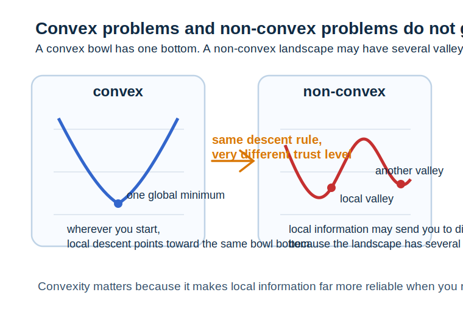
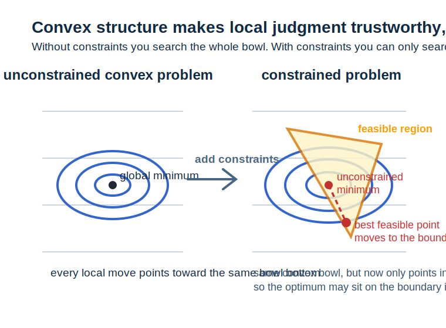

# 第 18 章 凸优化与约束优化

<div class="chapter-intro" markdown="1">
  <span class="chapter-pill">凸集</span>
  <span class="chapter-pill">凸函数</span>
  <span class="chapter-pill">约束优化</span>
  <p>这一章会把前面学过的<strong>梯度、优化路径与损失函数</strong>进一步提升到“问题结构”层面，帮助你理解为什么有些优化问题更容易做、为什么<strong>凸优化（convex optimization）</strong>如此重要，以及为什么一旦加入<strong>约束</strong>，就需要用新的数学语言来描述“可行解”和“最优解”。</p>
</div>

<div class="reading-focus" markdown="1">
<strong>阅读重点</strong>

- 先把**凸性**理解为“两个好点之间整段都还是好区域”
- 把**凸优化**理解为“局部最优就是全局最优”的结构性幸运
- 把**约束优化**理解为“不是所有方向都能走，最优解要在规则内寻找”
</div>

## 本章导读

前面第 8 章已经帮助我们建立了梯度下降、学习率、损失地形这些非常重要的直觉。但随着学习深入，一个新的问题会自然出现：为什么有些优化问题似乎比较温和，梯度下降很容易就能找到好解；而另一些问题则困难得多，容易卡住、震荡或者出现很多复杂现象？单靠“沿梯度走”这条局部规则，还不足以完全回答这个问题，我们还需要进一步看优化问题本身的整体结构。

凸优化正是在这里进入视野。它不是某种独立于机器学习的高级专题，而是在回答一个非常根本的问题：一个目标函数和可行域如果具有某种特殊形状，那么最优解会不会更容易找、局部信息会不会更可靠、算法分析会不会更清楚？当这种特殊形状满足凸性时，我们会得到很多难得的好性质。

约束优化则是另一个自然升级。现实问题中，我们并不总能在整个空间里随便选参数。有时参数必须满足长度限制、和为 1、非负、稀疏、预算上限等条件。此时优化不再只是“朝更低的地方走”，而变成“在允许的区域里找最低点”。也正因为如此，本章既是在为后续正则化、泛化和更高阶优化铺路，也是在把前面的优化直觉提升到结构化问题层面。

!!! info "配套内容"
    - [图示理解](#chapter-18-figures)：先看凸集、凸函数与约束区域在几何上有什么共同特征。
    - [Python 小实验](#chapter-18-python)：比较一个简单凸函数和一个非凸函数的梯度下降轨迹。
    - [本章小结](#chapter-18-summary)：回顾凸性和约束怎样改变优化问题的性质。

## 学习目标

学完本章后，读者应当能够达到以下要求：

- 能够用几何直觉解释什么是凸集、什么是凸函数
- 能够说明为什么凸优化里“局部最优 = 全局最优”如此重要
- 能够理解约束优化和无约束优化在问题结构上的差别
- 能够读懂拉格朗日函数为何会把“目标”和“约束”写进同一表达式

第一次阅读本章时，不必急于把所有严格证明一次看透。只要你能先建立“凸性是在保证问题结构更规整”“约束是在规定哪些区域能走”这两层直觉，本章最重要的地基就已经搭起来了。

## 本章为什么重要

机器学习里很多算法之所以表现不同，并不只是因为实现细节不同，更是因为它们面对的问题结构不同。一个目标函数如果是凸的，我们就更容易给出优化保证；如果一个问题还有明确约束，我们就必须知道最优解究竟应当怎样在可行区域边界或内部出现。也就是说，优化不只是算法技巧，更是问题结构的科学。

本章的重要性首先体现在“看问题级别的眼光”上。前面的优化章节主要回答“朝哪边走”；而本章开始进一步回答“这个地形本身值不值得放心走”。这层提升非常关键，因为现代机器学习里，很多时候真正决定困难程度的，不是你会不会做一次梯度更新，而是你能不能判断当前问题的整体结构是否友好。

本章的重要性还体现在“从无约束到有约束”的跨越上。很多学习者在最开始接触机器学习时，习惯默认参数可以自由变化；但在更深入的学习中，我们会不断遇到非负性、归一化、容量限制、正则约束或对偶问题。如果没有约束优化这层语言，后面很多方法会显得像突然变成了另一门学科。

## 先修知识清单

阅读本章前，最好已经对导数、梯度、梯度下降、损失函数和多元函数图像有较稳定的直觉。尤其要记得：第 8 章已经帮助我们看到“沿梯度反方向走”的局部更新规则，而本章将在这个基础上进一步追问“什么样的问题结构会让这种更新更可靠”。

如果这部分基础还有些松，也不必担心。本章里的几何直觉相对重要，你完全可以一边读凸集与凸函数，一边回想第 4 章的线性变换和第 8 章的等高线图像，把这些旧图景重新调出来辅助理解。

## 直觉解释

### 1. 凸集是在说“两个允许点之间整段都允许”

设想一个平面区域，如果你在里面随便选两个点，再用线段把它们连起来，整条线段都仍然留在这个区域里，那么这个区域就是凸集。这个定义看似简单，但它表达了一种非常强的几何规整性：区域内部没有“洞”、没有把允许点切开的凹陷裂口。

为什么这对优化重要？因为如果可行区域本身是凸的，我们就更容易在其中移动和分析。很多优化保证，其实都依赖于这种“中间路径不会突然跑出允许区域”的规整结构。

### 2. 凸函数是在说“函数图像不会在中间往下凹”

如果函数满足：对任意两个输入点，它们函数值连成的线段都在图像上方，那么这个函数就是凸函数。用更直观的话说，函数图像像一个碗，或者至少不会出现中间突然往下拐出更低坑谷的结构。这样的函数最重要的性质之一，就是只要你找到一个局部最优点，它通常也就是全局最优点。

也就是说，凸性并不是抽象的审美要求，而是在保证“局部信息能代表整体”。这对梯度下降特别重要，因为梯度本身只是一种局部信息。如果局部信息在全局上也值得信任，优化就会轻松很多。

### 3. 约束优化是在说“不是所有方向都可以走”

无约束优化里，你可以在整个参数空间里自由寻找更低的位置；而约束优化里，只有满足规则的点才允许被考虑。这时最优解有时在区域内部，有时会被挤到边界上。也就是说，最优点不仅取决于目标函数本身，也取决于允许区域长什么样。

把这件事想象成爬山会很直观：如果你在整个地形上随便走，就只要找最低谷；但如果你被规定只能在某块围栏区域内活动，那么真正可达到的最低点可能就在围栏边缘。约束优化的很多数学结构，都是在处理这种“目标形状”和“允许区域”共同决定解”的情形。

### 4. 拉格朗日方法是在把“想优化什么”和“必须满足什么”写在一起

约束一旦进入问题，最自然的需求就是：能不能不要把目标函数和约束条件分成两页分别看，而是把它们重新写成一个统一对象？**拉格朗日函数（Lagrangian）**正是在做这件事。它把原目标和约束用乘子结合起来，让我们能在一个表达式里同时追踪“想变小的方向”和“不能违反的规则”。

对初学者来说，这里最重要的不是马上掌握全部严格推导，而是先建立一个稳定认识：拉格朗日乘子并不是神秘常数，而是在度量“约束到底有多重要、放松一点会怎样改变最优值”的桥梁。

## 核心概念

### 1. 凸集

若集合 \(C\) 满足：对任意 \(x_1, x_2 \in C\) 以及任意 \(\lambda \in [0,1]\)，都有

\[
\lambda x_1 + (1-\lambda)x_2 \in C
\]

则称 \(C\) 为凸集。

!!! abstract "定义 18.1（凸集）"
    任取集合中两个点，它们之间的整条线段都仍在集合内部的集合，称为**凸集**。

### 2. 凸函数

若函数 \(f\) 满足：对任意 \(x_1, x_2\) 及 \(\lambda \in [0,1]\)，有

\[
f(\lambda x_1 + (1-\lambda)x_2)
\leq
\lambda f(x_1) + (1-\lambda)f(x_2)
\]

则称 \(f\) 为凸函数。

!!! abstract "定义 18.2（凸函数）"
    图像不会在两点之间向下凹陷、满足上式不等式的函数，称为**凸函数**。

### 3. 凸优化问题

若目标函数是凸函数，且可行域是凸集，则相应优化问题称为凸优化问题。它最珍贵的性质之一是：任何局部最优解都是全局最优解。

!!! abstract "定义 18.3（凸优化问题）"
    以凸函数为目标、并在凸集上进行求解的优化问题，称为**凸优化问题**。

### 4. 约束优化

一般约束优化问题可写作

\[
\min_x f(x)
\]

满足

\[
g_i(x) \leq 0, \qquad h_j(x) = 0
\]

这里 \(g_i\) 表示不等式约束，\(h_j\) 表示等式约束。

!!! abstract "定义 18.4（约束优化）"
    在满足若干等式或不等式约束的可行域内寻找最优解的优化问题，称为**约束优化问题**。

### 5. 拉格朗日函数

对带约束问题，可构造拉格朗日函数

\[
\mathcal{L}(x, \lambda, \nu)
=
f(x) + \sum_i \lambda_i g_i(x) + \sum_j \nu_j h_j(x)
\]

它把目标和约束统一写在同一表达式里。

!!! abstract "定义 18.5（拉格朗日函数）"
    把目标函数与约束条件通过乘子统一组合后形成的函数，称为**拉格朗日函数**。

### 6. 对偶问题

通过对拉格朗日函数作进一步变形，我们可以得到与原问题相关的对偶问题。对初学者来说，最重要的是先知道：原问题和对偶问题往往在不同角度描述同一个优化结构，有时对偶形式更容易分析或求解。

!!! abstract "定义 18.6（对偶问题）"
    从原始优化问题的拉格朗日结构出发构造出的、与原问题相对应的优化问题，称为**对偶问题**。

为帮助第一次进入这一章的读者稳定对象关系，可以先把几类结构并排对照：

| 对象 | 直觉重点 | 在优化中的作用 |
| --- | --- | --- |
| 凸集 | 两点之间整段都可行 | 保证可行域结构规整 |
| 凸函数 | 图像像碗，不在中间往下凹 | 保证局部最优可信 |
| 约束 | 并不是所有方向都允许走 | 规定解必须落在哪些区域 |
| 拉格朗日函数 | 把目标和约束写在一起 | 为分析最优性与对偶提供工具 |

## 例题与推导

### 例 1：为什么二次函数常是凸的

设

\[
f(x) = x^2
\]

它的二阶导数为

\[
f''(x) = 2 > 0
\]

这说明它的曲率始终向上，因此图像像一个标准“碗形”。这类函数最容易帮助初学者建立凸函数直觉：无论你从左边还是右边看，中间都不会突然塌出更低的局部坑。



先看这张图时，可以先只看左边那条蓝色曲线：它像一个标准碗形，最低点只有一个，所以你无论从哪边往下走，局部下降方向最终都会把你带向同一个底部。再看右边那条红色曲线，地形里不止一个谷，也有中间起伏，这就意味着“眼前往下走”这条局部规则未必总能代表整体结构。这样一对比，为什么凸性会让局部信息更值得信任、为什么非凸问题更容易出现多种局部去向，就会一下子清楚很多。

### 例 2：平方误差为什么常让线性回归问题显得规整

设损失为

\[
J(w) = \frac{1}{2}\|Xw - y\|^2
\]

这是一个关于参数 \(w\) 的二次函数。在很多常见条件下，它对 \(w\) 的形状是凸的，因此线性回归问题往往比深层非线性网络更容易分析。这个例子说明：优化难度并不只取决于参数多少，更取决于目标函数的整体结构。

### 例 3：带非负约束的最小化问题

考虑

\[
\min_x (x-2)^2
\]

并加上约束

\[
x \ge 0
\]

这个问题里，无约束最优解本来就是 \(x=2\)，它已经满足约束，因此约束并不改变最优解。但若问题改成

\[
\min_x (x+1)^2
\quad \text{subject to } x \ge 0
\]

无约束最优点会在 \(x=-1\)，但它不满足约束，因此最终可行最优点会被推到边界 \(x=0\)。这个例子很适合帮助初学者看到：约束有时不影响解，有时却会直接把最优点挤到边界上。也正因为如此，下一步引入拉格朗日函数时，你最好把它理解成一种“把边界压力正式写进目标语言里”的方法，而不只是多添一个符号。

### 例 4：拉格朗日乘子怎样把目标和约束连起来

考虑问题

\[
\min_{x,y} x^2 + y^2
\]

满足

\[
x + y = 1
\]

构造拉格朗日函数

\[
\mathcal{L}(x,y,\nu) = x^2 + y^2 + \nu(x+y-1)
\]

接下来我们不再分别盯着原目标和约束，而是在一个统一对象里对 \(x,y,\nu\) 分析最优性。对初学者来说，这里最值得把握的不是完整求解步骤，而是意识到：约束已经不再是外部附注，而被真正写进了优化问题本身。只要这一点开始稳定，后面再遇到 KKT 条件或对偶问题时，就不会觉得它们是在凭空加戏，而会把它们看成同一条结构线的继续展开。

## 图示理解 { #chapter-18-figures }

理解凸优化时，最值得先看的画面，是“地形本身”和“允许区域”怎样一起决定解。前面第 8 章更强调往哪里走，而这一章更强调地形和边界本身是不是规整。读图时最好先把第 1、2 步连起来看成“问题结构长什么样”，再把第 3、4 步连起来看成“最优解最终会落在哪里”。



先看这张图时，可以先只看左边那一半：蓝色等高线围成一个标准“碗形”地形，最低点只有一个，这正是凸问题最让人放心的地方，因为局部下降方向和整体最低处是在同一套结构里对齐的。接着再把视线移到右边那一半，你会发现同样的碗形地形一旦叠加上橙色可行域，问题就不再是“整个碗底在哪里”，而变成“允许区域里最低的位置在哪里”。此时红色虚线连起的两个点最值得观察：原本的无约束最低点可能已经不在可行域里，于是最优解就会被推到边界上。这样一来，约束优化就不再只是多写几条条件，而会变成“目标地形”和“允许区域”共同决定解的位置。

如果说上一张主图先帮你看清了“地形”和“可行域”怎样叠在一起，那么下面这张分步图就是在把这种几何直觉进一步压成四个更容易逐项检查的判断点。

<div class="ml-loop">
  <div class="ml-loop-head">
    <strong>图 18.2 从地形结构到可行区域，再到最终最优解</strong>
    <p>先看目标函数是不是“碗形”，再看允许区域是不是规整，最后再判断最优解落在内部还是边界。</p>
  </div>
  <div class="ml-loop-cycle">
    <div class="ml-loop-step">
      <strong>1. 目标地形</strong>
      <span>若函数像碗一样向上开，局部信息通常更可靠。</span>
    </div>
    <div class="ml-loop-step">
      <strong>2. 可行区域</strong>
      <span>若区域是凸的，从一个可行点走向另一个可行点不会中途越界。</span>
    </div>
    <div class="ml-loop-step">
      <strong>3. 搜索最优点</strong>
      <span>无约束时看整个地形；有约束时只能在允许区域中找最低处。</span>
    </div>
    <div class="ml-loop-step">
      <strong>4. 内部或边界</strong>
      <span>最优解可能在内部，也可能被约束推到边界上。</span>
    </div>
  </div>
  <div class="ml-loop-return">
    <strong>凸性真正带来的，是“局部判断更值得信任”。</strong> 一旦目标和区域都规整，优化分析就会比一般问题清楚得多。
  </div>
  <div class="ml-loop-tracks">
    <div class="ml-track ml-track-data">
      <strong>目标结构</strong>
      不是所有地形都一样平滑友好，凸性是在区分问题难度。
    </div>
    <div class="ml-track ml-track-model">
      <strong>区域结构</strong>
      可行域的形状会直接改变最优点可能落在哪里。
    </div>
    <div class="ml-track ml-track-loss">
      <strong>最优性结构</strong>
      在凸问题里，局部最优更接近全局结论。
    </div>
    <div class="ml-track ml-track-update">
      <strong>约束结构</strong>
      拉格朗日方法帮助我们把“想优化什么”和“必须满足什么”写进同一个式子。
    </div>
  </div>
</div>

读完这张图后，可以马上问自己两个问题：**如果地形本身不规整，局部下降方向还值不值得信任？如果允许区域收紧了，最低点会不会被推到边界上？** 只要这两个问题开始稳定，凸优化和约束优化就不会再只是两组定义，而会重新变成可以读图、可以判断的问题结构。

## Python 小实验 { #chapter-18-python }

下面这段代码比较一个凸函数和一个非凸函数在简单梯度下降中的轨迹。重点不是追求复杂数值分析，而是帮助你直观看到结构差异。

```python
from __future__ import annotations


def gradient_descent_quadratic(initial_value: float, learning_rate: float, steps: int) -> list[float]:
    """在凸二次函数上做梯度下降。

    :param initial_value: 初始点
    :param learning_rate: 学习率
    :param steps: 迭代步数
    :return: 轨迹列表
    """
    x_value: float = initial_value
    trajectory: list[float] = [x_value]

    for _ in range(steps):
        gradient: float = 2.0 * x_value
        x_value -= learning_rate * gradient
        trajectory.append(x_value)

    return trajectory


def gradient_descent_nonconvex(initial_value: float, learning_rate: float, steps: int) -> list[float]:
    """在一个简单非凸函数上做梯度下降。

    :param initial_value: 初始点
    :param learning_rate: 学习率
    :param steps: 迭代步数
    :return: 轨迹列表
    """
    x_value: float = initial_value
    trajectory: list[float] = [x_value]

    for _ in range(steps):
        # 对 x^4 - 3x^2 求导后得到 4x^3 - 6x。
        gradient: float = 4.0 * (x_value ** 3) - 6.0 * x_value
        x_value -= learning_rate * gradient
        trajectory.append(x_value)

    return trajectory


print("凸函数轨迹:", gradient_descent_quadratic(initial_value=3.0, learning_rate=0.2, steps=8))
print("非凸函数轨迹:", gradient_descent_nonconvex(initial_value=0.5, learning_rate=0.05, steps=8))
```

如果你运行这段代码，会发现凸二次函数上的轨迹通常更稳定地朝唯一最低点靠近；而在非凸函数中，轨迹表现会明显更依赖初始位置与局部结构。这个最小实验非常适合帮助初学者把“问题结构不同，优化体验就不同”看成具体事实。

## 与机器学习的联系

### 1. 线性回归和部分经典模型常受益于凸结构

许多早期经典模型之所以更容易分析，一个重要原因就是目标函数常具有凸性，这让最优性与收敛分析更清晰。

### 2. 深度学习常面对非凸问题

现代神经网络的训练往往不再是严格凸优化问题，因此我们不能简单继承所有凸优化结论。但理解凸性仍然重要，因为它能提供清晰参照系。

### 3. 约束广泛存在于参数设计和资源限制中

无论是概率分布参数必须和为 1、权重需要稀疏，还是资源与预算上限，这些都让约束优化成为机器学习中非常自然的一部分。

### 4. 对偶思想会在更高阶方法中不断出现

虽然本章只做入口级介绍，但对偶问题、拉格朗日乘子和约束结构，后面会在支持向量机、最优化理论和更系统的统计学习方法中反复出现。

## 常见误区

### 误区 1：只要会梯度下降，就已经掌握优化

梯度下降解决的是一种更新方式，但并不自动告诉你当前问题结构是否友好。问题结构本身同样重要。

### 误区 2：凸函数只是数学分析里的抽象概念

凸性会直接影响局部最优是否可信、优化是否容易分析、算法是否更稳定，因此它并不是脱离实践的形式定义。

### 误区 3：约束只是附加条件，不改变问题本质

约束可能直接改变最优解位置，甚至把最优点推到边界上，因此它不是装饰性条件，而是问题结构的一部分。

### 误区 4：拉格朗日乘子只是求导技巧

它当然是求解工具，但更深层的价值在于：它把目标和约束统一组织起来，让我们能更系统地分析最优性和对偶结构。

## 练习题

1. 请用自己的语言说明为什么凸集要求“两点之间整段都仍在集合里”。
2. 为什么说凸函数的局部最优往往就是全局最优？
3. 约束优化和无约束优化的最本质区别是什么？
4. 当约束把无约束最优点排除在外时，最终最优解往往会发生什么变化？
5. 拉格朗日函数为什么值得被看成“目标和约束的统一表达式”？

## 本章知识结构

| 概念 | 一句话核心 | 在机器学习中的角色 |
| --- | --- | --- |
| 凸集 | 可行区域内部没有中途断裂 | 保证约束空间结构规整 |
| 凸函数 | 局部判断更值得信任 | 帮助理解为什么某些问题更容易做 |
| 凸优化 | 局部最优等于全局最优 | 提供清晰的最优性与算法分析框架 |
| 约束优化与拉格朗日 | 在规则内寻找最优并统一表达目标与约束 | 为正则化、对偶与复杂结构问题打基础 |

知识脉络：

- 先从**凸集**理解可行区域为什么要规整
- 再从**凸函数**理解目标地形为什么更可靠
- 接着把两者合起来得到**凸优化**
- 最后进入**约束优化**与拉格朗日语言

## 本章小结 { #chapter-18-summary }

本章最核心的任务，是把前面学过的优化直觉进一步提升到“问题结构”层面。凸集帮助我们理解可行区域的规整性，凸函数帮助我们理解目标地形为什么有时更值得信任，而凸优化则告诉我们：当目标和可行域都具有良好结构时，优化问题会变得更容易分析、更容易保证。与此同时，约束优化也提醒我们，现实问题并不总允许在整个空间里自由选择参数，最优解往往还要受到规则边界的影响。

如果把本章放回整本书的进阶路径里看，它正在帮助你从“会做一次梯度更新”走向“会看一个优化问题本身长什么样”。这种提升非常重要，因为后面无论继续进入更复杂的正则化、统计学习理论还是更高阶优化方法，真正决定理解深度的，往往都不只是算法步骤，而是你是否开始具备这种结构化看问题的能力。也就是说，本章先把“什么样的目标更容易优化”讲清，下一章会继续追问“模型为什么会在新样本上表现好或不好”。

<div class="chapter-nav">
  <a href="../17-information-theory/">
    <strong>上一章</strong>
    回到第 17 章：信息论基础
  </a>
  <a href="../">
    <strong>章节目录</strong>
    返回章节导航页
  </a>
  <a href="../19-generalization-regularization-and-bias-variance/">
    <strong>下一章</strong>
    进入第 19 章：泛化、正则化与偏差-方差
  </a>
</div>
