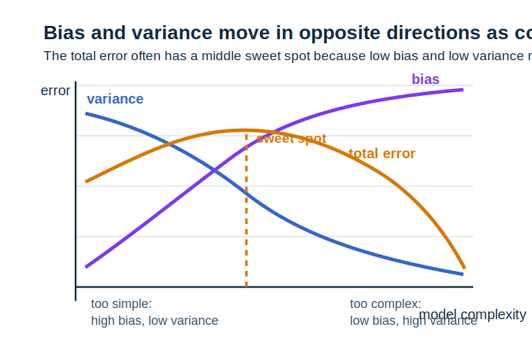
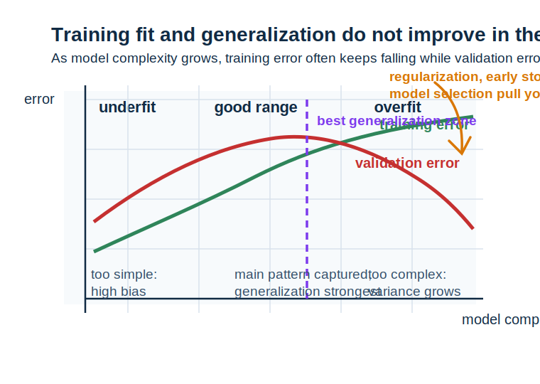

# 第 19 章 泛化、正则化与偏差-方差

<div class="chapter-intro" markdown="1">
  <span class="chapter-pill">泛化</span>
  <span class="chapter-pill">正则化</span>
  <span class="chapter-pill">偏差-方差</span>
  <p>这一章会把前面已经出现过的<strong>训练误差、测试误差、模型复杂度与正则项</strong>进一步组织成一条统一主线，帮助你理解为什么“在训练集上表现很好”并不等于“模型真的学得好”，以及为什么很多训练技巧最终都在服务于<strong>泛化（generalization）</strong>能力。</p>
</div>

<div class="reading-focus" markdown="1">
<strong>阅读重点</strong>

- 先把**泛化**理解为“模型在新样本上还能不能保持表现”
- 把**正则化**理解为“限制模型过度迎合训练数据的方式”
- 把**偏差-方差权衡**理解为“过于简单和过于复杂之间的结构性平衡”
</div>

## 本章导读

很多初学者在最开始做机器学习实验时，最自然的目标是让训练损失尽快下降、训练准确率尽快升高。但随着学习逐步深入，一个关键事实会不断出现：模型在训练集上学得越好，并不一定意味着它在新样本上也会表现越好。也就是说，机器学习真正关心的，不只是“记住这批数据”，而是“从这批数据里学到可迁移的规律”。这正是泛化问题的核心。

前面的章节中，我们已经零散接触过这个主题。第 8 章讲过优化和训练现象，第 11 章讲过估计与样本波动，第 12 章提过正则化，第 16 章又说明了最大后验和先验如何自然连接到目标函数。到了这里，我们可以把这些线索重新汇总成一条更完整的主线：为什么模型会过拟合，为什么约束模型复杂度有帮助，为什么偏差和方差常常像跷跷板一样此消彼长。

这一章的重要任务，不是教你记几个经验口号，而是帮助你建立一种更高层的判断能力：当一个模型表现不好时，到底是因为表达能力不够、训练不充分、样本太少，还是因为它过度记住了噪声？如果这层判断能力开始稳定，后面面对更复杂的模型和训练现象时，你就更容易知道该往哪里排查。

!!! info "配套内容"
    - [图示理解](#chapter-19-figures)：先看训练误差、测试误差和模型复杂度之间的关系。
    - [Python 小实验](#chapter-19-python)：比较不同复杂度模型在训练集与验证集上的误差变化。
    - [本章小结](#chapter-19-summary)：回顾泛化、正则化与偏差-方差怎样连成一条线。

## 学习目标

学完本章后，读者应当能够达到以下要求：

- 能够解释训练误差、测试误差和泛化误差的区别
- 能够说明过拟合与欠拟合分别意味着什么
- 能够理解正则化为什么有助于改善泛化
- 能够用偏差-方差语言解释模型复杂度变化带来的典型现象

第一次阅读本章时，不必急于掌握所有统计学习理论细节。只要你能先建立“训练表现只是起点，泛化表现才是目标”“模型太简单和太复杂都会出问题”这两层稳定认识，本章的核心任务就已经完成了一半。

## 本章为什么重要

机器学习和普通曲线拟合练习最大的区别之一，就在于我们关心的不是把现有点全都背下来，而是希望模型能面对没见过的新样本时仍然保持合理判断。如果没有泛化视角，很多训练行为都会被误读。比如，看到训练损失持续下降，你可能会误以为模型一定在进步；但如果测试误差已经开始反弹，那么这其实是在提醒你模型可能已经在过拟合训练数据中的噪声。

本章的重要性首先体现在“评价标准”的升级上。前面的章节更强调模型怎么搭、目标怎么写、参数怎么求，而这一章则进一步强调：最终标准不是训练过程看起来多顺，而是模型是否真的学到了可迁移结构。也正因为如此，泛化不是模型训练之后才补充考虑的事情，而是整个建模过程一直在服务的最终目标。

本章的重要性还体现在“工具重新解释”上。正则化、先验、早停、验证集、模型复杂度控制，这些看似分散的方法，背后其实都在围绕同一个问题工作：如何避免模型过度迎合当前训练样本中的偶然细节。只要这一条主线开始清楚，很多实践技巧就不再像散落的小窍门，而会重新回到同一套数学理解里。

## 先修知识清单

阅读本章前，最好已经对损失函数、训练过程、样本波动、正则化项和最大后验估计有基本直觉。特别要记得：第 12 章已经让我们看到 L1、L2 正则化，第 16 章又说明过先验和正则项之间的联系，而本章将把这些对象放到“模型为什么会在新数据上失灵”这条更大的主线上重新理解。

如果这些内容还有些松，本章也依然值得继续读。你完全可以把它当作一个重新梳理全书旧知识的节点：一旦某个概念暂时不稳，就回看相邻章节补一补，再回到这一章继续往前。

## 直觉解释

### 1. 训练表现好，不等于学到了真正规律

设想你让一个学生死记硬背题库答案，他在练习册上可能表现非常好，但一旦题目换了表述或数据分布稍有变化，成绩就会立刻掉下来。模型过拟合训练数据时，发生的事情很像这个过程：它并不是没有“学”，而是学得太贴着当前样本，以至于把偶然噪声也当成了规律。

因此，泛化能力真正关心的是：模型在没见过的新样本上还能不能继续表现好。也就是说，训练表现是必要条件，但绝不是充分条件。

### 2. 模型太简单会欠拟合，太复杂会过拟合

如果模型过于简单，它可能连训练集中的主要趋势都抓不住，这就叫欠拟合；如果模型过于复杂，它不仅能抓住主要规律，还会把训练样本里的局部噪声也一起记进去，这就叫过拟合。两者看起来相反，但本质上都说明模型没有落在一个合适的复杂度区间。

对初学者来说，最重要的不是把这两个词背熟，而是建立一种“复杂度是有代价的”意识：表达能力越强，未必越好，因为它也更容易顺手把噪声学进去。

### 3. 正则化是在给模型“别太任性”的提醒

无论是 L2 正则、L1 正则、参数先验还是早停，它们背后都可以理解成某种限制：不要让模型为了把训练误差再压低一点，就把参数推到特别极端、特别脆弱的位置。也就是说，正则化不是在阻止模型学习，而是在提醒模型不要过度迎合当前训练样本。

如果把这件事放回最大后验视角，也会更清楚：正则化很多时候不是附加惩罚，而是在把“参数通常不该太极端”这样的先验判断一起写进目标函数。

### 4. 偏差和方差是在从两个方向描述模型错误

偏差可以理解为“模型表达能力或假设过强，导致长期看总是偏离真实规律”；方差则可以理解为“模型对样本波动过于敏感，换一批训练数据就可能学出很不一样的结果”。模型太简单时，偏差往往更大；模型太复杂时，方差往往更大。这种此消彼长的关系，就是偏差-方差权衡。

这层语言很重要，因为它让我们不再只会说“模型效果不好”，而开始能进一步判断“问题更像来自表达不足，还是来自对样本过度敏感”。

## 核心概念

### 1. 泛化

泛化（generalization）指模型在未见过的新样本上仍能保持合理表现的能力。它是机器学习区别于简单记忆系统的关键标准。

!!! abstract "定义 19.1（泛化）"
    模型从训练样本中学到的规律能否迁移到新样本上的能力，称为**泛化能力**。

### 2. 过拟合与欠拟合

欠拟合表示模型太简单，连训练数据中的主要规律都没抓住；过拟合表示模型太复杂或训练过度，把训练样本里的偶然细节也记住了。

!!! abstract "定义 19.2（过拟合与欠拟合）"
    模型因表达不足而无法学到主要规律的现象称为**欠拟合**；模型因过度迎合训练样本而损害新样本表现的现象称为**过拟合**。

### 3. 泛化误差

泛化误差可以理解为模型在新数据分布上的平均表现与理想目标之间的差距。实际中我们常用验证集或测试集误差来间接估计它。

!!! abstract "定义 19.3（泛化误差）"
    模型在新样本分布上的平均误差，称为**泛化误差**。

### 4. 正则化

正则化是在原始训练目标之外加入某种约束或偏好，以抑制模型过度复杂、过度敏感或参数过大。

!!! abstract "定义 19.4（正则化）"
    为改善模型泛化能力而在训练过程中加入的复杂度控制或参数约束机制，称为**正则化**。

### 5. 偏差与方差

偏差（bias）描述模型预测的系统性偏离，方差（variance）描述模型对训练样本波动的敏感程度。两者共同影响模型最终误差。

!!! abstract "定义 19.5（偏差与方差）"
    描述模型系统性误差的部分称为**偏差**，描述模型对数据波动敏感程度的部分称为**方差**。

### 6. 验证集与模型选择

为了判断模型是否泛化良好，我们通常会把数据分成训练集、验证集和测试集。验证集用于调参和选模型，测试集用于最后评估。

!!! abstract "定义 19.6（验证集）"
    在训练之外专门用于比较模型或超参数配置、间接评估泛化表现的数据集合，称为**验证集**。

为帮助第一次进入这一章的读者稳定结构关系，可以先把几个最常见对象并排对照：

| 对象 | 核心问题 | 作用 |
| --- | --- | --- |
| 训练误差 | 模型有没有把已见样本学好 | 反映拟合现有样本的能力 |
| 测试/验证误差 | 模型在新样本上表现怎样 | 反映泛化质量 |
| 正则化 | 是否限制模型过度复杂 | 改善泛化稳定性 |
| 偏差-方差 | 错误主要来自哪一类结构问题 | 帮助分析模型失效原因 |

## 例题与推导

### 例 1：为什么训练误差持续下降时，测试误差可能反而上升

设一个高复杂度模型在训练集上不断优化。随着训练进行，它当然会越来越适应训练样本，因此训练误差持续下降并不奇怪。但如果模型开始把训练数据中的偶然噪声也学进去，那么它对新样本的适应能力反而会变差，于是测试误差可能先降后升。

这个例子提醒我们：训练曲线和泛化曲线并不总是同步变化。也正因为如此，机器学习不能只盯训练误差，更要学会在训练误差继续下降时追问一句：验证误差此刻是在继续变好，还是已经开始暴露过拟合信号？

### 例 2：低阶多项式与高阶多项式的典型对比

若你用一次函数去拟合本来带有明显弯曲趋势的数据，模型可能连主要趋势都抓不住，这更像欠拟合；若你用过高阶多项式去穿过几乎每个训练点，它可能在训练集上误差极低，但图像会在点与点之间剧烈摆动，这更像过拟合。

这个例子非常经典，因为它把“模型复杂度不是越高越好”直观地画了出来。

### 例 3：L2 正则为什么会倾向于更平滑的解

若目标函数写成

\[
\mathcal{L}(w) = \text{data loss}(w) + \lambda \|w\|^2
\]

那么模型不仅在试图拟合数据，还在同时承受“参数过大要付额外代价”的限制。于是，极端参数虽然可能进一步压低训练误差，但未必还能让整体目标更优。这个例子说明：L2 正则是在通过压制参数过大来降低模型对训练样本局部波动的敏感性。

### 例 4：偏差-方差怎样随复杂度变化

当模型复杂度很低时，表达能力受限，偏差通常较大；随着复杂度上升，偏差会下降，但模型对训练样本波动的敏感度增加，方差往往会上升。最终总误差常呈现“先降后升”的趋势。这个现象非常适合帮助初学者建立“模型复杂度存在折中区间”的意识。



先看这张图时，可以先只看紫色偏差曲线和蓝色方差曲线朝着相反方向变化这一点。模型越简单，偏差越高，因为它装不下足够丰富的规律；模型越复杂，方差越高，因为它更容易对训练样本里的局部波动变得敏感。接着再看橙色总误差曲线，你就会发现真正值得寻找的不是“偏差最低”或“方差最低”的极端位置，而是两者折中后总误差最低的那一段。这样一来，偏差-方差权衡就不再只是一个口号，而会重新变成一张可以直接读出“为什么中间更稳”的图。读到这里时，最好顺手再问自己一句：如果我继续把模型复杂度往右推一格，先恶化的更可能是哪一项？只要这个问题开始能靠图自己回答，偏差和方差就不再只是两个分散术语，而会开始变成你调参时真的会调用的判断语言。

## 图示理解 { #chapter-19-figures }

理解泛化时，最值得先看的画面，不是一条孤立曲线，而是训练误差、验证误差和模型复杂度放在同一张图里的关系。这样一来，你才会真正看到为什么“更会背训练集”并不等于“更会面对新样本”。读图时最好先盯住训练误差与验证误差什么时候开始分叉，再回头判断这个分叉点大致落在什么复杂度区间。



先看这张图时，最值得先盯住的是两条曲线什么时候开始明显分开。绿色的训练误差会随着模型复杂度上升而持续下降，这件事本身并不奇怪，因为模型越来越会贴住训练集；真正关键的是红色验证误差的走势，它会先下降，再在某个区间之后重新抬头。这个转折点就是最值得读出来的地方，因为它在提醒你：模型从“逐步抓住主要规律”开始转向“越来越会记住训练样本里的偶然细节”。右上角那条橙色提示箭头则进一步把正则化、早停和模型选择都重新接回到这张图上，说明这些方法本质上都在努力把模型从过拟合区往更稳健的区间拉回来。也就是说，这张图最重要的不只是告诉你“哪里过拟合了”，更是在训练实践里教你形成一个动作：一旦看到分叉，就该开始考虑降复杂度、加正则化、早停，或者重新检查数据量与噪声水平。

如果说上一张主图先帮你抓住了曲线分叉和复杂度区间，那么下面这张分步图就是在把这条总体趋势拆成更容易逐段判断的四个阶段。

<div class="ml-loop">
  <div class="ml-loop-head">
    <strong>图 19.2 模型复杂度上升时，训练误差与泛化表现如何变化</strong>
    <p>先看训练误差通常怎样单调下降，再看验证误差为何常常呈现先降后升的趋势。</p>
  </div>
  <div class="ml-loop-cycle">
    <div class="ml-loop-step">
      <strong>1. 复杂度很低</strong>
      <span>模型表达能力不足，训练误差和验证误差都可能偏高。</span>
    </div>
    <div class="ml-loop-step">
      <strong>2. 复杂度适中</strong>
      <span>模型既能抓住主要规律，又不至于过度追噪声，泛化往往最好。</span>
    </div>
    <div class="ml-loop-step">
      <strong>3. 复杂度很高</strong>
      <span>训练误差继续下降，但验证误差可能开始上升，进入过拟合区。</span>
    </div>
    <div class="ml-loop-step">
      <strong>4. 加入正则化</strong>
      <span>通过约束参数或训练过程，把模型往更稳健的复杂度区间拉回去。</span>
    </div>
  </div>
  <div class="ml-loop-return">
    <strong>真正要盯的不是训练误差最低，而是泛化表现最好。</strong> 机器学习最终关心的是模型对新样本的可靠程度。
  </div>
  <div class="ml-loop-tracks">
    <div class="ml-track ml-track-data">
      <strong>训练视角</strong>
      训练误差低说明模型会拟合已有样本，但这只是第一步。
    </div>
    <div class="ml-track ml-track-model">
      <strong>复杂度视角</strong>
      模型越强大，既可能更会学规律，也可能更会学噪声。
    </div>
    <div class="ml-track ml-track-loss">
      <strong>泛化视角</strong>
      验证/测试误差更接近我们真正关心的新样本表现。
    </div>
    <div class="ml-track ml-track-update">
      <strong>控制视角</strong>
      正则化、早停和模型选择都在帮助我们避免掉进过拟合区。
    </div>
  </div>
</div>

读完这张图后，最值得立刻自问的一句是：**如果训练误差还在下降，但验证误差已经开始抬头，我究竟应该高兴还是警惕？** 如果你的第一反应开始不再只是“训练得更好了”，而会自动多出一句“也许该停一停、该约束一下，或者该换一个复杂度区间了”，那么泛化视角就算真正进入了你的判断系统。

## Python 小实验 { #chapter-19-python }

下面这段代码用极简方式模拟“模型复杂度上升时，训练误差下降而验证误差先降后升”的现象。重点不是精准复现实验细节，而是帮助你把曲线关系看成数值趋势。

```python
from __future__ import annotations


def simulated_training_error(model_complexity: int) -> float:
    """模拟训练误差随复杂度变化的趋势。

    :param model_complexity: 模型复杂度等级
    :return: 训练误差
    """
    return 1.0 / (model_complexity + 1)


def simulated_validation_error(model_complexity: int) -> float:
    """模拟验证误差随复杂度变化的趋势。

    :param model_complexity: 模型复杂度等级
    :return: 验证误差
    """
    base_term: float = 1.0 / (model_complexity + 1)
    overfit_term: float = 0.08 * max(0, model_complexity - 4) ** 2
    return base_term + overfit_term


for complexity in range(1, 9):
    train_error: float = simulated_training_error(complexity)
    validation_error: float = simulated_validation_error(complexity)
    print(
        f"复杂度 {complexity}: "
        f"train = {train_error:.3f}, "
        f"validation = {validation_error:.3f}"
    )
```

如果你运行这段代码，会看到训练误差大致持续下降，而验证误差会在某一段后开始反弹。这个极简实验非常适合帮助初学者把“欠拟合 -> 合适 -> 过拟合”这一条主线真正看成动态过程，而不是孤立定义。

## 与机器学习的联系

### 1. 模型训练真正的目标是泛化，不只是拟合

无论模型多复杂、训练多充分，最终都要回到“在新样本上还能不能保持表现”这条标准上。

### 2. 正则化和先验可以用统一语言解释

从优化角度看，正则化是在目标里加约束；从概率建模角度看，它又常常是在引入参数先验。两种解释互相照亮。

### 3. 早停、数据增强和交叉验证都在服务泛化

这些方法表面不同，但本质上都在帮助模型不要过度迎合当前训练样本的偶然细节。

### 4. 偏差-方差语言帮助我们更有针对性地诊断问题

当模型效果不好时，偏差-方差视角能帮助我们判断：到底该增加模型能力、增加数据，还是加强正则化与稳定性控制。

## 常见误区

### 误区 1：训练误差越低，模型一定越好

训练误差低只是说明模型更会拟合训练样本，并不自动保证新样本表现更好。

### 误区 2：正则化是在故意让模型“学不好”

正则化并不是反对学习，而是在防止模型为了压低训练误差而学入太多不稳定细节。

### 误区 3：过拟合只会出现在特别深的大模型里

任何足够灵活、样本相对不足或训练过度的模型，都可能出现过拟合。

### 误区 4：偏差和方差只是统计学术语，和模型调参关系不大

恰恰相反，很多调参决策都在隐含地处理偏差和方差之间的平衡。

## 练习题

1. 为什么说训练误差和泛化误差并不是同一个东西？
2. 请用自己的语言区分欠拟合与过拟合。
3. 为什么模型复杂度上升时，训练误差通常下降，但验证误差可能先降后升？
4. L2 正则化为什么常常有助于改善泛化？
5. 如果一个模型训练集和测试集都表现差，这更像偏差问题还是方差问题？为什么？

## 本章知识结构

| 概念 | 一句话核心 | 在机器学习中的角色 |
| --- | --- | --- |
| 泛化 | 模型是否能把学到的规律带到新样本上 | 是机器学习最终要追求的能力 |
| 过拟合与欠拟合 | 模型过强或过弱都会出问题 | 帮助判断复杂度是否合适 |
| 正则化 | 限制模型过度迎合训练数据 | 是改善泛化的重要工具 |
| 偏差-方差 | 从两类不同误差来源理解模型失效 | 帮助诊断和调参 |

知识脉络：

- 先区分**训练表现**与**泛化表现**
- 再理解**欠拟合**与**过拟合**是复杂度两端的问题
- 接着用**正则化**控制模型不要过度迎合样本
- 最后用**偏差-方差**语言分析误差来源

## 本章小结 { #chapter-19-summary }

本章最核心的任务，是把前面零散出现过的训练误差、验证误差、正则化项、先验偏好和模型复杂度重新组织成“泛化”这条主线。机器学习真正关心的不是模型在训练集上背得多熟，而是它在新样本上还能不能继续表现好。正则化帮助我们限制模型过度迎合训练数据，偏差-方差视角则帮助我们判断错误究竟更像来自表达不足，还是来自对样本波动过度敏感。

如果把本章放回整本书的进阶路径里看，它正在把前面学过的优化、概率建模和先验语言重新汇合到“模型最终为什么会在真实世界里表现好或不好”这个更大的问题上。只要这层视角开始稳定，后面继续进入更系统的统计学习理论或更复杂模型实践时，就不容易只盯着训练曲线而失去更高层判断。也就是说，本章先把“学得好”和“泛化好”区分开，下一章会继续把这些判断能力接到卷积、序列和注意力等更现代结构上。

<div class="chapter-nav">
  <a href="../18-convex-and-constrained-optimization/">
    <strong>上一章</strong>
    回到第 18 章：凸优化与约束优化
  </a>
  <a href="../">
    <strong>章节目录</strong>
    返回章节导航页
  </a>
  <a href="../20-convolutions-sequences-and-attention/">
    <strong>下一章</strong>
    进入第 20 章：卷积、序列与注意力的数学入口
  </a>
</div>
